# 01Arduino功能块介绍 

arduino相对其他单片机或者其他开发板对于普通人已经是一个非常友好的存在，也越来越多人用上了arduino。

但是对于从来没有接触过代码，从来没接触过电路的友友来说，还是一个高门槛的存在。

有时候，我们只是想实现某个简单的控制功能，控制简单的模块，而被告知，你要先学点C语言基础，你要看一下底层代码，绕了一大圈，最后目标没达到，反而产生了厌恶。

所以小喵可以推出这个arduino图形化编程系列教程，希望能帮到那些想快速实现功能目标的友友，本教程只是讲解了arduino最基础的模块，全程不叽叽歪歪，只讲最核心的操作重点，如果你想了解更深入的技术底层，请自行查阅arduino相关书籍。如果你恰好有高级模块的需求，可以小喵科技家论坛与我们一起技术探讨。

如果你觉得我们教程讲得不错，请帮我们传播，让更多的人受益~

## 简单的Arduino图形化编程环境搭建  
  
**Kittenblock下载**  

[click](https://bbs.kittenbot.cns/forum.php?mod=viewthread&tid=115&extra=page%3D1)
  

**硬件选择**    
   
首先USB连接上你的Arduino板子，再选择对应硬件
 
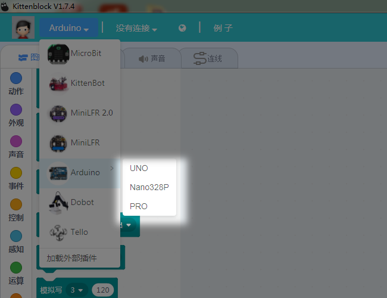   
    
这时候需要连接COM口，第一次使用的用户请安装CH340串口驱动,再进行串口选择。
  
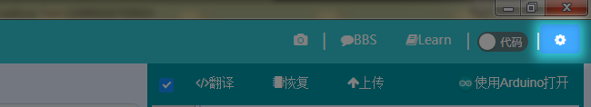  
  
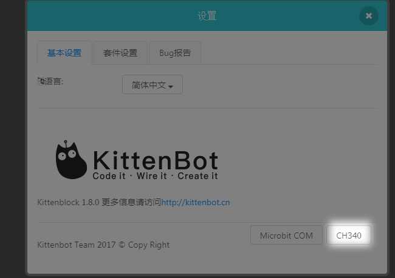  

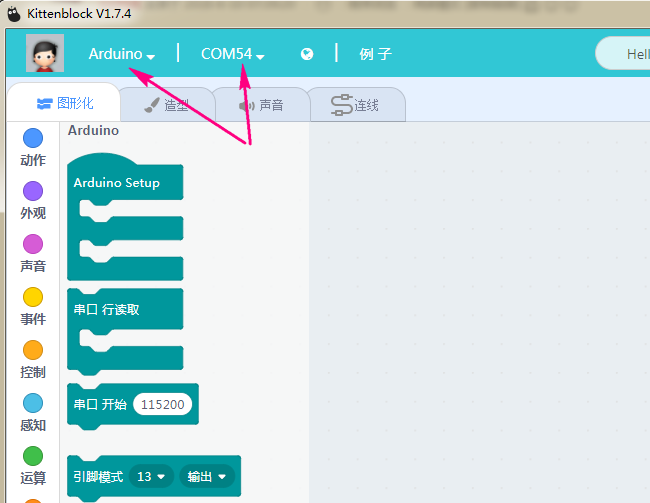  
  
此时可以看到左边分栏里多出了4个Adruino对应的插件包  

   
  
通过这些插件就可以开始编程你的Arduino了    
  
## Arduino分栏积木块说明  
   
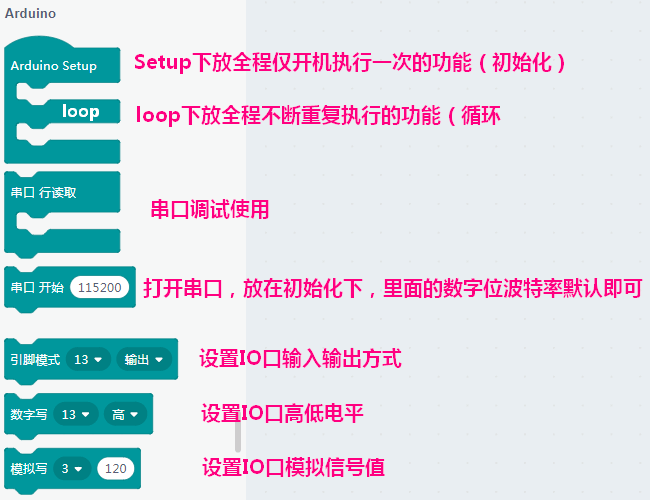
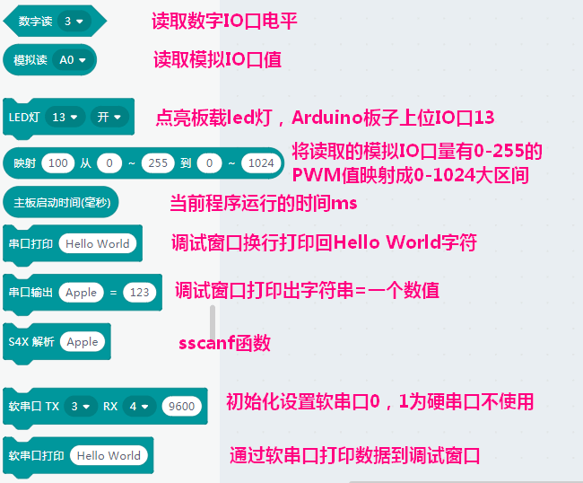  
  
## 传感器分栏积木块说明  
  
**以下介绍Kittenblock中Arduino对应传感器分栏的功能块** 
  
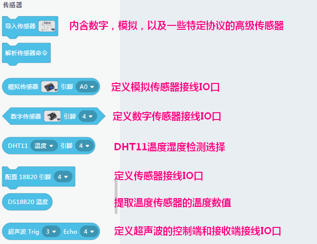
  
## 显示分栏积木块说明  
  
**以下介绍Kittenblock中Arduino对应显示分栏的功能块** 
  
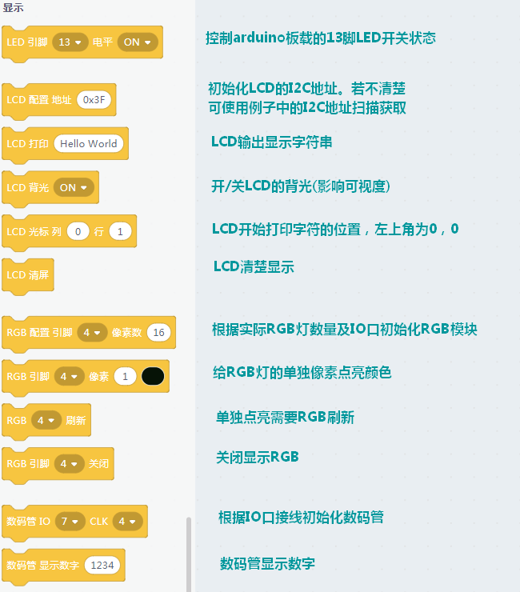  
  
  
## 执行器分栏积木块说明  
  
**以下介绍Kittenblock中Arduino对应显示分栏的功能块** 
  
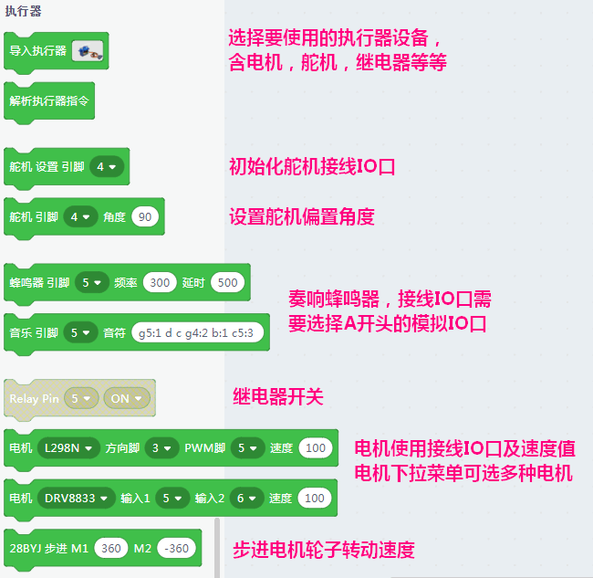

## Arduino代码练习  
  
**将积木块拖入到Setup和Loop函数体块下面，右边的窗口会生成对应的函数，无论是对于Arduino的玩家还是想学习Arduino的人而言，都是十分人性化的存在**
 
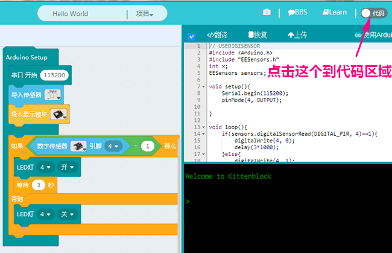   
  
  
**注意：**  
  
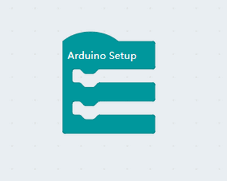  
  
新手注意，这个积木块是整个函数体必须的，没有就无法生成代码，无法下载
  

    
  

  
  
