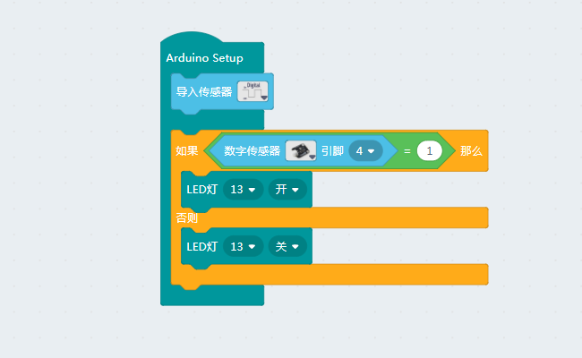

# 10使用人体红外热释电传感器

## 接线

人体红外热释电传感器是数字传感器，使用数字IO口

## 功能搭建

如上述接线使用数字4号IO口，当在范围内有动物移动的时候，就能输出高电平使板载LED点亮并且传感器上的led也会亮起来

__注：__

- 热释电传感器存在延时性，接受信号以及响应信号的输出都存在延时，输出信号存在3s左右的延时

- 热释电传感器的检测角度大约横纵100°
