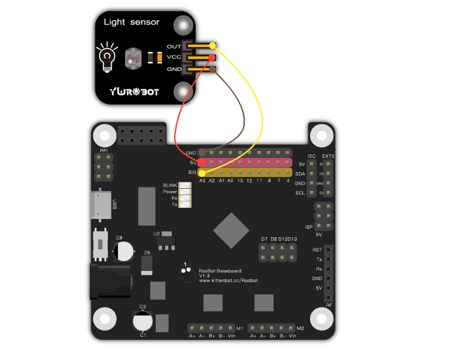
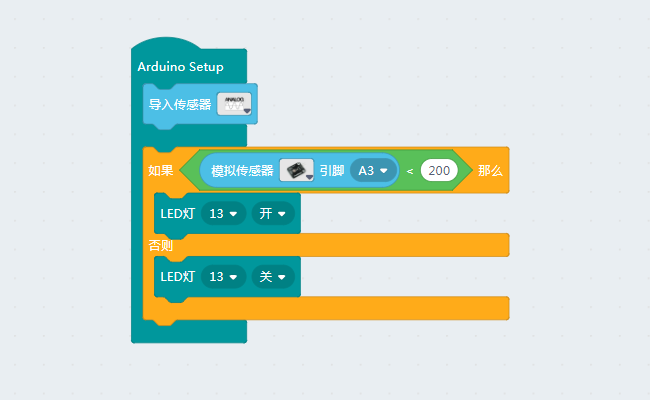

# 12使用光敏传感器

## 接线

光敏传感器是一款模拟传感器，接A开头的模拟IO口，它的可读范围是0-1023的模拟量

## 功能搭建

根据上述接线，使用A3脚，由于光敏传感器使用的是光敏电阻，这种电阻随着光线变强，阻值会变小，反正在黑暗的环境下阻值极大。所以我们给一个值大概这个值为200就是较暗的环境了，当低于这个亮度我们开灯，反之关灯

__注：__

- 光敏传感器的原理是利用光敏电阻和另一个电阻分流实现的

- 判断的值可以根据实际需求设定，建议使用串口调试找到合适的值，具体操作见旋转电位器篇

- 感光类传感器在智能家居中使用频繁