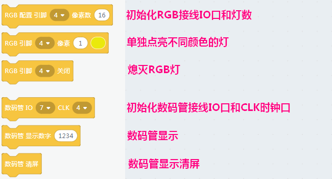

# Arduino功能块介绍 
  
## 简单的Arduino图形化编程环境搭建  
  
**Kittenblock下载**  
  
[Click here to Download](http://kittenbot.cn/bbs/forum.php?mod=viewthread&tid=115&extra=page%3D1)    

**硬件选择**    
   
首先USB连接上你的Arduino板子，再选择对应硬件
 
   
    
这时候COM口会自动连接，若没有请手动选择

  
  
此时可以看到左边分栏里多出了4个Adruino对应的插件包  

   
  
通过这些插件就可以开始编程你的Arduino了    
  
## Arduino分栏积木块说明  
   
  
  
## 传感器分栏积木块说明  
  
**以下介绍Kittenblock中Arduino对应传感器分栏的功能块，传感器颜色为蓝色，这也和小喵家研发出品的特色电子周边颜色对应** 
  
    
  
## 显示分栏积木块说明  
  
**以下介绍Kittenblock中Arduino对应显示分栏的功能块，显示模块如8x8 RGB灯阵屏颜色为黄色，这也和小喵家研发出品的特色电子周边颜色对应** 
  
      
  
  
## 执行器分栏积木块说明  
  
**以下介绍Kittenblock中Arduino对应显示分栏的功能块，显示模块如8x8 RGB灯阵屏颜色为黄色，这也和小喵家研发出品的特色电子周边颜色对应** 
  

## Arduino代码练习  
  
**将积木块拖入到Setup和Loop函数体块下面，右边的窗口会生成对应的函数，无论是对于Arduino的玩家还是想学习Arduino的人而言，都是十分人性化的存在**
 
   
  
  
**注意：**  
  
  
  
新手注意，这个积木块是整个函数体必须的，没有就无法生成代码，无法下载
  

    
  

  
  
