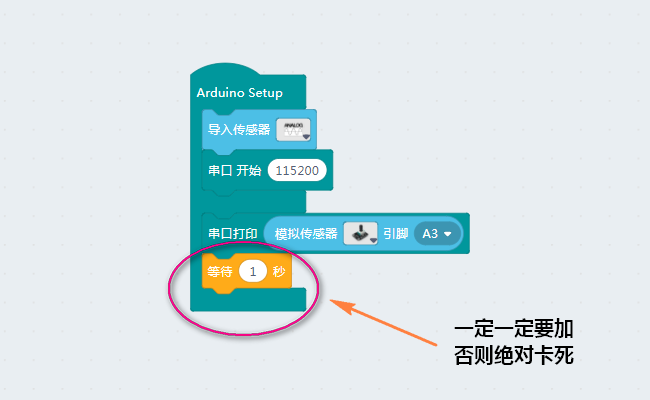

# 08使用旋转与滑动电位器

## 接线

电位器是一种模拟值传感器,使用A开头的模拟IO口

## 数值测试

要想在控制台中看到根据扭动变化的数值，需要添加串口开始作为初始化，并在无限循环中加入串口打印，打印出接在A3的滑动或旋转电位器的值

这样就可以在右边的控制台看到返回的数值范围为0-1024

## 功能搭建

使用可电位器可以实现很多控制功能，大到机床的调控，小到led灯的亮度调控。此处我们使用它来控制舵机角度。由于舵机使用的是180°舵机，所以我们先将电位器的值做一个映射，由0-1024映射到0-180，此时我们扭动/滑动电位器就能对应控制舵机转动了

__注：__

- 使用串口打印串口开始的值取默认别改且一定要给1S左右延时，否则软件卡死，程序卡死。要想解决只能不停复位并同时上传空程序

