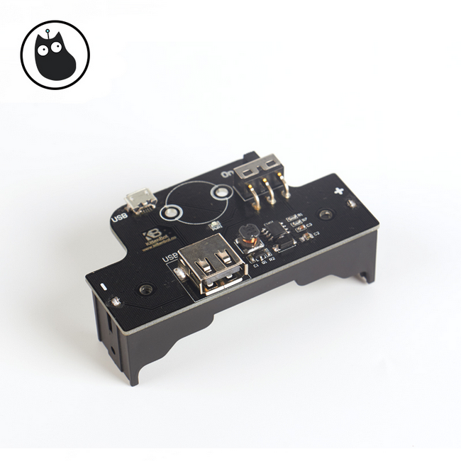
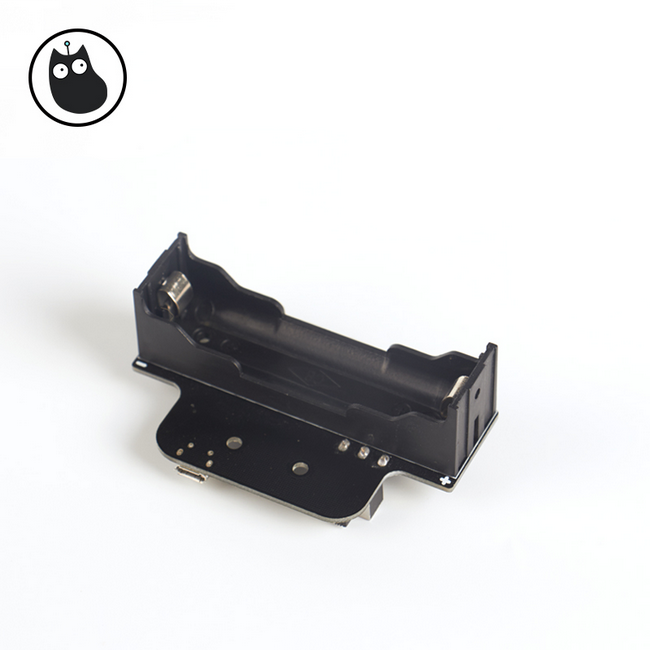

# 18650充电电池座说明

## 购买链接

__转到淘宝购买__----------→[18650充电电池座](https://item.taobao.com/item.htm?spm=a1z10.3-c-s.w4002-17001215033.72.4d38762ecmTQrB&id=559771713191)

## 产品名称

18650可充电电池座

## 适用人群

18650锂电池使用者，Arduino系列Rosbot主控板供电方案。

## 配送清单

18650可充电电池座 x1

## 18650充电电池座示意图

  

 

## 产品简介

这是一款18650单节锂电池的电池座，拥有USB接口可用于充电及，电池盒自带开关功能转为diy项目设计。

## 产品特色

- 带开关
- 可充电
- USB接口

## 产品参数

长x宽x高：79mm x 43mm x 30mm

净重：21.4g

毛重：根据包裹最终大小决定

## 技术参数

- 电压：5V输入（输出）
- 电流：1A
- 防反接

## 注意事项

- 输入电流不可大于1A 

如果以上都不能解决问题，请联系小喵科技，热诚为你服务