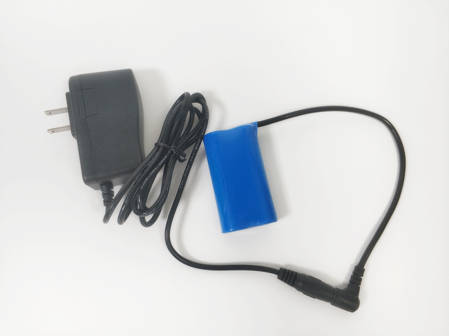

# 18650锂电池组充电器   

## 购买链接

__转到淘宝购买__----------→[18650锂电池组充电器](https://item.taobao.com/item.htm?spm=a1z10.3-c-s.w4002-17001215033.60.4d38762ecmTQrB&id=560183968396)

## 产品名称：   

18650锂电池组充电器   

## 适用人群：   
购买18650锂电池组的用户，如果没有买18650电池组的用户无需购买   

## 配送清单：   

18650锂电池组充电器 X 1   

   

## 产品简介：   

KittenBot 8.4V 1A锂电池组电池充电器可为聚合物锂电池组充电   

## 产品特色：   

- 带充电指示灯   

## 产品参数：   

长 x 宽 x 高：75.5mm x 46mm x 45.65mm   

线长:115.5cm   

净重：71.8g   

毛重：根据包裹最终大小决定   

## 技术参数   

输入电压：AC100-240 50/60Hz   

输出电压：8.4V   

输出电流：1A（1000mA）   

工作效率：85%   

充电指示：空载绿灯，负载红灯，电池充满绿灯   

## 使用实物图   

   

