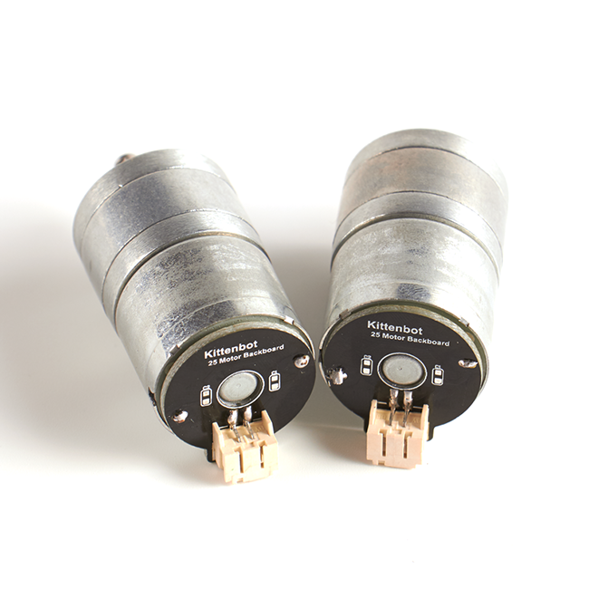
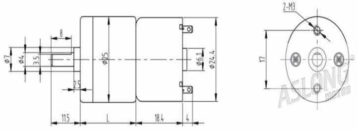
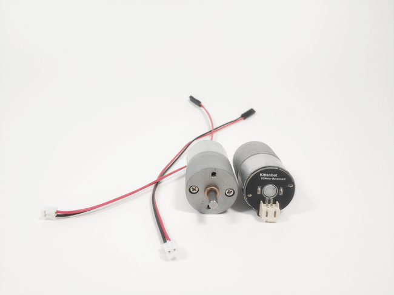
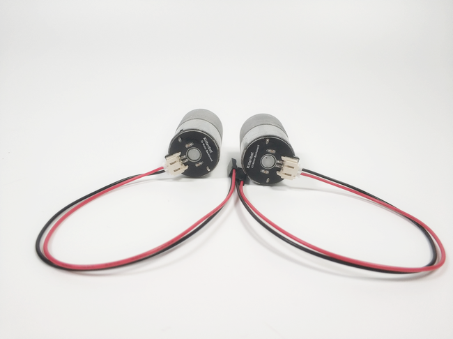

# 25减速直流电机   

## 购买链接

__转到淘宝购买__----------→[25减速直流电机](https://item.taobao.com/item.htm?spm=a1z10.3-c-s.w4002-17001215033.57.7a81762efFySkh&id=558632834609)

## 产品名称：   

25减速直流电机   

## 适用人群：   

大学生学生/培训机构/DIY爱好者   

## 配送清单：   

25电机 X 1   

PH2.0配套红黑线一根   

   

## 产品简介：   
此25电机电机为微型直流减速电机可用于有速度要求和扭矩要求的DIY场景，可调速，可实现正反转，低噪音。   

用于安装Kittenbot小车套件以及多种智能小车如万向轮小车套件，等设备,性价比高。   

## 产品特色：   

- 支持Kittenblock图形化积木块编程   
- 扭矩较大，速度快    
- 带有减速器    
- 免焊线带背板   

## 产品参数：
- 长x直径：54.9mm（长）x24.4mm（直径）   
- 净重：67.8g   
- 毛重：根据包裹最终大小决定   

机械图纸：   

   

## 技术参数   

- 工作电压：5V DC   
- 空载电流：140mA   
- 负载电流：200mA   
- 空载转速：211rpm   
- 负载转速：147rpm   
- 扭矩：0.19kg·cm   
- 回转方向：CW 从出力轴端观看   
- 工作温度：-10℃~+50℃   
- 工作湿度：30%~80%   
- 贮藏温度：-20℃~+60℃   
   
## 使用接线实物图   

   

   

## 注意事项   
- 电机的两个引脚实际上是没有正负之分的。但是两个引脚只要交换顺序后，电机就会从正转变为反转。所以我们人为规定了正负，以便大家按照说明书接线。最终保证大家装出来的小车前进后退都是相对应的。   
- 25电机属于大电流电机，所以使用前需要保证你的电路板可以接大电流电机   
如Rosbot主控板支持接25电机，但是Microbit或者是Robotbit是不支持接25电机的。   

