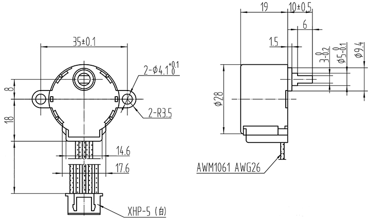

# 28BYJ-48步进电机   

## 购买链接

__转到淘宝购买__----------→[28BYJ-48步进电机](https://item.taobao.com/item.htm?spm=a1z10.3-c-s.w4002-17001215033.89.30dc762e7TCR5o&id=558705744256)

## 产品名称：   
28BYJ-48步进电机   

## 适用人群：   

diy爱好者，需要精准位置运动的应用搭建者  

## 配送清单：   
28BYJ-48步进电机 X 2   

   

## 产品简介：   

KittenBot减速步进电机,绘图机器人专用电机，控制较精准（相比直流电机），所以常用于有角度精度要求的场合。   

## 产品特色：   

- 支持Kittenblock图形化编程，Makecode图形化编程   
- 体积小，扭矩大，性价比高，适合对速度要求不高，但是力度要求大的场合。   
- 控制比较精准，可用于机器人绘图或者精准控制的场合   

## 产品参数：   
- 尺寸：28mm（直径）   
- 净重：32.8g   
- 毛重：根据包裹最终大小决定   
- 机械图纸：（仅供参考，具体准确尺寸请以实物为准）   

   

## 技术参数   
- 电压：5V   
- 步进角度：5.625 x 1/48   
- 减速比：1/48   
- 类型：4相5线减速步进电机   
- 
## 使用实物图   

   

