# 乐高2KG伺服舵机/乐高减速电机   

## 购买链接

__转到淘宝购买__----------→[2KG减速电机/伺服舵机](https://item.taobao.com/item.htm?spm=a1z10.3-c-s.w4002-21482550023.30.2b365d5fCg1w4k&id=603423647052)

## 产品名称

Geekservo 2KG 乐高伺服舵机/乐高减速电机   

## 配送清单

可混批

## 产品简介   

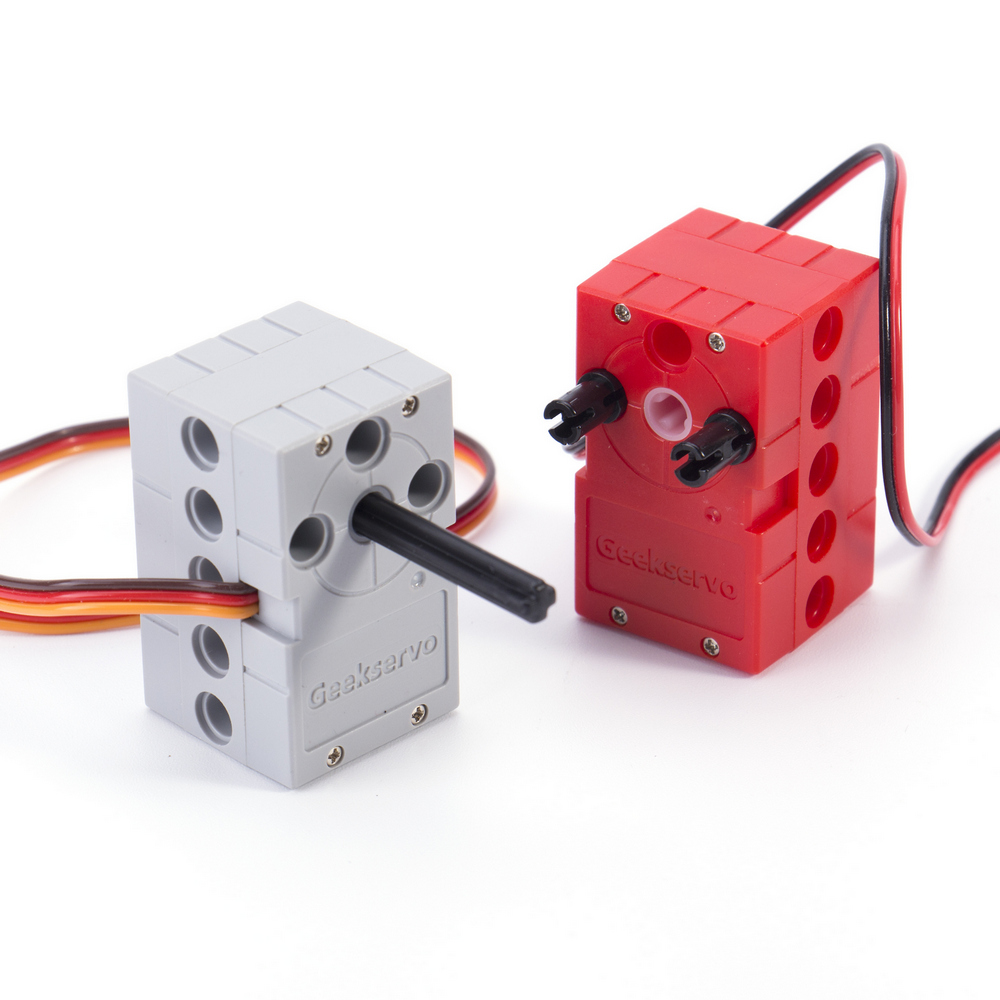

自2018年推出推出的Geekservo系列，第一款Geekservo 9G，引领大家从以前那种常规的蓝色9g小舵机走向了乐高体系的舵机，解决了传统舵机与乐高结构件的连接问题。Geekservo 9G是由传统的蓝色9G小舵机演变过来，定位是简单的连接用法。所以2KG系列是继Geekservo 9g系列的又一乐高结构执行器。主要优化了以下体验以及增强了属性  

- 用户的各种创新用法，已经远超我们的设计预期。进阶过程中，搭建比较紧凑和齿轮配合的机构总会遇到半孔的位置尺寸问题

- 外形结构上采用中规中矩的长方体形式。不再考虑兼容乐高砖块形式，只兼容乐高的科技件系列。结构紧凑，两侧和上下两个面有半孔和全孔的插销孔。

- 颜色体系上与第一款 Geekservo 9G一致。乐高灰对应伺服舵机类型，乐高红对应减速电机类型

- 程序控制上与常规舵机控制类似。脉冲宽度500-2500us（9g舵机脉冲宽度600-2400us）

- 软件程序上Kittenblock与Makecode都有图形化积木块进行支持，Arduino IDE有示例代码


## 产品特色   

- Geekservo 2KG舵机/电机就应运而生。小喵科技与工厂联合开发，具有独家专利 

- 在继承了Geekservo 9g所有的特点优点情况下，增强了扭矩和速度，改善了结构使之禁得住各种结构搭建的考验
  

  - 输出轴采用十字沉孔处理 

    可以根据用户需求，自由插入不同长度的十字轴，拼装更灵活更方便

  - 转动角度范围大 

    舵机控制范围0~360度（注意，这里指的是区间，而不是电机的可持续转动）

  - 扭力更大

    扭力是之前Geekservo第一款的扭力3倍左右


## 产品参数   

- 灰色伺服舵机参数规格   
  - 工作电压：3.3V~6V
  - 额定电压：4.8V   
  - 额定电流：70mA
  - 堵转电流：900mA
  - 打滑电流：700mA
  - 最大扭矩：1.6±0.2 kg-cm （4.8V）
  - 角度转速：60°/0.14s   
  - 净重：20g（单个）

- 红色减速电机规格   
  - 工作电压：3.3V~6V
  - 额定电压：4.8V   
  - 额定电流：200ma   
  - 堵转电流：700ma   
  - 打滑电流：450ma   
  - 最大扭矩：1.6±0.2 kg-cm （4.8V）
  - 最高转速：45rpm（3V供电情况下）   
  - 净重：20g（单个）   


## 尺寸规格    

- 长度：五个乐高孔单元8x5=40mm   
- 宽度：三个乐高宽度单元8x3=24mm   
- 高度：三个乐高高度单元8x3=24mm   
- 基础孔位：直径4.8   
- 输出轴：带极力齿乐高十字轴沉孔（双边） 

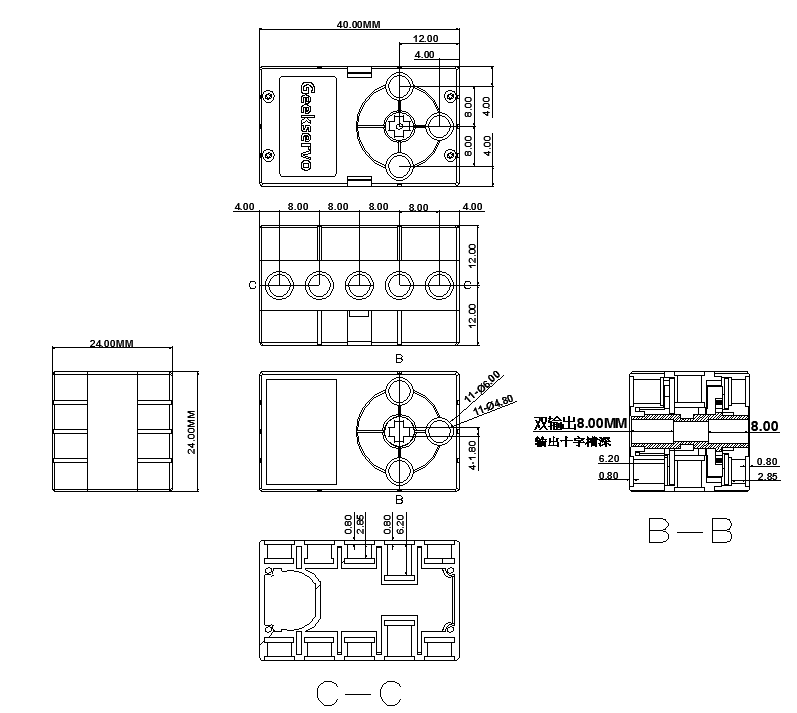

## 线序介绍   

- 灰色伺服舵机   

  为常规舵机的线序，黄接数据引脚（控制引脚）、红接正极、棕接负极

- 红色减速电机    

  红色正极，黑色负极，但实际使用中可以不用区分，反接只会导致旋转方向改变 

## 机械安装实例 

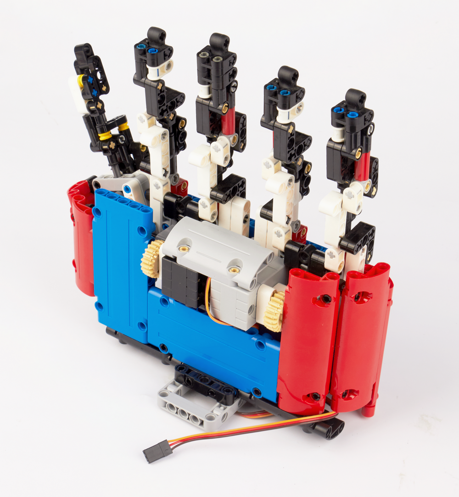


## 与主控板连接方式演示

- 灰色伺服舵机    

  - 针对Robotbit，有S1-S8的舵机接口可以接，

    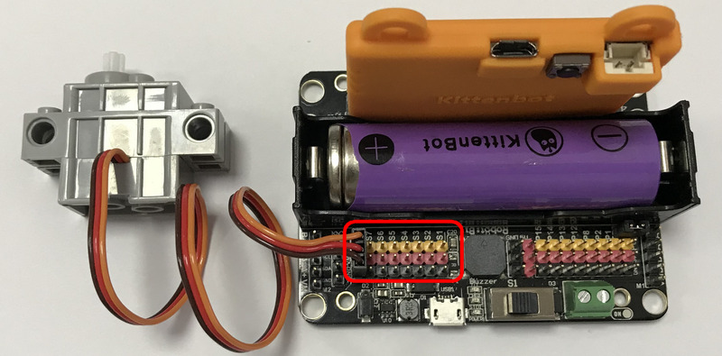

  - 针对Rosbot，所有IO均可接

    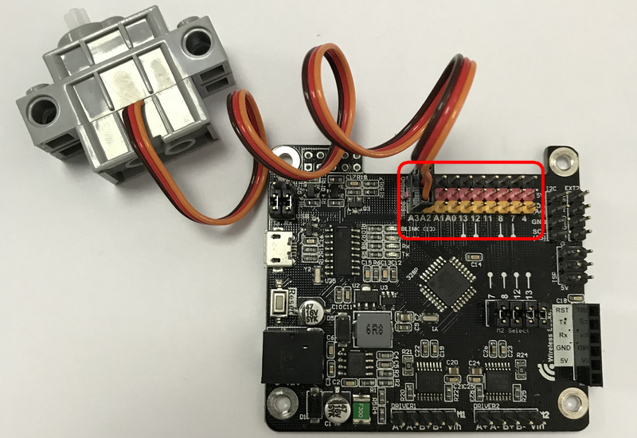

- 红色减速电机    

  - 针对Robotbit，有M1、M2的A+A-、B+B-接口可以接

    

  - 针对Rosbot，有M1、M2的A+A-、B+B-接口可以接  

    

## 图形化编程使用方式   

- Makecode编程方式 

  在喵家产品Robotbit、Powerbrick和Nanobit中都有用到，故我们提供了对应的插件，可以分别加载  
  Robotbit：https://github.com/KittenBot/pxt-robotbit  
  Powerbrick：https://github.com/KittenBot/pxt-powerbrick   
  Nanobit：https://github.com/KittenBot/pxt-nanobit     
  以下以Robotbit为例  

  - 灰色伺服舵机

    舵机相关积木

    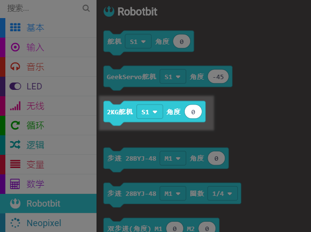

    摆动的程序

    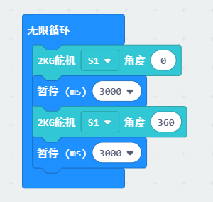  

  - 红色减速电机  

    电机相关积木

    

    转动的程序

    

----------

- Kittenblock中控制方式      

  - 灰色伺服舵机   

    Robotbit(micro：bit)    
    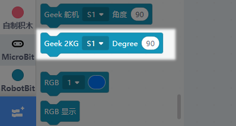  
 
      
    Rosbot/Arduino   
      
    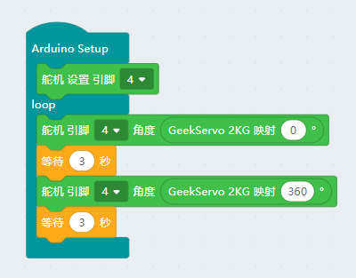  


  - 红色减速电机  

    Robotbit(micro：bit)     
    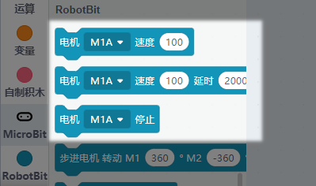   

    Rosbot   
    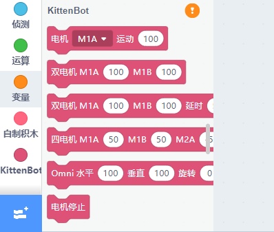 

    Arduino         
    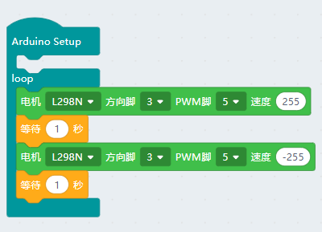 


## 代码编程方式     

新手建议用上一节的Kittenblock图形化编程软件，有一定基础的才推荐使用代码操作。 
以下只对灰色伺服舵机进行讲解，电机的的操作API请参照上述图形化编程转代码 

- 2KG灰色舵机的 角度-脉宽  

  - 0度：500us
  - 90度：1500us 
  - 360度：2500us

__Microbit(micropython)__  

- 使用microbit自带的类中的write_analog(value)可以输出PWM，对应的占空比为0~1023对应0%~100%  

  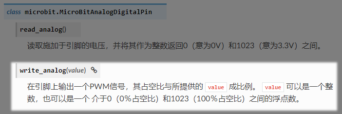 

  根据舵机的控制原理可知舵机的控制一般需要一个20ms左右的时基脉冲，那么从上面给出的角度对应的脉宽时间可有如下计算    
    
  ```python
    import microbit
    microbit.pin1.set_analog_period(20) # 设置PWM信号的周期，默认就是20ms
    pwm = degree * 50 / 9 +500  # degree为你需要的舵机角度，pwm为脉冲宽度
    D = pwm / 20000 # 换算成占空比
    microbit.pin1.write_analog(1023*D) # 以P1脚为例，这样就可以对Geekservo舵机进行比较精准的控制 
  ```

- 使用Robotbit的用户可以直接调用Robotbit库，请先下载喵家定制运行环境的[Mu-edior](https://www.kittenbot.cn/Mu)，后具体转到[Robotbit的API](http://learn.kittenbot.cn/zh_CN/latest/exboards/robotbit/robotbit-API.html)查看


__Arduino(C/C++)__ 

```C++
    int angleMap(int degree){
      return degree * 50 / 9 +500;
    }
```    

另外初始化的时候需要向Arduino声明舵机控制周期为600~2400us，以便重新计算定时器周期。
```C++
	servo.attach(4, 600, 2400);
```

大家可以将下面的代码直接复制到Arduino中并烧录到主板上，注意例子中我们舵机接在4号引脚。
```C++
    #include <Servo.h>

    Servo servo;
    
    int angleMap(int degree){
      return degree * 50 / 9 +500;
    }
    
    void setup() 
    { 
     servo.attach(4, 600, 2400);
    } 
    
    void loop() {
     servo.writeMicroseconds(angleMap(0));
     delay(2000);
     servo.writeMicroseconds(angleMap(90));
     delay(2000);
     servo.writeMicroseconds(angleMap(180));  
     delay(2000); 
    }
```

## 注意事项：   

- 2KG灰色舵机的转动范围：0~-360°，一共是360°，但不是连续转动，举例栗子，从0转动到360°，再从360°转到0是逆着回去的。

- 2KG灰色舵机有严格的线序之分，插接电路板请根据说明指引进行插接   

- 2KG使用过程中禁止长时间堵转，长时间堵转有可能导致电机损坏   
