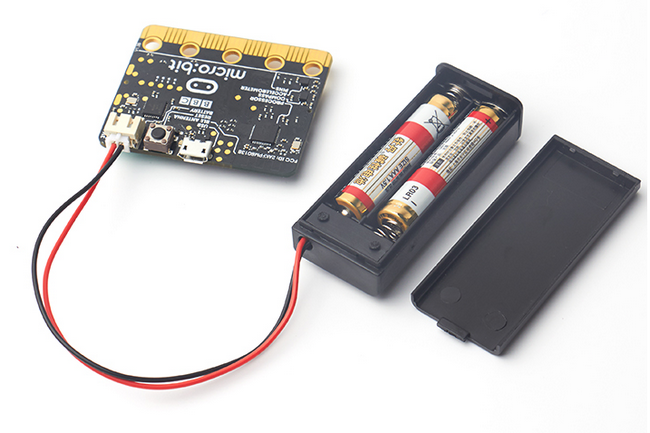

# 2节7号电池盒   

## 购买链接

__转到淘宝购买__----------→[2节7号电池盒](https://item.taobao.com/item.htm?spm=a1z10.3-c-s.w4002-17001215033.41.1df7762exi5M0c&id=561457322929)

## 产品名称：   

2节7号电池盒   

## 适用人群：   

需要给microbit单独供电的使用者  

## 配送清单：   
 
2节7号电池盒 X 1   

   

## 产品简介：   
此款2节7号电池盒带PH2.0端子线，不仅可为micro:bit供电，还可为多种设备提供电源。   

## 产品特色：   
- 兼容micro:bit电源接口    
- 带开关，无需拔插端子头即可断电   
- 带盖子保护，更好的保护电池，防止短路
- 带PH2.0端子线   

## 产品参数：   
- 长x宽x高：63mm x 25.6mm x 15mm   
- 线长：约14cm,红黑线，红正黑负   
- 净重：10.3g   
- 毛重：根据包裹最终大小决定   
- 适用电池规格：AAA 7号电池   
- 适用电池节数：2节   
- 接口：PH 2.0   

## 使用方法：   

   

