# 360度连续舵机  

## 购买链接

__转到淘宝购买__----------→[360度连续舵机 ](https://item.taobao.com/item.htm?spm=a1z10.3-c-s.w4002-21482550023.9.67a2762eim9Mb5&id=591715190337)

## 产品名称：
   
Geekservo 乐高伺服舵机/乐高减速电机   

## 配送清单：   

套餐1：360度舵机x1（不太推荐，因为360舵机一般是成对使用）

套餐2：360度舵机x4   

## 产品简介   
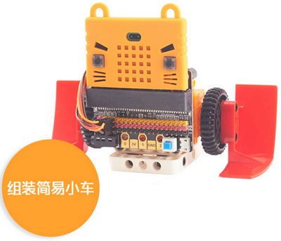   
小喵科技作为研发型的科技公司，一向以开放的心态听取用户意见，综合用户意见后，研发两款性价比高，适配乐高的伺服舵机与减速电机
大家从此可以摒弃，用普通蓝色9g舵机+转接块的方式安装与乐高结合。接口采取常用的2.54接口，可以适配是市面上常用的主控板。舵机控制方式并没有加入小喵家的特殊协议，而是兼容市面上的舵机控制方式协议。小喵是希望以最大的兼容方式，让普通用户也能把这个乐高舵机/电机用到各种DIY中，而不仅仅停留于小喵家的软件。

之前小喵与厂家合作推出了两款乐高相关的电机。本次小喵迎合市场需求，推出了橙色的360度连续舵机。360度连续舵机一般配套无直流电机驱动的电路板如IObit进行使用，当然有电机驱动的电路板也可以使用如Rosbot、Robotbit

## 产品特色   

- 乐高橙
360度连续舵机本质是一个带驱动芯片的直流电机减速箱，只不过它的运动控制方式和速度控制方式是舵机的控制方式。

----------

以下介绍下360连续舵机/乐高伺服舵机/减速电机的特色：   
### 极力齿过载保护   

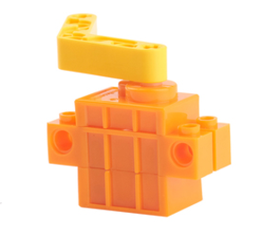
   
一般是市面上常规的9g小舵机坏的原因都在电机上。   
电机坏的原因无非三个：   
1. 电机本质寿命问题   
2. 长时间堵转，电机烧毁    
3. 小熊孩用力扭，把齿轮箱扭坏了。
小喵首先采用了优质的电机，采用优质的电刷材料。另外一方面为了应对后两种情况。在输出轴的最后一级做了极力齿，所谓的极力齿，就是在设定的扭矩范围内，输出轴正常输出。超出最大扭矩后，极力齿就开始工作。用力乱拧输出轴在极力齿的保护下，只会哒哒哒进行跳齿保护。可以防止小熊孩的破坏，所以特别适合青少年编程培训搭建。虽然价格上比蓝色9g小舵机贵，但是实用性，耐用性和寿命上，乐高舵机/电机远超9g小舵机。   
### 兼容性强   
无论是程序还是机械结构乐高搭建上，尽可能做了兼容处理。   

### 控制简单   
乐高舵机采用了常规的脉宽方式控制，并没有加入协议控制。与常规9g小舵机控制方式类似，90°脉宽是1500（与常规小舵机控制方式一样）   

### 体积小巧   
在乐高Technical体系中，似乎不再往体积小的规格发展，并且电动机上都以可测转速的减速直流电机为主。体系中缺少小巧实用的动力电机，而这款Geekservo正好能满足 

### 安装方式灵活   
兼容Technical系列安装方式与普通乐高砖块安装方式。

### 自带十字输出轴   
输出抽直接采取十字轴安装方式   

## 产品参数   

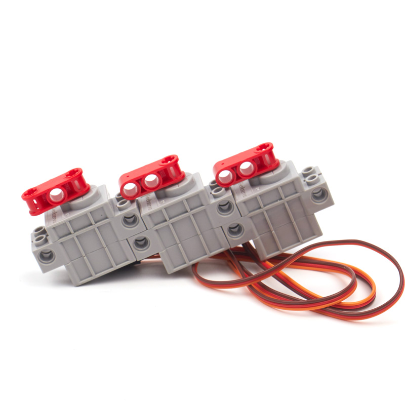

### 360度舵机参数规格   
- 工作电压：3.3V~6V
- 额定电压：4.8V   
- 额定电流：200ma   
- 堵转电流：700ma   
- 打滑电流：450ma   
- 最大扭矩：500g.cm   
- 最高转速：70rpm（3V供电情况下）  
- 净重：12.8g（单个）
   
### 伺服舵机参数规格   
- 工作电压：3.3V~6V
- 额定电压：4.8V   
- 额定电流：200ma   
- 堵转电流：700ma   
- 打滑电流：450ma   
- 最大扭矩：500g.cm   
- 角度转速：60°/0.12s   
- 净重：12.8g（单个）

### 减速电机规格   
- 工作电压：3.3V~6V
- 额定电压：4.8V   
- 额定电流：200ma   
- 堵转电流：700ma   
- 打滑电流：450ma   
- 最大扭矩：500g.cm   
- 最高转速：70rpm（3V供电情况下）   
- 净重：12.4g（单个）   
 
点评：减速电机速度较慢，体积小但扭矩一点都不小，适合简单入门的小制作，小喵后期会推出速度更快的直流牙箱   

## 尺寸规格   
- 长度：五个乐高孔电源8x5=40mm   
- 宽度：两个乐高宽度单元8x2=16mm   
- 高度：三个乐高高度单元3.2x3=9.6mm   
- 基础孔位：直径4.8   
- 输出轴：带极力齿乐高十字轴   
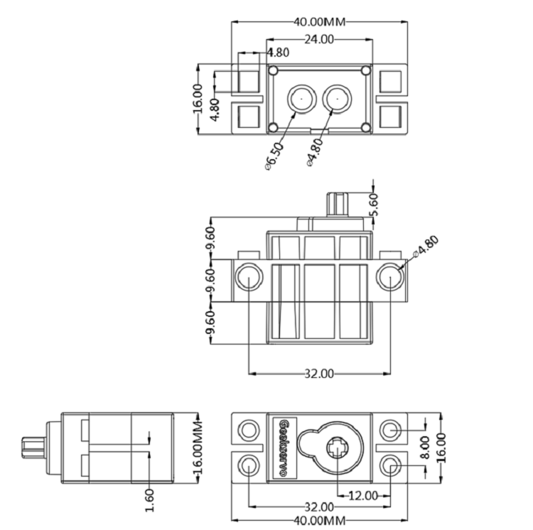

## 360度连续舵机/伺服舵机线序   
常规舵机线序
- 红接正极
- 棕接负极
- 黄接数据引脚（控制引脚）

## 减速电机线序   
红接正极
黑接负极（实际并没有正负）   

## 机械安装方式  

以灰色舵机为例（三种电机的结构是一样的，只是颜色和内部电路板有差异）

### 与颗粒乐高安装   
底部安装   

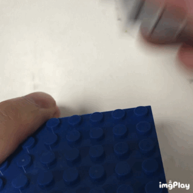   

侧边法兰下安装   

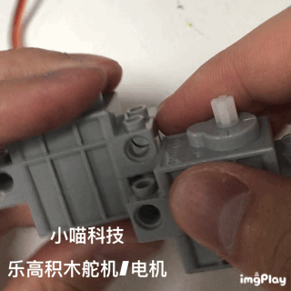   

侧边法兰上安装   

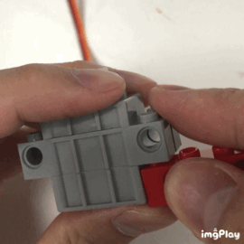   

### 与Technical乐高安装

侧孔安装   

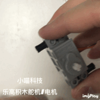   

底孔安装   

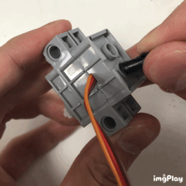   

输出轴安装   

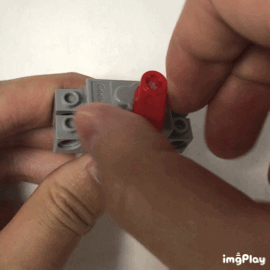

## 与主控板连接方式

### IObit

IObit常规使用，IO口可以0~16引脚（19，20是没有反应的）

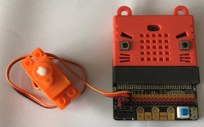

IObit特殊应用，按照常规用VCC那边的电压是3.3V，电机的力气也就限制在3.3V。如果按照以下接法，外部接口提供5V电源，然后这个舵机的电压就是5V，力气就会明显大点。

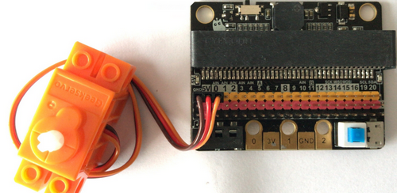

**直接接在IO口上，用Makecode——引脚——伺服积木块进行控制。**

### IObit控制360舵机程序

180度为最大速度正转，0度为最小速度反转。90度即为停止。

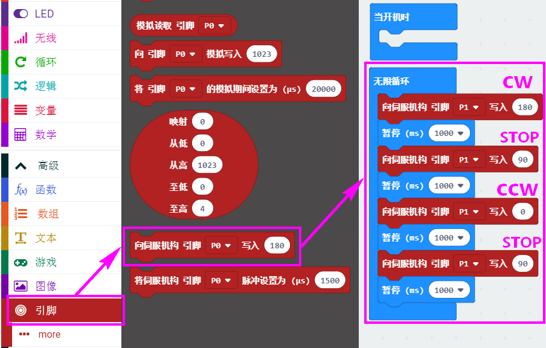

### Robotbit

Robotbit接360舵机有两种接法：

接法1：可以直接接在舵机接口上，**用Robotbit插件中的舵机积木块进行控制**。

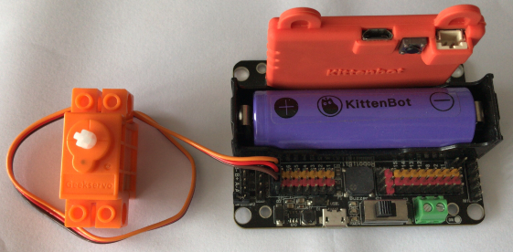

接法2：可以直接接在普通IO接口上，**用Makecode——引脚——伺服积木块进行控制**。

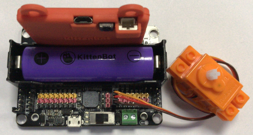

### Robotbit控制360舵机程序

接法1对应程序：

舵机是接到专用舵机接口（S1-S8，以下程序是接到S1上），180度为最大速度正转，0度为最小速度反转。90度即为停止。

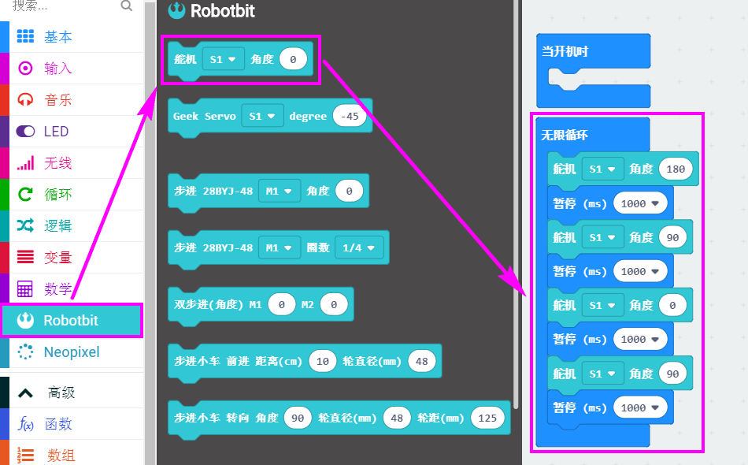

接法2对应程序：

舵机是接到普通IO口中，180度为最大速度正转，0度为最小速度反转。90度即为停止。

### Rosbot/Arduino

接在Rosbot上当普通舵机进行使用，当然你接在Arduino上也是一样的。

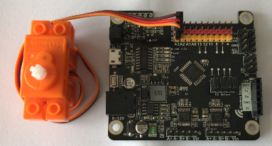

### Rosbot/Arduino控制360舵机程序

在kittenbot中分栏（只要是UNO内核，都可以用Kittenbot分栏）

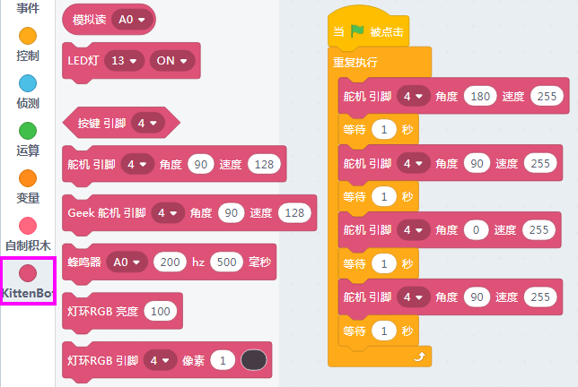

在Arduino中分栏

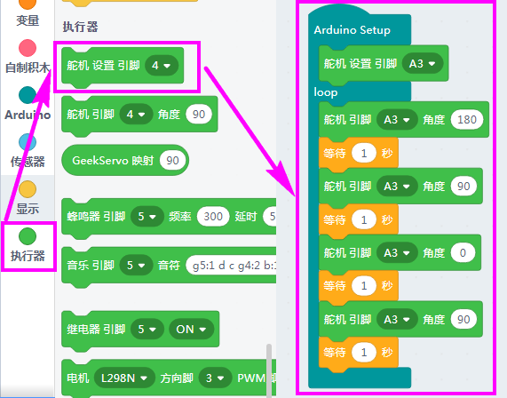

## 注意事项：   

geekservo舵机有严格的线序之分，插接电路板请根据说明指引进行插接   

geekservo使用过程中禁止长时间堵转，长时间堵转有可能导致电机损坏   
