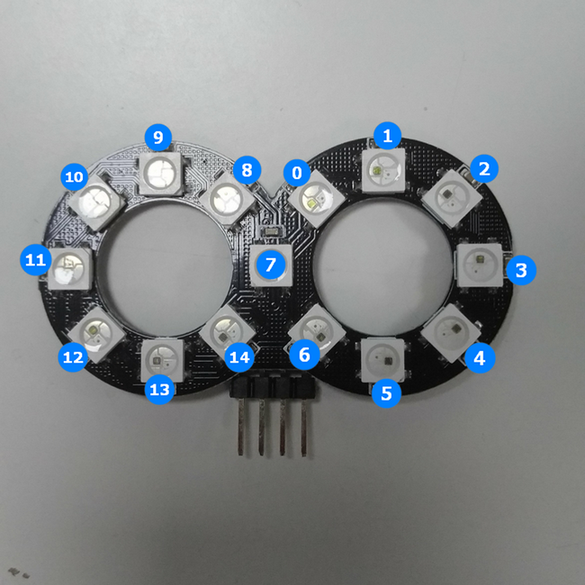
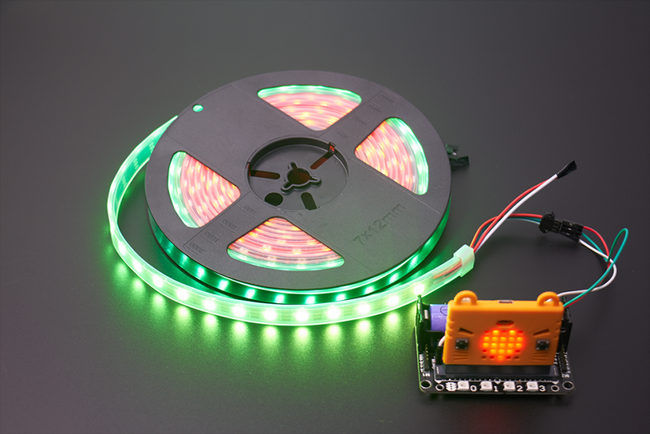
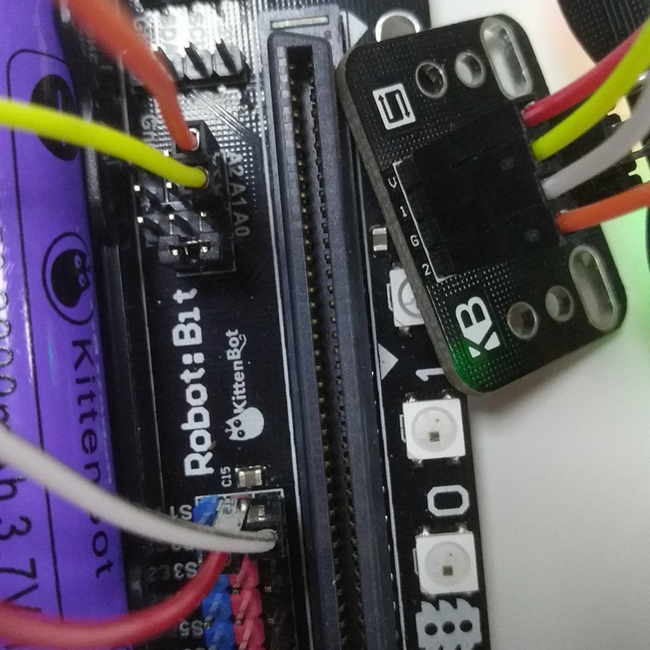
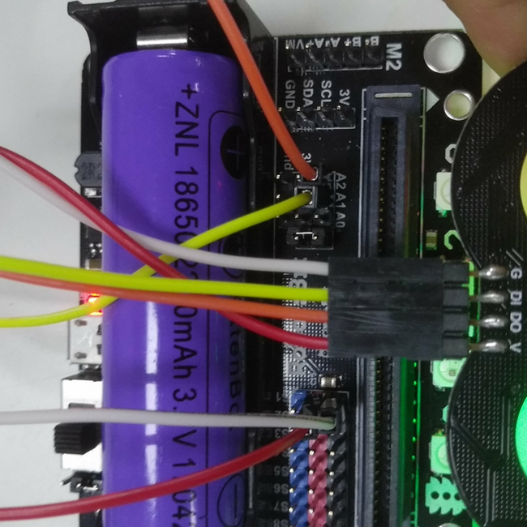
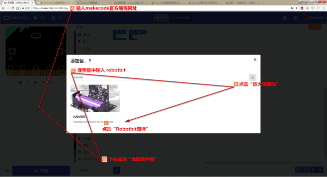
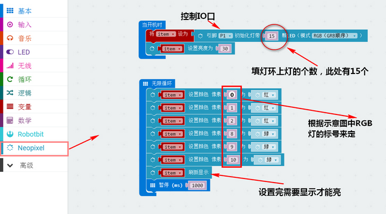
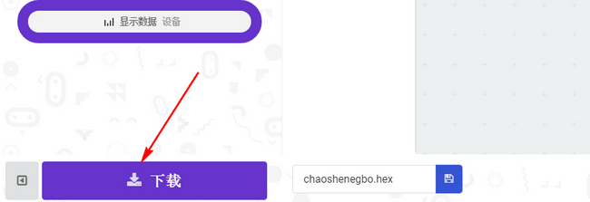
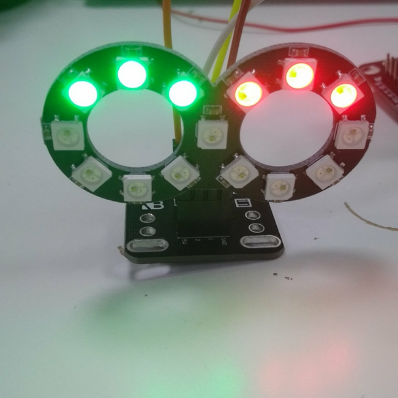

# 8字灯环

## 购买链接

__转到淘宝购买__----------→[8字灯环](https://item.taobao.com/item.htm?spm=a1z10.3-c-s.w4002-17001215033.23.5803762e2zN2MZ&id=559762805967)

## 产品名称

8字灯环，8字这个前缀顾名思义是形容灯环的外形酷似数字8，其RGB灯亮起来时具有绚丽色彩的同时，其外形也为众多diy爱好者所亲睐

## 适用人群

拥有Rosbot和Robotbit拓展版的并且想要做一些有趣的机器人diy爱好者。

## 8字灯环示意图

下面是八字灯环的引脚介绍以及RGB灯的编号  

 

  

## 灯条示意图 

灯条展现出的是充满了diy气息的装饰气氛  

  

## 产品简介

八字灯环是一款由基于ws2812的15位RGB灯构成，首先在外围电路上仅使用一颗电容就能够满足电路需求，这使得电路在最大程度上变得美观。其次该模块使用单线通讯，为diy节省更多io口的同时能够让你在最快的时间内实现RGB灯的绚丽效果，用于diy是很好的选择。

## 产品特色

- 基于图形化编程使用方便
- 单线通讯
- 绚丽夺目
- 性价比高

## 产品参数

长x宽x高：57mm x 40mm x 8mm

净重：4.7g

毛重：根据包裹最终大小决定

## 技术参数

- 工作电压：5V
- 单线通讯
- 驱动芯片：WS2812B
- 工艺：焊接/贴片

## 8字灯环接线  

**有转接板的接线方法:**  
	    
robotbit——转接板  

- 3V——V  
- P1——1  
- Gnd——G  
- P2——2   

  
**直接接线方法:**  

robotbit——8字灯环  

- 5V——V
- P1——DI
- Gnd——G
- P2——DO(单个灯环的话可以不接这里)   

   

## 使用环境 

- Kittenblock(基于Scratch3.0)/Makecode可连接硬件：Microbit&Robotbit
- Arduino：Rosbot主控板

## 使用方法

- 编程方式：Kittenblock(基于Scratch3.0)/Arduino/Makecode
- 兼容硬件（配合硬件，或者配套什么使用）：microbit+robotbit拓展板
- 小喵教程集合地址：learn.kittenbot.cn
- 小喵论坛地址：kittenbot.cn/bbs
- 网易云课堂：搜索小喵科技
- 更多的实时讨论，请加入爱上小喵科技官方Q群：568084773
使用小喵科技离线版makecode的如下添加robotbit软件包   

  

使用官方在线版makecode的如下添加robotbit软件包  
 
   

根据编码设置像素位置点亮想要的位置  
 
  

**下载**  

  
     
## 8字灯环效果展示
使用以上示例得到的结果如下  
  
   

## 注意事项 
    
- 检查接线是否正确   
- Robotbit板子电源开关一定要打开   
  
如果以上都不能解决问题，请联系小喵科技，热诚为你服务  