# SD无线模块（喵比特专用）

## 简介

SD无线模块是喵家主要针对喵比特编程主控板推出的无线模块，无线模块形状酷似一张SD卡，所以命名为SD无线模块。此无线模块主要用于2.4G、蓝牙通讯。喵比特可以通过此无线模块与Microbit之间进行2.4G通讯或者与手机、电脑之间进行蓝牙通讯。

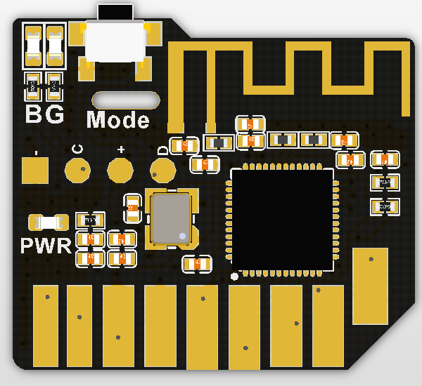

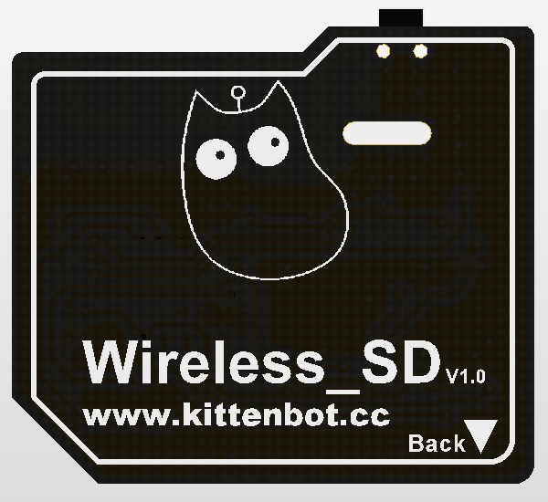

## 技术参数

主控芯片：nRF51822  ARM Cortex-M0

时钟频率：16Mhz

板子尺寸：24x21X3mm

重量：1.4g 

通讯最大距离：10m

供电方式：3.3V

无线通讯：2.4G和蓝牙2.4G

无线状态灯（绿色为2.4G模式、蓝色为蓝牙模式）

模式切换按键

SD卡金手指接口，引脚接口排布兼容SD卡

## 特色

可以插到喵比特的SD卡槽上，作为无线通讯模块进行通讯。不仅可以实现喵比特与喵比特之间的通讯，还能实现喵比特与Microbit之间的2.4G无线通讯

## 编程平台

https://arcade.makecode.com/

SD无线模块作为喵比特的无线通讯模块进行使用，所以暂时只能用在Arcade平台上。

插件地址：https://github.com/KittenBot/pxt-sdwireless

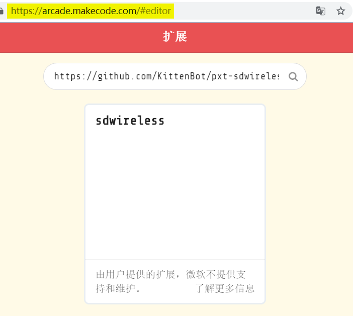

插件成功加载：

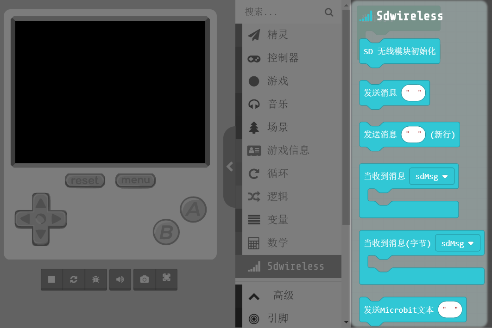

积木情况简介：

积木的具体使用可看本文文末的使用说明

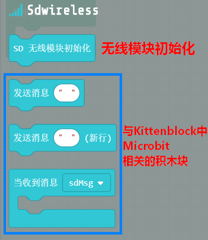

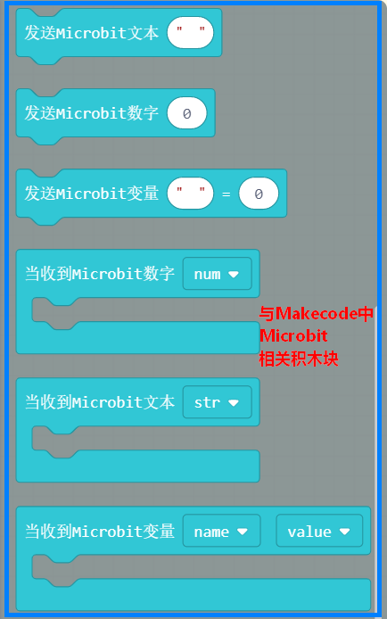

## 具体使用

### 插上SD无线模块

SD无线模块安装要注意方向，如图所示，要把模块插到底

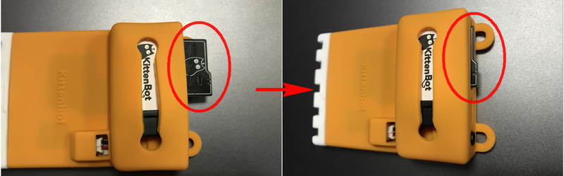

### 插上喵比特USB数据线

插上数据线后，SD无线模块的绿灯会亮起来，它的初始化状态为2.4G模式

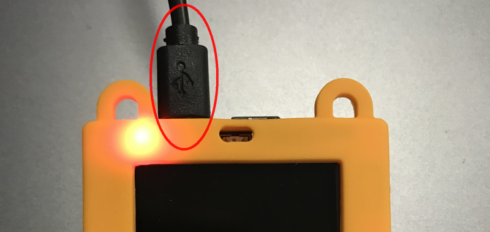

### 编写喵比特程序

打开Arcade平台：https://arcade.makecode.com/

加载SD模块插件：https://github.com/KittenBot/pxt-sdwireless

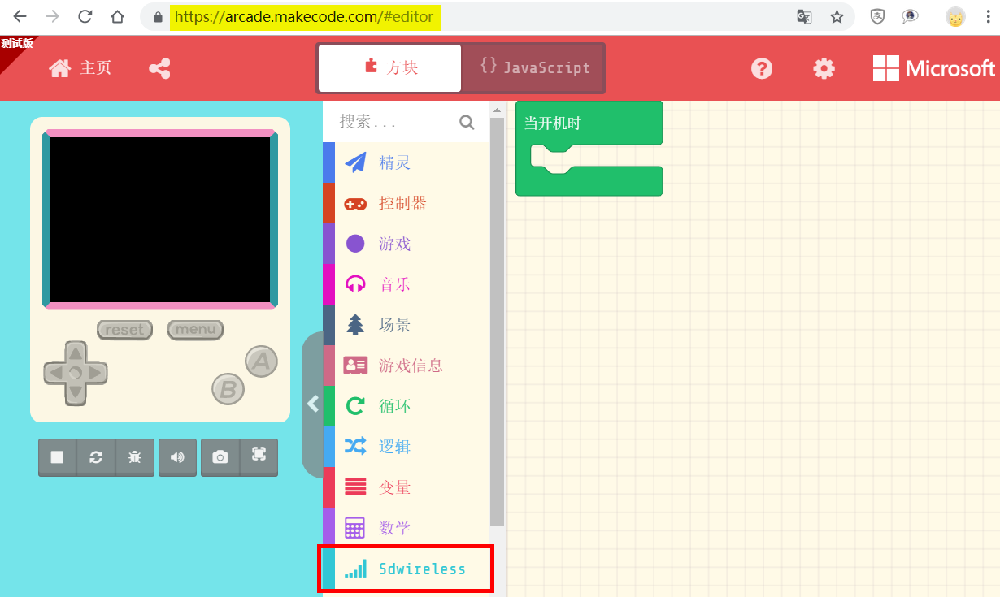

编写程序下载到喵比特板子上

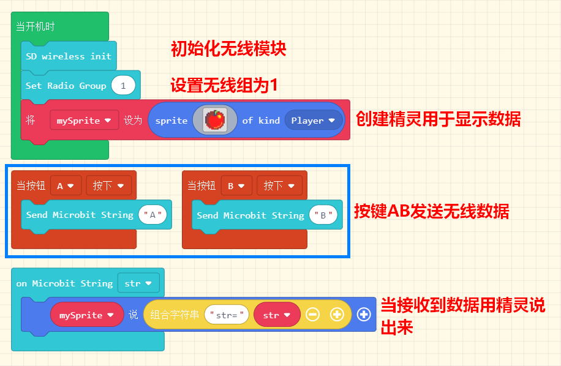

### 编写Microbit程序

编写常规的Microbit2.4g程序，注意无线组设置与喵比特无线组设置应为同一组，即数字应为相同。

编写下载到Microbit板子上

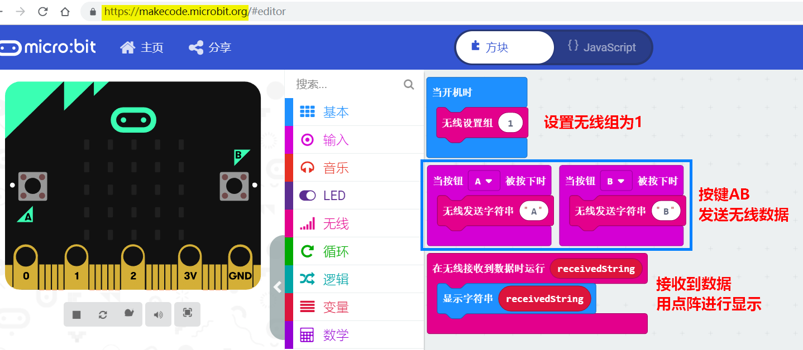

### 实验测试

最后实验现象如下：

待补充...

