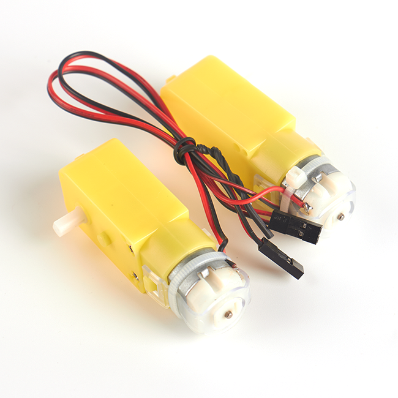
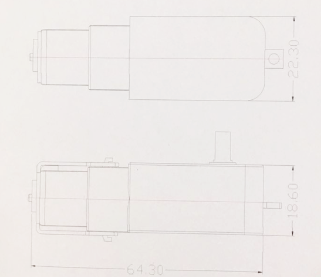

# TT减速直流电机   

## 购买链接

__转到淘宝购买__----------→[TT减速直流电机](https://item.taobao.com/item.htm?spm=a1z10.3-c-s.w4002-17001215033.35.1170762ey89wOL&id=558693739545)

## 产品名称：   

TT减速直流电机   

## 适用人群：   

大学生学生/培训机构/DIY爱好者   

## 配送清单：   

TT电机 X 1   

   

## 产品简介：   
此TT电机为直流减速电机可用于有速度要求和扭矩要求的DIY场景，可调速，可实现正反转，低噪音。用于安装Kittenbot小车套件以及多种智能小车等设备,性价比高。   

## 产品特色：   
- 支持Kittenblock图形化积木块编程   
- 电流较市面上常规电机的电流小   
- 支持正转反转   
- 马达齿不易打滑   

## 产品参数：
长 x 宽 x 高：70.15mm x 22.33mm x 18.53mm   

净重：30.1g   

毛重：根据包裹最终大小决定   

   

## 技术参数   

工作电压：5V DC   

空载转速：200rpm±10%   

齿轮比：1比48   

## 使用实物图   
   
