# 喵家蓝牙适配器4.0   

## 产品名称：   
蓝牙适配器4.0   

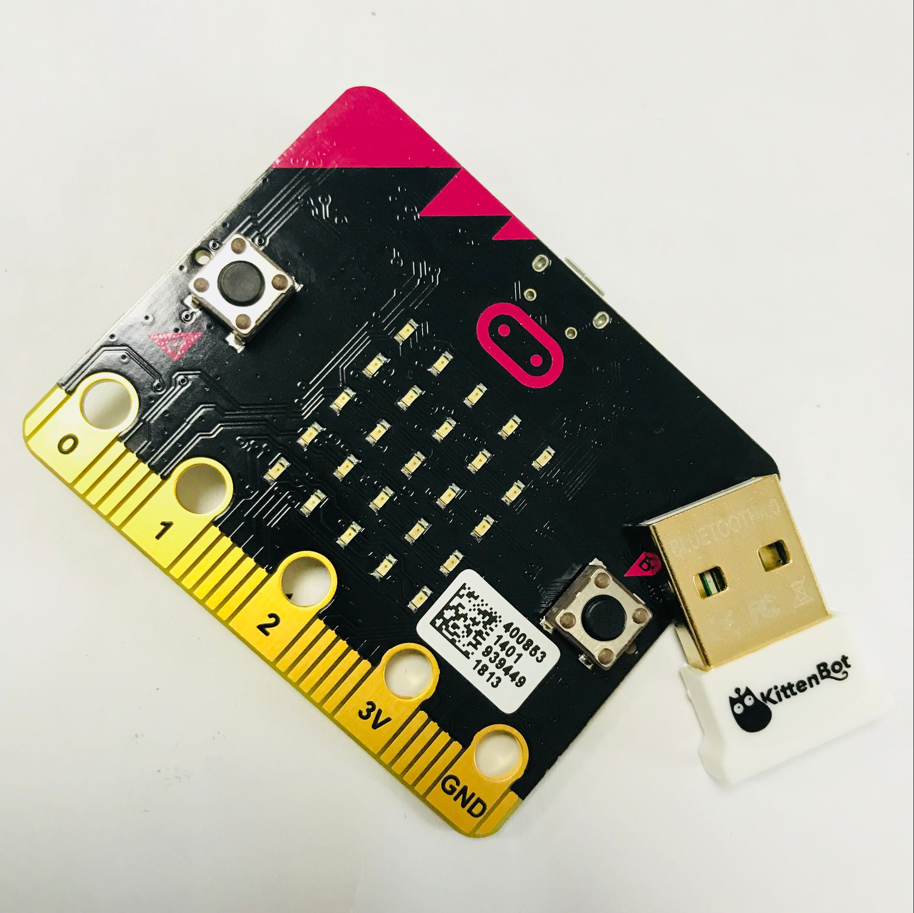   

适用人群：Microbit拥有者   

## 配送清单：   
蓝牙适配器4.0 X1   

## 产品简介：   
此蓝牙适配器是用于电脑上，usb蓝牙4.0适配器。   
它可实现电脑与其他具有蓝牙协议的设备连接。如Microbit、手机等等

## 产品特色：   
- 支持Microbit的蓝牙通讯（稍后等待MIT开放下载接口，现在暂时只能做到PC端与Microbit端通讯）   
- 乐高的EV3蓝牙通讯(稍后等MIT开放接口，理论上是支持的)   
- 标准蓝牙4.0规范，双模式传输，向下兼容蓝牙2.0、2.1、3.0规范   
- 双模低功耗，低延迟，极速连接灯。   

## 产品参数：   
- 传输距离：10米（无阻隔）    
- 传输速率：3Mbps，支持文件、音频高速传输   
- 支持系统：window xp、win7、win8、win10   
- 长x宽x高：2cmx1.5cmx0.6cm   
- 净重：15g   
- 毛重：根据包裹最终大小决定   

## 技术参数：   
- 工作电压：5V DC   
- 待机电流：0.4uA（当被连接时）   
- 工作电流：22mA（具体根据工作模式）   
- 工作环境要求：-20°C——+70°C   
- 工作湿度要求：10%——90%   
- 技术认证：RoHS、CE、FCC、BQB   

## 使用环境：
编程方式：Kittenblock(基于Scratch3.0)/Makecode   
可连接硬件：Microbit   

## 具体使用方法：
### 喵家蓝牙设备器插上电脑
会提示你安装新硬件，确认安装即可。   
如果没有提示安装硬件，这个也没有关系。（因为下一步我们要用其他驱动来替换这个驱动）   

### 替换驱动
下载此[zadig-2.4](https://bbs.kittenbot.cn/forum.php?mod=attachment&aid=Mjg0MnwyNWU1NDU5MXwxNTU2MDc1MzQ0fDN8NTc1)工具   
如果你电脑安装了杀毒软件，杀毒软件会将它识别为病毒...你记得找回来，或者下载前先关闭杀毒软件。

### 设置更新驱动
下载完成后，解压，双击打开   
   
打开后的界面如图   
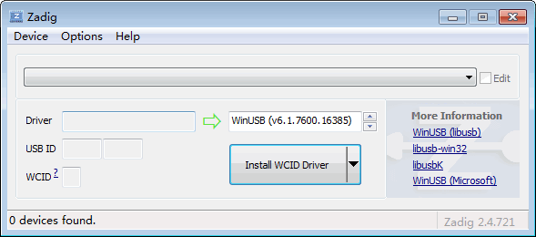   
选择Options——List ALL Devives   
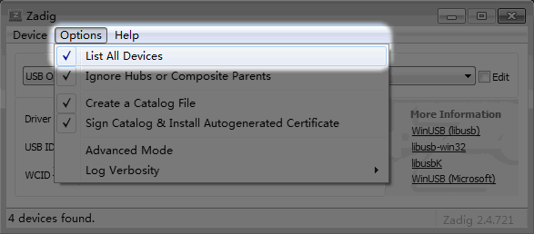   

在中间的下拉栏找到我们的喵家特色蓝牙设备器CSR8510...，它对应的USB ID一定是**0A12 0001**   

不要选错

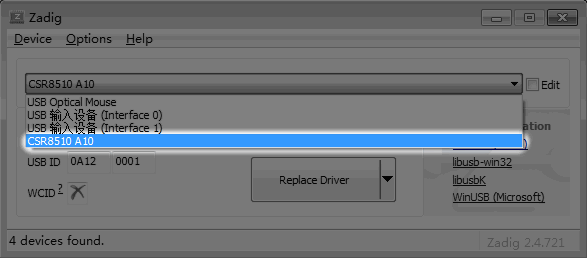   
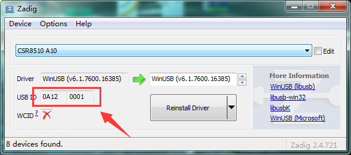   

之后点击Install Driver就行了，静静等待它自动完成。   
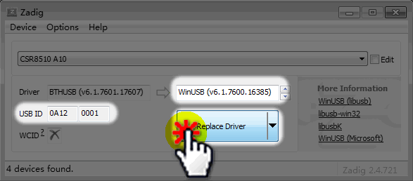   

这个驱动安装只需要做一遍，如果后面你蓝牙设备更换usb口，有可能windows又安装成官方的驱动。
不用担心，只需要重复上面步骤即可。   

## Kittenblock内使用

## 软件中启动蓝牙功能

Kittenblock中的蓝牙功能默认是不启动，需要用户在小齿轮设置中，自主启动！(大部分用户经常忘记启动蓝牙)

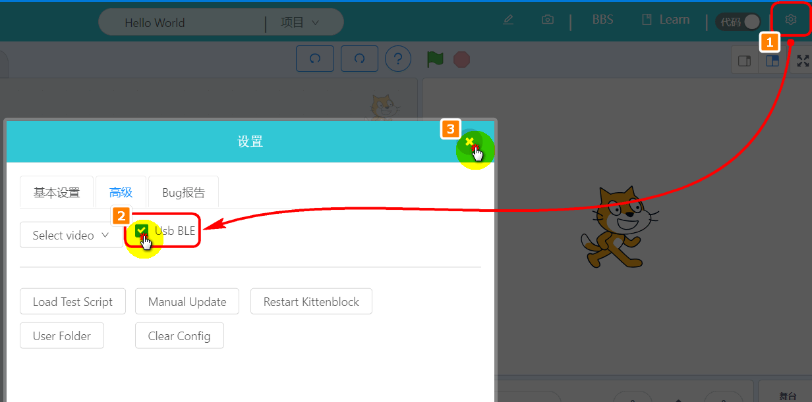

### 给Microbit通电

打开Robotbit电源，可给Microbit供电。或者插上USB给Microbit供电

### 打开Kittenblock

(1.78或以上版本)，选择硬件Microbit Python-ble（如果你是能量魔块，你就选Powerbrick-ble）

ble!

ble!

ble!

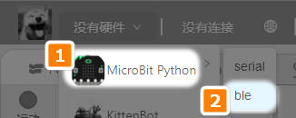

### 恢复固件

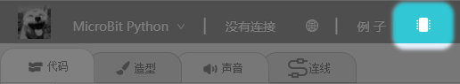

成功刷入后，Microbit显示一串英文，这串英文其实就是这块Microbit的蓝牙ID，如果你有多块板子，这个ID就是用来区分的。

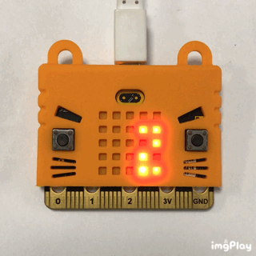

### 搜索蓝牙连接

如果搜索不出来，请检查：1、蓝牙驱动是否正确安装。2、Microbit是否正确恢复了固件。

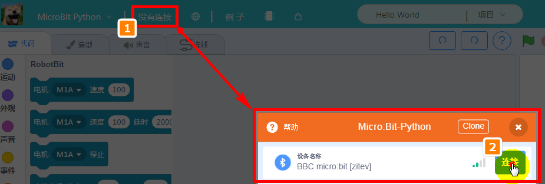

### 连接成功

关闭窗口。

一旦蓝牙连接上后，Microbit点阵屏就会显示一个红心

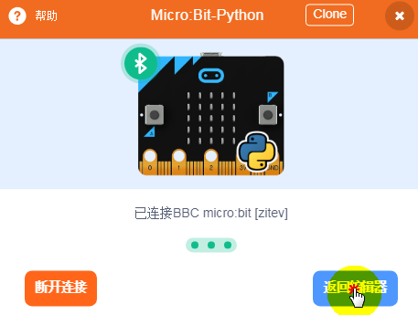

连接上后可以试试拖动一些方块到工作区，点击看看效果~

## 视频演示

[这里给大家录制了一个视频操作，如果对以上操作有疑问，可以戳我看看](https://www.bilibili.com/video/av46253904)

## 产品详细的学习资料地址：   
http://learn.kittenbot.cn/zh_CN/latest/electronics/USB%E8%93%9D%E7%89%99%E9%80%82%E9%85%8D%E5%99%A8.html

## 其他教程   
小喵教程集合地址：learn.kittenbot.cn   
小喵论坛地址：kittenbot.cn/bbs   
网易云课堂：搜索小喵科技   
更多的实时讨论，请加入爱上小喵科技官方Q群（淘宝不支持放Q群号，具体请向客服索要）   

## 注意事项：
- 在使用Kittenblock与喵家usb蓝牙适配器的过程中，请勿随意把掉usb蓝牙适配器，拔掉会导致Kittenblock软件程序崩溃。   正确做法是，先保存程序后，关闭软件后再拔掉蓝牙适配器。

- 当在软件中启动了蓝牙功能后，强烈建议电脑调成不休眠状态，否则电脑休眠会使软件崩溃蓝屏。（因为蓝牙线程问题）

本产品只适用于14岁以上的儿童进行独立使用，8~14岁儿童请在家长或者老师的陪同下进行使用。   

如使用前请按照小喵官方资料指导下进行使用，不要随便接插电路   

注意不要在金属表面，或者导电的物体上使用，以免短路   

请避免在潮湿和有水的地方使用，以免短路   

电路板或者机械上含有细小物件请不要吞食，请放在儿童接触不到的地方妥善保管   

