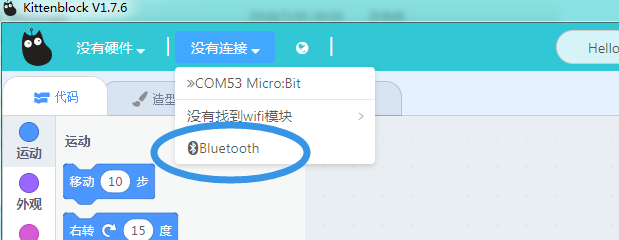
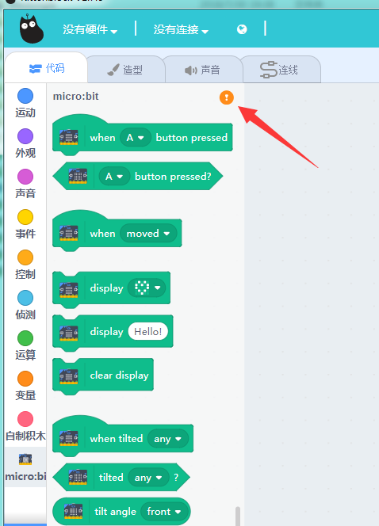
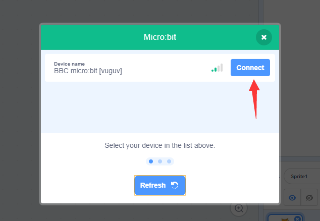

# 产品名称：蓝牙适配器4.0   

图片后面再补   

适用人群：Microbit拥有者、EV3拥有者   

## 配送清单：   
蓝牙适配器4.0 X1   

## 产品简介：   
此蓝牙适配器是用于电脑上，usb蓝牙4.0适配器。   
它可实现电脑与其他具有蓝牙协议的设备连接。如Microbit，Ev3主控、手机等等

## 产品特色：   
- 支持Microbit的蓝牙通讯下载、乐高的EV3蓝牙通讯下载   
- 标准蓝牙4.0规范，双模式传输，向下兼容蓝牙2.0、2.1、3.0规范   
- 双模低功耗，低延迟，极速连接灯。   

## 产品参数：   
- 传输距离：10米（无阻隔）    
- 传输速率：3Mbps，支持文件、音频高速传输   
- 支持系统：window xp、win7、win8、win10   
- 长x宽x高：2cmx1.5cmx0.6cm   
- 净重：5g   
- 毛重：根据包裹最终大小决定   

## 技术参数：   
- 工作电压：5V DC   
- 待机电流：0.4uA（当被连接时）   
- 工作电流：22mA（具体根据工作模式）   
- 工作环境要求：-20°C——+70°C   
- 工作湿度要求：10%——90%   
- 技术认证：RoHS、CE、FCC、BQB   

## 使用环境：
编程方式：Kittenblock(基于Scratch3.0)/Makecode   
可连接硬件：Microbit、EV3主机    

## 具体使用方法：
Dongle插上电脑本身会自动安装一个官方的驱动程序，但是这个驱动程序并不是我们需要的，我们需要替换成libusb兼容的过滤驱动。
### 安装过滤驱动程序
前往 [https://zadig.akeo.ie/](https://zadig.akeo.ie/) 下载最新的Zadig工具，它可以把usb设备替换成libusb兼容的驱动。

在中间的下拉栏找到我们的usb dongle，注意USB ID一定是**0A12 0001**不然有可能把你的鼠标或键盘换成过滤驱动就用不了了。

之后点击Install Driver就行了，静静等待它自动完成。
这个过程只需要做一遍，如果更换usb端口后有可能windows又安装成官方的驱动，只需要重复上面步骤换成过滤驱动就行了。

### 刷入MIT官方的microbit固件

点击下面地址下载hex固件，并将其复制到microbit的u盘盘符上。
[http://cdn.kittenbot.cn/microbit/scratch-microbit-1.0.hex](http://cdn.kittenbot.cn/microbit/scratch-microbit-1.0.hex)

该固件由MIT官方开发，目前还没有开源。大家可以前往[https://scratch.mit.edu/microbit](https://scratch.mit.edu/microbit)查看最新更新情况。

### Kittenblock内使用
打开最新的Kittenblock (1.76+)
如果驱动安装正确并插着电脑上，我们在通信接口下可以找到蓝牙dongle设备。
注意蓝牙跟usb或wifi不一样，不需要先点击连接，而是交给不同的插件去连接。具体看后面描述~

在Kittenblock左下角打开扩展插件，并在弹出的窗口中找到Micro:bit插件。这个插件由MIT官方提供和开发，我们只是在kittenblock内部对接了蓝牙dongle设备。

加载插件后在插件顶端找到硬件连接按钮

点击打开microbit设备搜索框，如果找不到microbit请点击刷新，前提是一定要刷MIT官方提供的microbit固件。

连接上后可以试试拖动一些方块到工作区看看效果~

## 产品详细的学习资料地址：   

## 其他教程   
小喵教程集合地址：learn.kittenbot.cn
小喵论坛地址：kittenbot.cn/bbs
网易云课堂：搜索小喵科技
更多的实时讨论，请加入爱上小喵科技官方Qqun（淘宝不支持Qqun，具体请向客服索要）

## 注意事项：
本产品只适用于14岁以上的儿童进行独立使用，8~14岁儿童请在家长或者老师的陪同下进行使用。
如使用前请按照小喵官方资料指导下进行使用，不要随便接插电路
注意不要在金属表面，或者导电的物体上使用，以免短路
请避免在潮湿和有水的地方使用，以免短路
电路板或者机械上含有细小物件请不要吞食，请放在儿童接触不到的地方妥善保管