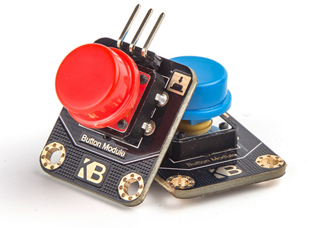

# Kittenbot按键模块

## 购买链接

__转到淘宝购买__----------→[红蓝按钮](https://item.taobao.com/item.htm?spm=a1z10.3-c-s.w4002-17001215033.30.4d38762ecmTQrB&id=555317774482)

## 产品名称

Kittenbot按键模块

## 适用人群

想要做一些控制类的应用案例的diy使用者，同时也适用于培训机构做编程入门案例

## 配送清单

按键模块（红/蓝） x1

## 红蓝按扭示意图

  

## 产品简介

按钮是一款常见电子模块，其主要作用是开关和一些电路控制。这款红蓝按钮设计外观干净大方，触感有弹性，适合用于多种颜值要求较高的DIY设计

## 产品特色

- 美观大方
- 按钮盖子可更换
- 触感好有弹性

## 产品参数

长x宽x高：30mm x 21mm x 15mm

净重：3.1g

毛重：根据包裹最终大小决定

## 技术参数

- 接线S脚接IO口提供‘0’、‘1’的TT电平信号
- 使用需要软件上拉

## 注意事项

- 抬起为1、按下为0  

如果以上都不能解决问题，请联系小喵科技，热诚为你服务