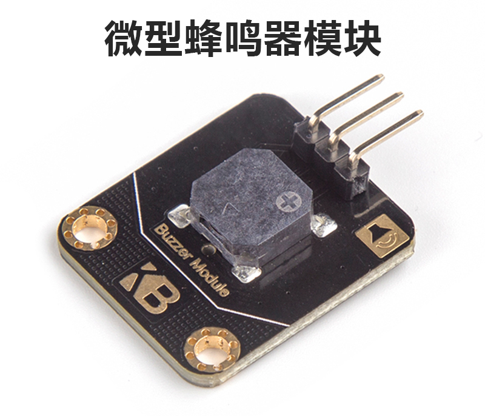

# 蜂鸣器说明

## 购买链接

__转到淘宝购买__----------→[无源蜂鸣器模块](https://item.taobao.com/item.htm?spm=a1z10.3-c-s.w4002-17001215033.84.4d38762ecmTQrB&id=555197212166)

## 产品名称

蜂鸣器模块

## 适用人群

可用于培训机构作为蜂鸣器原理入门案例，同时也适用于diy爱好者为自己的设计加上有趣的旋律。

## 配送清单

蜂鸣器模块 x1

## 蜂鸣器示意图

  

## 产品简介

这是一款微型无源蜂鸣器，有三个接口分别为电源，地，信号源。它不需要交流信号，其内部有一个压电和驱动电路使其能够在2KHz范围内振动。可以用这个模块去创造好听又简单的旋律。

## 产品特色

- 小巧
- 发声频率广

## 产品参数

长x宽x高：30mm x 21mm x 7mm

净重：2.3g

毛重：根据包裹最终大小决定

## 技术参数

- 电压：3~5V
- 端口：数字量电平

