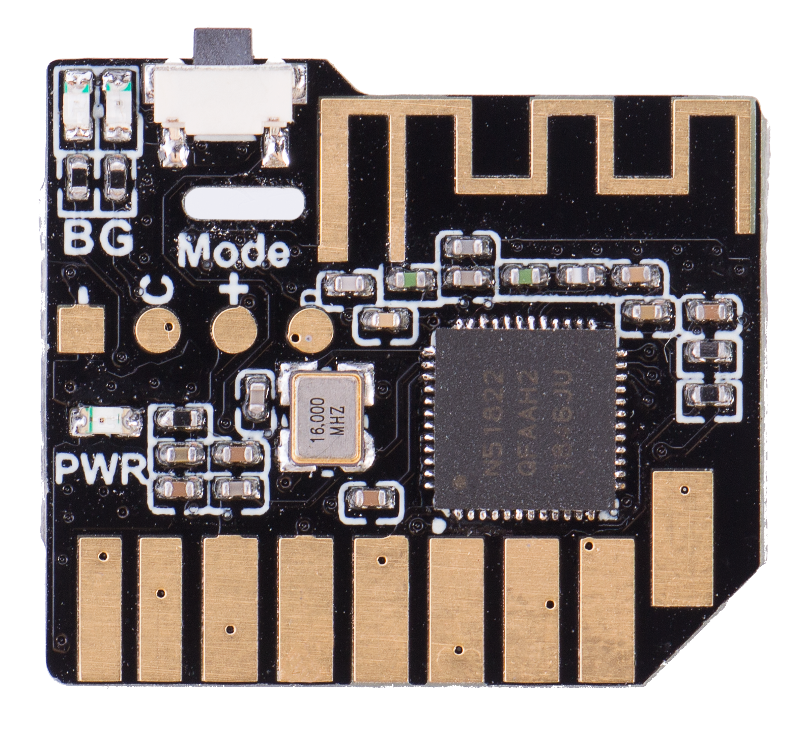

电子产品/配件
====================

这里包含了喵家几乎所有在售电子零件模块等的基本参数和使用说明 

正在调整图文对应的...

.. toctree::
    :maxdepth: 1
    :glob:
    :hidden:

    SD无线模块
    Geekservo
    2KG
    乐高积木风扇
    麦克纳姆轮子
    萌熊MP3模块.md
    贱鼠LED矩阵屏.md
    猫头超声波.md
    8字灯环灯条.md
    柔性屏8x32&16x16.md
    五路巡线模块.md
    USB蓝牙适配器.md
    灯条.md
    ps2.md
    万向轮.md
    铝合底盘.md
    全向轮.md
    巡线黑胶带.md
    2节7号电池盒.md
    TT电机.md
    9g舵机.md
    25电机.md
    28BYJ-48步进电机.md
    30cm长USB数据线.md
    18650可充电锂电池.md
    18650锂电池组.md
    18650锂电池组充电器.md
    红外接收器.md
    乐高转杜邦数据线.md
    橡胶轮.md   
    鳄鱼夹连接线.md
    十字螺丝刀.md
    wifi/index
    转接板.md
    fengmingqi.md
    button.md
    18650充电电池座.md

==================  ==================  =====================
|SDBle|_                |macWheel|_         |GPS|_
------------------  ------------------  ---------------------
`SDBle`_                `macWheel`_         `GPS`_
------------------  ------------------  ---------------------
|MPR121|_              |Lora+GPS|_      |Standard+Max30102|_
------------------  ------------------  ---------------------
`MPR121`_              `Lora+GPS`_      `Standard+Max30102`_
==================  ==================  =====================

.. _SDBle: ./SD无线模块.html

.. |macWheel| image:: ./images/mac.png
.. _macWheel: ./麦克纳姆轮子.html

.. |SIM800L| image:: ./_static/SIM02.png
.. _SIM800L: ./introduction/sim02.html

.. |GPS| image:: ./_static/GPS3.png
.. _GPS: ./introduction/gps8m03.html

.. |Lora+GPS| image:: ./_static/s76g05.png
.. _Lora+GPS: ./introduction/s76g05.html

.. |Standard+Max30102| image:: ./_static/std11.png
.. _Standard+Max30102: ./introduction/sg06.html

