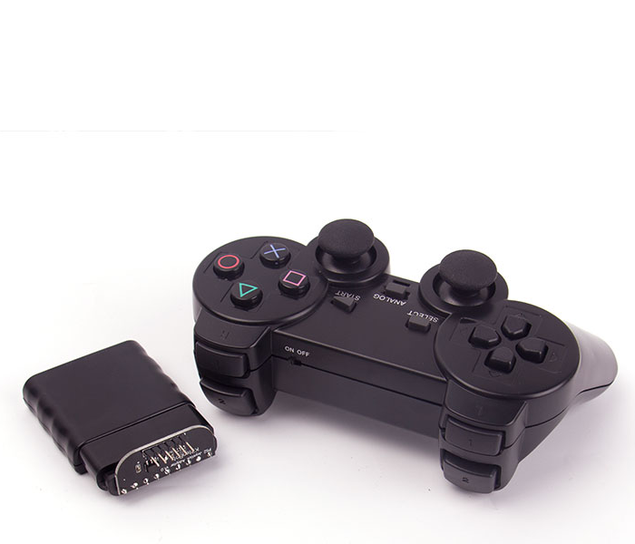
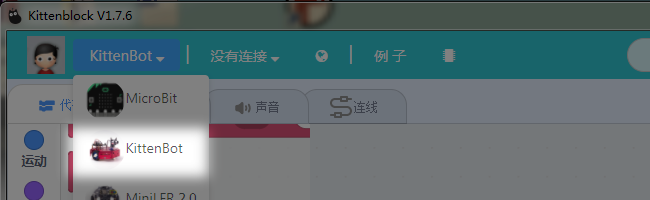
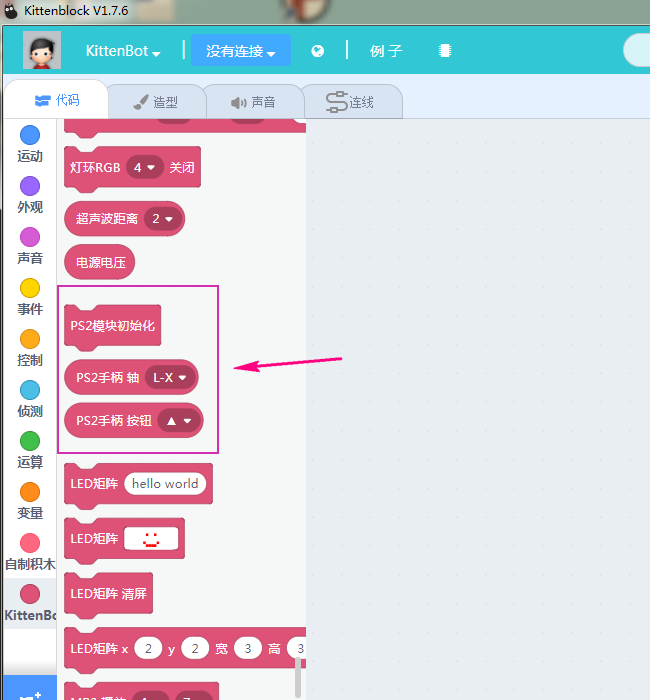

# 玩转PS2手柄

## 购买链接

__转到淘宝购买__----------→[PS2手柄](https://item.taobao.com/item.htm?spm=a1z10.3-c-s.w4002-17001215033.36.4d38762ecmTQrB&id=555406931635)

## 适用人群

拥有Arduino、Rosbot主控板的diy爱好者

## 配送清单

- PS2手柄 x 1

- 手柄接收器 x 1

- 杜邦线 x 6

## 产品简介

这是一款2.4G无线通讯手柄，属于Arduino编程手柄。在小喵图形化编程平台有专属Scratch积木块对其功能编程，使用体验一流，且具有方便，技术支持完备等特点，主要用于开源硬件的遥控。

## 产品特色

- 无限2.4G连接
- 手感舒适
- 连接迅速
- 反应快，无延迟
- 结合硬件玩出新花样
- Scratch图形化编程
- 使用简单

## 产品参数

长x宽x高： 156mm x 100mm x65mm

净重：  172g

毛重：根据包裹最终大小决定

## 技术参数

- 使用2颗AAA（7号）电池，电池连续使用时间约10小时以上
- 支持多路信号，同时控制，互不干扰
- 具有电源指示灯及MODE指示灯。
- 无线频率：2.4GHz
- 工作范围：8米，45度角

## 使用环境

Kittenblock(基于Scratch3.0)的Arduino主控板Rosbot

## 接线

__依照Kittenblock中kittenbot硬件选择的全向轮小车所需接线为例子__

PS2接收头--Rosbot
CLK   -    A0

CS    -    A1

CMD   -    A2

DAT   -    A3

GND   -    GND

5V    -    5V

## 使用方法

- 编程方式：Kittenblock(基于Scratch3.0)/Arduino(Rosbot控制板)
- 兼容硬件（配合硬件，或者配套什么使用）：全向轮等智能小车系列
- 小喵教程集合地址：learn.kittenbot.cn
- 小喵论坛地址：kittenbot.cn/bbs
- 网易云课堂：搜索小喵科技
- 更多的实时讨论，请加入爱上小喵科技官方Q群：568084773

在kittenblock软件中使用

具体使用案可参考如下
[PS2全向轮小车](http://learn.kittenbot.cn/zh_CN/latest/kittensuite/quanxiang.html#)

## 注意事项

- 使用前需要将手柄上方(下方的)开关置ON
- 如果使用不正常请检查接线是否按上述接线，以及是否有松动

如果以上都不能解决问题，请联系小喵科技，热诚为你服务

_请避免在潮湿和有水的地方使用，以免短路_
