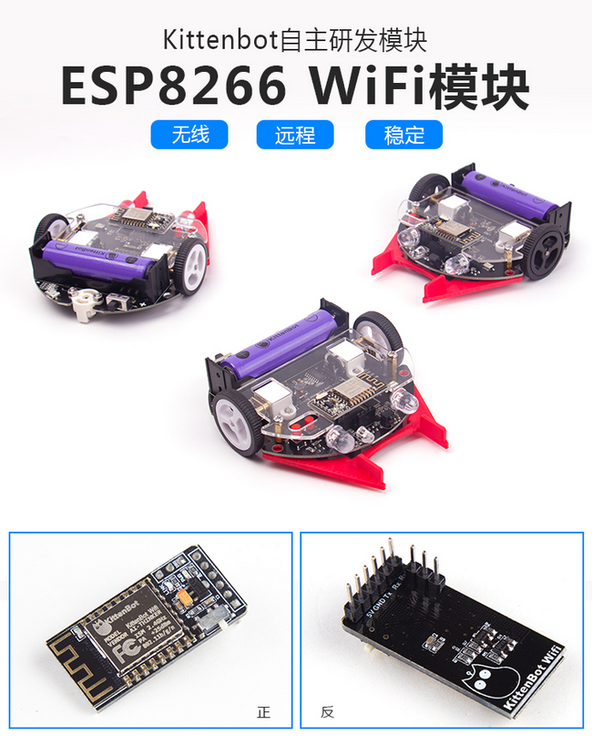
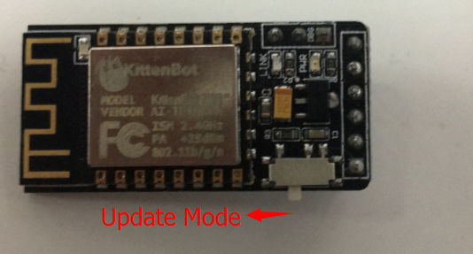
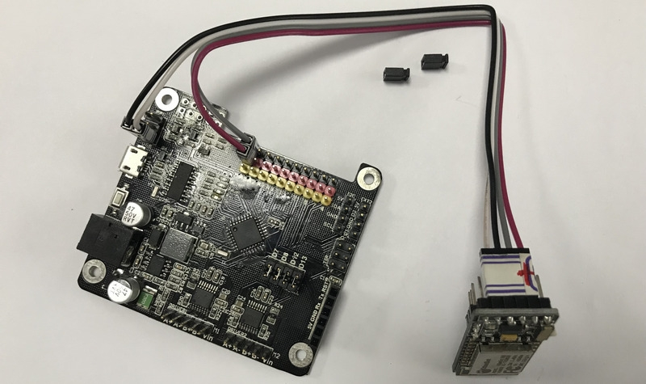
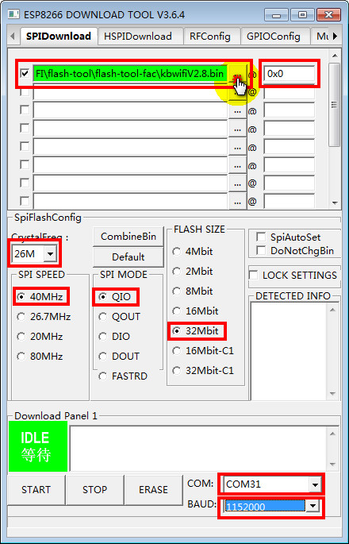
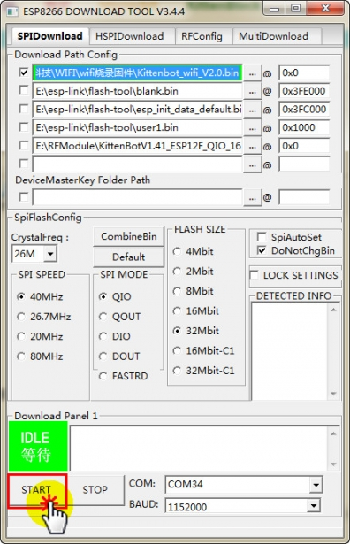
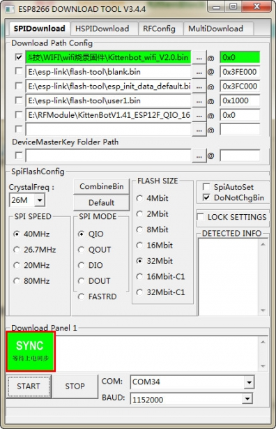
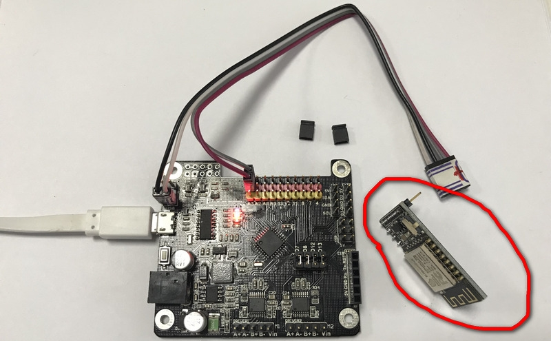
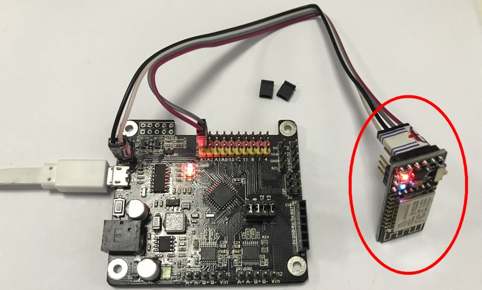
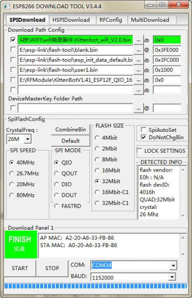

# wifi模块简介与固件更新

固件更新适用，固件版本在V2.8以下的版本。

如果你不确定你的wifi版本，你连上wifi热点后，登录wifi的网页192.168.4.1，就可以看到wifi信息

## 购买链接

__转到淘宝购买__----------→[wifi模块](https://item.taobao.com/item.htm?spm=a1z10.3-c-s.w4002-17001215033.62.1170762ey89wOL&id=551380787824)

## 产品名称：   

wifi模块  

## 适用人群：   

手头拥有一定硬件及相关基础的人，想要做远程控制及iot的创客爱好者  

## 配送清单：

wifi模块 x1  

   

## 产品简介：   

这款wifi模块是完全自主开发的固件，而非市面上的AT指令固件。拥有便捷的网页配置界面，可自定义波特率，名字，查找和连入路由器等等，其中为Rosbot和miniLFR小车提供了无线控制和远程下载，同时兼容Arduino。

## 产品特色：   

- 配置方便
- 连接稳定
- 低功耗

## 产品参数：   
- 尺寸：36mm x 18mm x 13.5mm   
- 净重：4.3g   
- 毛重：根据包裹最终大小决定   

## 技术参数   

- 电压：5V   
- 工作电流：62mA
- 802.11b/g/n
- 待机功耗小于1.0 mV（DTIM3）
- 深度睡眠保持电流10uA，关/断电流小于5uA
- HSPI,UART,I2C,I2S,红外遥控，PWM,GPIO
- 支持STA/AP/STA + AP模式、支持Smart Config功能（包括Android和IOS设备）
- 唤醒2ms内连接和传输数据包
- 内置Tensilica L106超低功耗32位微控制器，时钟频率位80MHz，支持160MHz，至此RTOS
- 内置10位ADC、TCP/IP协议栈
- 内置PLL，稳压器和电源管理组件，802.11b模式+20 dBm输出功率保护间隔
- A-MPDU，A-MSDU聚合和0.4s
- WiFi @ 2.4GHz，支持WPA/WPA2模式
- 工作温度范围-40°C-125°C

## wifi模块固件更新教程

目前wifi模块固件最新版本v2.8，如果您需要IOT功能请务必将wifi模块固件升级到最新版本。(V2.8是新推出来的固件，市面上的wifi模块都不是最新版本，所以用IOT功能需要手动升级下)

### 操作过程

1、wifi模块上电前，拨动wifi的设置开关，进入wifi固件更新模式，结果如下图

2、拔掉Rosbot主控板跳帽，进行接线（上电钱请再三确实接线是否正确，非常容易接错）
接线如图所示

3、下载ESP8266的固件更新软件，[http://cdn.kittenbot.cn/flash-tool.zip](http://cdn.kittenbot.cn/flash-tool.zip)

4、双击打开“ESPFlashDownloadTool.exe”

5、按照如图所示操作

在文件第一栏中加载压缩包内的固件bin文件（例如： **kbwifiV2.8.bin**）

其他设置如下图，必须设置一模一样，否则下载失败或者导致wifi模块无法通讯。下载前请再三确认。

一般用户会忘记打左上角的勾！记得勾上！记得勾上！记得勾上！

COM选择，是你插上Rosbot主控板后出现的COM口，对应选择你的COM口，波特率优先选择1152000，如果下载失败后，尝试吧波特率降低一点点，波特率实际上就是下载的速度，太快有些电脑有时候会失败。

6、进行下载
点击“START”

7、出现红框提示后，再稍作等待，即可看到，红框的"等待上电同步"变成“下载中"

PS：有一部分电脑，如果红框一直显示“等待上电同步”，一直都不动，这时候你需要把wifi模块拔下来，如下图：

再插上，这时候红框就会变成“下载中"

8、等待成功提示，这样就成功更新完。

  
9、把wifi拔下来，开关拨动回去正常模式。**（90%的用户都会忘记）**

10、Rosbot板子的跳帽插回去否则Rosbot不能正常使用**（90%的用户都会忘记）**
  

PS：如果更新失败了，请重新再尝试一下，检查下步骤是否错误或者是否遗漏。

wifi烧录完成功，开关拨回正常模式，红灯常亮，蓝色亮着，每隔1秒闪烁一下

**实在更新不成功，可以联系我们的淘宝客服，附上纸条，写清楚问题，联系方式，邮寄地址，把模块寄回来，帮你进行更新。**
