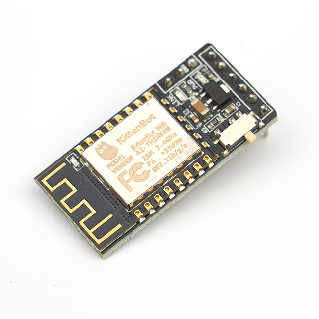

# 喵家wifi模块 

## 购买链接

__转到淘宝购买__----------→[wifi模块](https://item.taobao.com/item.htm?spm=a1z10.3-c-s.w4002-17001215033.62.1170762ey89wOL&id=551380787824)

## 产品名称：   

wifi模块  

## 适用人群：   

手头拥有一定硬件及相关基础的人，想要做远程控制及iot的创客爱好者  

## 配送清单：

wifi模块 x1  

   

## 产品简介：   

这款wifi模块是完全自主开发的固件，而非市面上的AT指令固件。拥有便捷的网页配置界面，可自定义波特率，名字，查找和连入路由器等等，其中为Rosbot和miniLFR小车提供了无线控制和远程下载，同时兼容Arduino。

## 产品特色：   

- 配置方便
- 连接稳定
- 低功耗

## 产品参数：   
- 尺寸：36mm x 18mm x 13.5mm   
- 净重：4.3g   
- 毛重：根据包裹最终大小决定   

## 技术参数   

- 电压：5V   
- 工作电流：62mA
- 802.11b/g/n
- 待机功耗小于1.0 mw（DTIM3）
- 深度睡眠保持电流10uA，关/断电流小于5uA
- HSPI,UART,I2C,I2S,红外遥控，PWM,GPIO
- 支持STA/AP/STA + AP模式、支持Smart Config功能（包括Android和IOS设备）
- 唤醒2ms内连接和传输数据包
- 内置Tensilica L106超低功耗32位微控制器，时钟频率位80MHz，支持160MHz，至此RTOS
- 内置10位ADC、TCP/IP协议栈
- 内置PLL，稳压器和电源管理组件，802.11b模式+20 dBm输出功率保护间隔
- A-MPDU，A-MSDU聚合和0.4s
- WiFi @ 2.4GHz，支持WPA/WPA2模式
- 工作温度范围-40°C-125°C