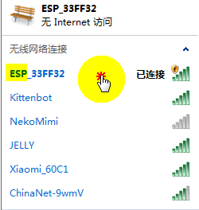
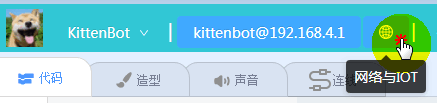
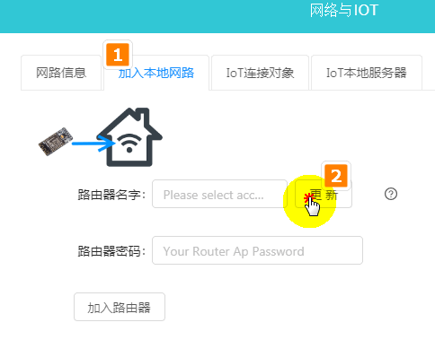
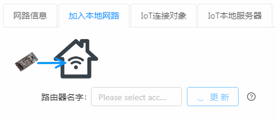
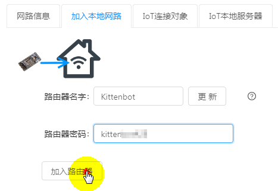
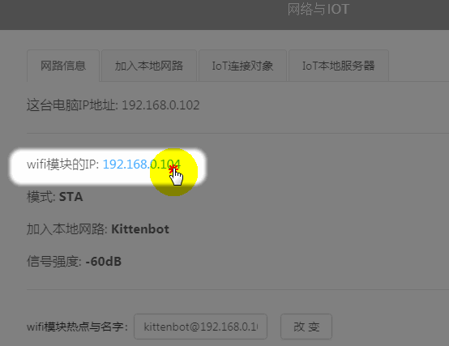
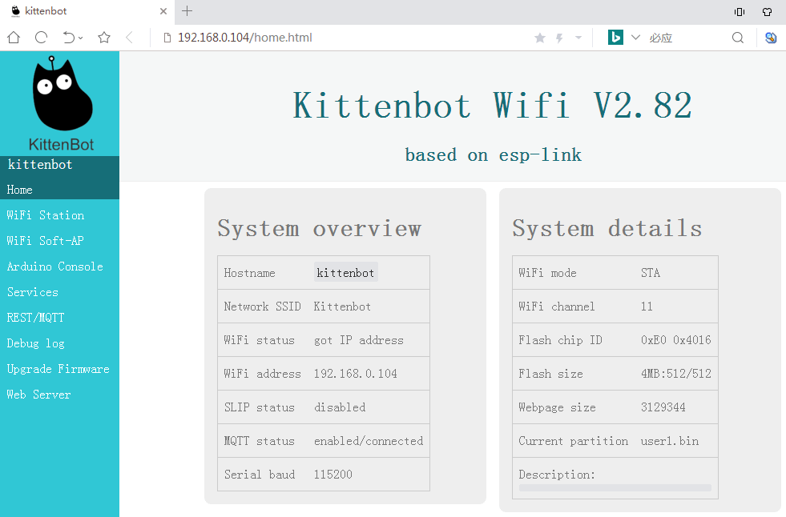
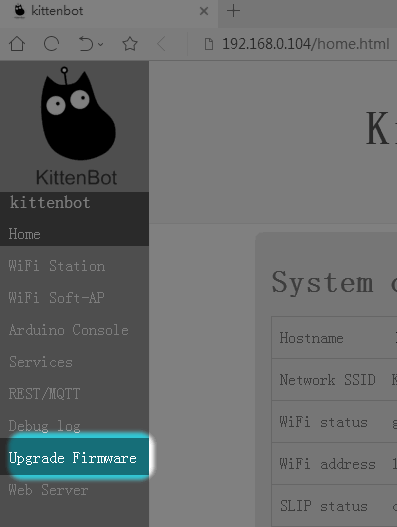
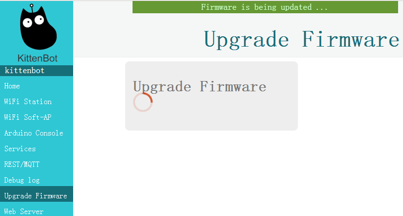

# wifi模块固件更新方法(V2.8以上的版本)

适用于wifi模块固件V2.8以上的版本

[wifi模块固件下载地址，点我](https://bbs.kittenbot.cn/forum.php?mod=attachment&aid=Mjk1OXwwYzkxYWU3MnwxNTYwNzM1OTIwfDN8NjI5)

## 利用wifi固件的网页给自己刷固件

如果你的wifi模块已经按照上篇的wifi模块更新了V2.8固件后，恭喜你！

你以后更新固件只需要连接上wifi模块，打开其网页，就能在wifi模块的网页上给wifi模块自己刷固件，听上去是不是很神奇？确实是黑科技！

## 原理
喵大神将wifi模块里面的程序分成两个区假设是1区和2区，平时运行启用一个区（例如1去），刷固件的时候，就给另外一个区（2区）刷固件，刷好后，就运行2区，这时候就是最新的固件。下次刷就是2区给1区刷。不知道原理我说明白没有，没明白也没关系。

## 网页刷固件适用范围

- 喵家常规wifi模块或者能量魔块的wifi模块（市面上常规wifi不确定是否可以，自己可以测试下，不负责任哈~）

- wifi固件要求V2.8以上

## 将wifi模块通电

如果你是喵家普通wifi，直接插到Rosbot或者LFR小圆车的wifi专用接口上。或者你用其它板子把5V和GND供给wifi模块

## 将wifi模块连上家里路由器

PC端电脑 无线连接搜索出ESP_XXXXX,这个是wifi模块的热点

 

## 打开Kittenblock，选择wifi模块热点

一般都是192.168.4.1！！！

 

 

## 将wifi模块加入家里路由器局域网中

实质就是让wifi模块有上网的能力

 

更新，可以寻找附近的wifi网络

 

## 寻找中

 

## 选择你当前wifi的名字，例如我这里是Kittenbot

并且填入wifi密码！密码不能错~否则连接不成功

 

## 提示连接成功后

重启软件

## 重新打开Kittenblock

## 重新连接，如图所示，一定是192.168.XXX.XXX

 

## 成功连接上

 

## 进入网络与IOT

 

## 直接电机wifi模块的地址，这时候浏览器会自动打开新页面

 

## wifi网页，如图所示

可以看到我现在wifi模块的版本号是V2.8.2

 

## 选择更新固件

 

## 选更新文件

- 注意wifi当前的版本，只有V2.80以上的固件才能通过此方法更新固件。

- 注意网页提醒你，使用user2固件，（也有可能提醒你使用user1固件）

- 选择文件

- 更新

 

 

## 固更新中

 

## 成功

到此，你已经成功更新下一个版本的固件了。

 
