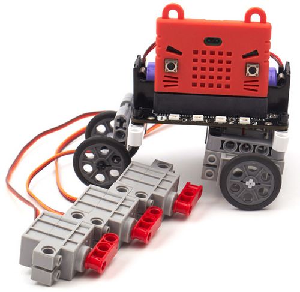
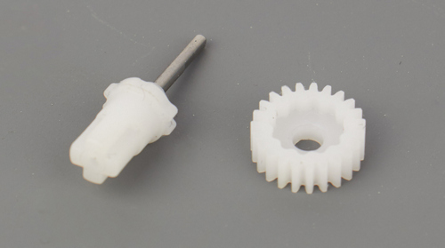
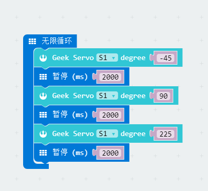
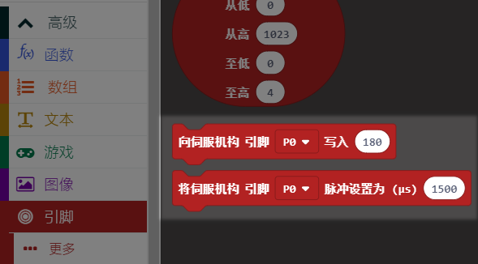
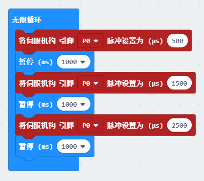
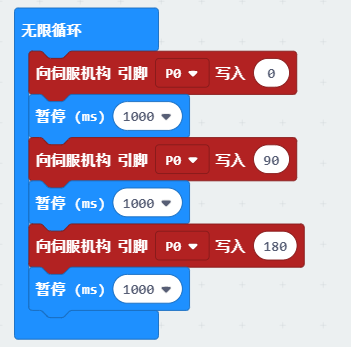
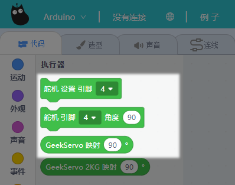
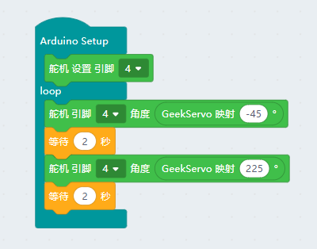
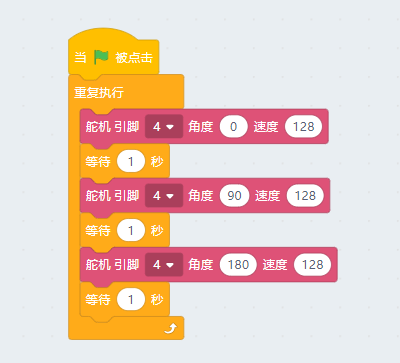
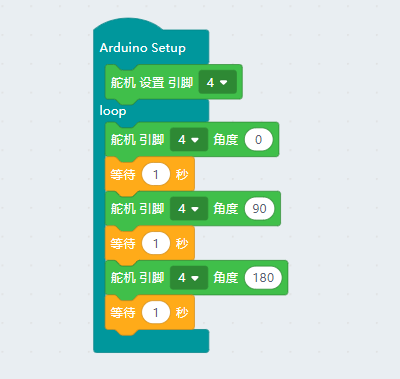

# 伺服舵机/乐高减速电机   

## 购买链接

__转到淘宝购买__----------→[伺服舵机/减速电机](https://item.taobao.com/item.htm?spm=a1z10.3-c-s.w4002-17001215033.26.38cc762e0K09dh&id=572085241353)

__转到淘宝购买__----------→[360度舵机(作电机用)](https://item.taobao.com/item.htm?spm=a1z10.3-c-s.w4002-21482550023.9.67a2762eim9Mb5&id=591715190337)

## 产品名称
   
- Geekservo 乐高伺服舵机/乐高减速电机  
- Geekservo 360度可连续旋转舵机

## 配送清单  

可混批

## 产品简介   

  

Geekservo系列兼容市面上的舵机控制方式协议，在结构上兼容乐高拼接

- 红色：减速电机，可控制速度和正反转，喵家的控制板含有图形化积木块插件和代码控制支持 

- 灰色：伺服舵机，优于市面上的普通蓝色9g小舵机，选用300°电位器保证了270°的宽角度区间(程序中为-45~225°)。由于转动角度与9g舵机有差，所以控制脉冲也相对有变化，底部的篇幅会介绍  

- 橙色：三线的舵机，特点在于可用脉冲信号控制旋转速度，一般用作没有电机驱动的电路板上制作小车或旋转结构。需要注意的是，虽然是舵机控制方式，但无法作为舵机使用，且就当做电机使用

## 产品特色   

Geekservo采用了优质电机及优质的电刷材料，在输出轴的最后一级做了极力齿(所谓的极力齿，就是在设定的扭矩范围内，输出轴正常输出。超出最大扭矩后，极力齿就开始工作。用力乱拧输出轴在极力齿的保护下，只会哒哒哒进行跳齿保护)，这可以避免被小朋友乱扭几下造成损坏。由于解决了以上问题以及它的实用和耐用性，特别适合青少年编程培训教学中使用。这也是为什么该系列比起市面普通的9g小舵机和TT电机会稍贵，请相信物有所值。 

- __耐用性好__  

      

  对于舵机而言，就先存市面上最便宜的蓝色9g小舵机，使用中的注意点特别多，也导致一不慎就坏掉，而Geekservo系列采用极力齿则解决了如下这些常见问题   

  - 电机本质寿命问题  

  - 长时间堵转，电机烧毁  

  - 不懂的孩用力扭输出轴，把齿轮箱扭坏了 

- __兼容性强__   

  - 在结构上：首先Geekservo系列含有标准乐高插销孔和砖块安装凹点，可兼容乐高结构。输出轴采用十字出轴方式

  - 在编程使用上：伺服舵机和减速电机都与市面上普通的可编程舵机和电机使用方式一样，不使用闭源方案，做到兼容易用

- __体积小巧__   

  在乐高Technical体系中，似乎不再往体积小的规格发展，并且电动机上都以可测转速的减速直流电机为主。体系中缺少小巧实用的动力电机，而Geekservo系列体积小但扭矩一点都不小，能够满足某些硬性需求

## 产品参数 

- 灰色伺服舵机参数规格    
  - 工作电压：3.3V~6V
  - 额定电压：4.8V   
  - 额定电流：200ma   
  - 堵转电流：700ma   
  - 打滑电流：450ma   
  - 最大扭矩：500g.cm   
  - 角度转速：60°/0.12s   
  - 净重：12.8g（单个）

- 红色减速电机规格    
  - 工作电压：3.3V~6V
  - 额定电压：4.8V   
  - 额定电流：200ma   
  - 堵转电流：700ma   
  - 打滑电流：450ma   
  - 最大扭矩：500g.cm   
  - 最高转速：70rpm（3V供电情况下）   
  - 净重：12.4g（单个） 

- 橙色可持续旋转舵机     
  - 工作电压：3.3V~6V
  - 额定电压：4.8V   
  - 额定电流：200ma   
  - 堵转电流：700ma   
  - 打滑电流：450ma   
  - 最大扭矩：500g.cm   
  - 最高转速：70rpm（3V供电情况下）  
  - 净重：12.8g（单个）  
 

## 尺寸规格 

- 长度：五个乐高孔电源8x5=40mm   
- 宽度：两个乐高宽度单元8x2=16mm   
- 高度：三个乐高高度单元3.2x3=9.6mm   
- 基础孔位：直径4.8   
- 输出轴：带极力齿乐高十字轴  


## 线序介绍 
  
- 灰色伺服舵机   

  为常规舵机的线序，黄接数据引脚（控制引脚）、红接正极、棕接负极

- 红色减速电机    

  红色正极，黑色负极，但实际使用中可以不用区分，反接只会导致旋转方向改变 

- 橙色可持续旋转舵机   

  为常规舵机的线序，黄接数据引脚（控制引脚）、红接正极、棕接负极

## 机械安装方式演示  

- 与颗粒乐高安装  
  - 底部安装   

       

  - 侧边法兰下安装   

       

  - 侧边法兰上安装   

       

- 与Technical乐高安装 

  - 侧孔安装   

       

  - 底孔安装   

       

  - 输出轴安装   

    

## 与主控板连接方式演示

- 灰色伺服舵机    

  - 针对Robotbit，有S1-S8的舵机接口可以接，

    

  - 针对Rosbot，所有IO均可接

    

- 红色减速电机    

  - 针对Robotbit，有M1、M2的A+A-、B+B-接口可以接

    

  - 针对Rosbot，有M1、M2的A+A-、B+B-接口可以接  

    

- 橙色可持续旋转舵机

  这一款舵机如顶部介绍一般，它虽然叫做舵机，但却只能用于电机的使用方式。多用于一些不带电机驱动的电路板来制作小车或旋转结构，下面以喵家Iobit（micro：bit扩展板）为例 

  - 接3.3V

    

  - 5V供电，力气和速度会大一些，但鉴于引脚排布问题，只能用于P0一个引脚的控制（也就是直插的方式只能使用5V方式控制1个舵机，并且使用中需要确定蜂鸣器关闭，由于P0和蜂鸣器复用）

    

## 图形化编程使用方式   

- Makecode编程方式 

  在喵家产品Robotbit、Powerbrick和Nanobit中都有用到，故我们提供了对应的插件，可以分别加载  
  Robotbit：https://github.com/KittenBot/pxt-robotbit  
  Powerbrick：https://github.com/KittenBot/pxt-powerbrick   
  Nanobit：https://github.com/KittenBot/pxt-nanobit    
  以下以Robotbit为例  

  - 灰色伺服舵机

    舵机相关积木

    

    摆动的程序

    

  - 红色减速电机  

    电机相关积木

    

    转动的程序

     

  - 橙色可持续转动舵机 

    相关积木

    

    以下两种转动程序效果一样

     
    

----------

- Kittenblock中控制方式      

  - 灰色伺服舵机   

    Robotbit(micro：bit)    
      
      
    Rosbot  
       

    Arduino   
       
     

  - 红色减速电机  

    Robotbit(micro：bit)     
       

    Rosbot   
     

    Arduino         
     

  - 橙色可持续旋转舵机  

    改舵机本身是使用脉冲进行控制，但由于没有单独的脉冲积木块，所以这里直接使用舵机积木块（0°对应500us，90°对应1500us，180°对应2500us），按照如下程序搭建，观察效果为：反转-停止-正转  
    
    Robotbit(micro：bit)    
       

    Rosbot   
     

    Arduino         
    

## 代码编程方式     

新手建议用上一节的Kittenblock图形化编程软件，有一定基础的才推荐使用代码操作。  
以下只对灰色伺服舵机进行讲解，橙色舵机和灰色舵机使用方法雷同。而电机的的操作API请参照上述图形化编程转代码。

- 9g舵机的 角度-脉宽  

  - 0度：500us
  - 90度：1500us 
  - 180度：2500us

- GeekServo的 角度-脉宽  

  - -45度：600us
  - 90度：1500us 
  - 225度：2400us

__Microbit(micropython)__  

- 使用microbit自带的类中的write_analog(value)可以输出PWM，对应的占空比为0~1023对应0%~100%  

   

  根据舵机的控制原理可知舵机的控制一般需要一个20ms左右的时基脉冲，那么从上面给出的角度对应的脉宽时间可有如下计算    
    
  ```python
    import microbit
    microbit.pin1.set_analog_period(20) # 设置PWM信号的周期，默认就是20ms
    pwm = (degree-90) * 20 / 3 + 1500  # degree为你需要的舵机角度，pwm为脉冲宽度
    D = pwm / 20000 # 换算成占空比
    microbit.pin1.write_analog(1023*D) # 以P1脚为例，这样就可以对Geekservo舵机进行比较精准的控制 
  ```

- 使用Robotbit的用户可以直接调用Robotbit库，请先下载喵家定制运行环境的[Mu-edior](https://www.kittenbot.cn/Mu)，后具体转到[Robotbit的API](http://learn.kittenbot.cn/zh_CN/latest/exboards/robotbit/robotbit-API.html)查看


__Arduino(C/C++)__ 

```C++
    int angleMap(int degree){
      return (degree-90) * 20 / 3 + 1500;
    }
```    

另外初始化的时候需要向Arduino声明舵机控制周期为600~2400us，以便重新计算定时器周期。
```C++
	servo.attach(4, 600, 2400);
```

大家可以将下面的代码直接复制到Arduino中并烧录到主板上，注意例子中我们舵机接在4号引脚。
```C++
    #include <Servo.h>

    Servo servo;
    
    int angleMap(int degree){
      return (degree-90) * 20 / 3 + 1500;
    }
    
    void setup() 
    { 
     servo.attach(4, 600, 2400);
    } 
    
    void loop() {
     servo.writeMicroseconds(angleMap(0));
     delay(2000);
     servo.writeMicroseconds(angleMap(90));
     delay(2000);
     servo.writeMicroseconds(angleMap(180));  
     delay(2000); 
    }
```

## 注意事项   

- Geekservo的转动范围：-45~-225°，一共是270°，而不是转动到270°   

- Geekservo舵机有严格的线序之分，插接电路板请根据说明指引进行插接   

- Geekservo使用过程中禁止长时间堵转，长时间堵转有可能导致电机损坏   
