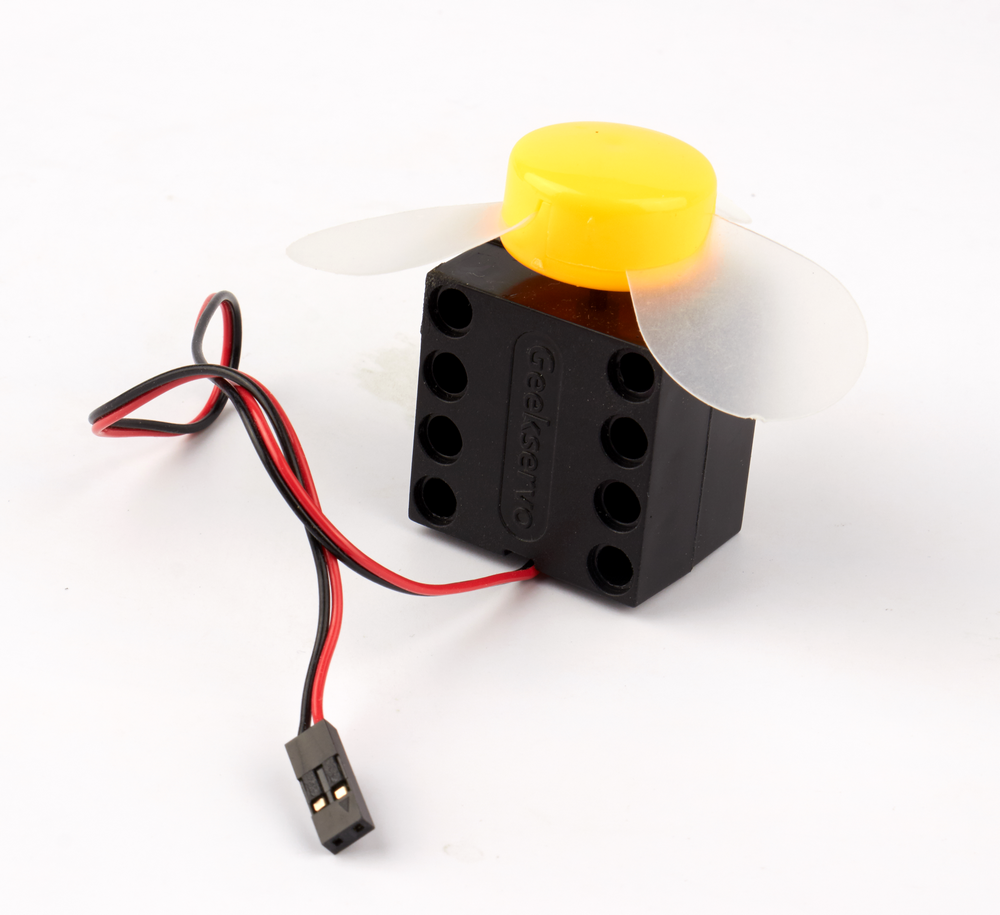
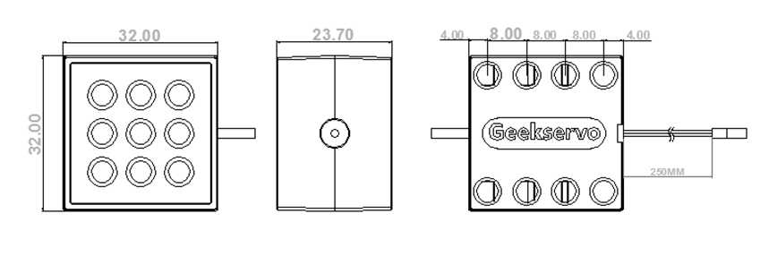
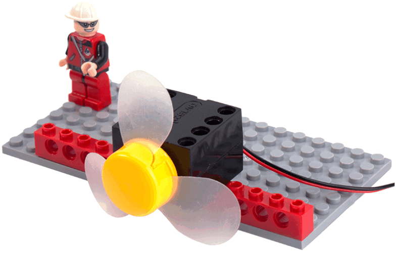
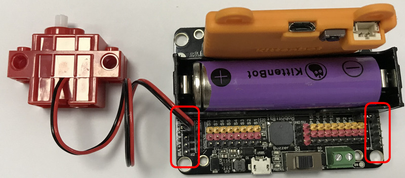
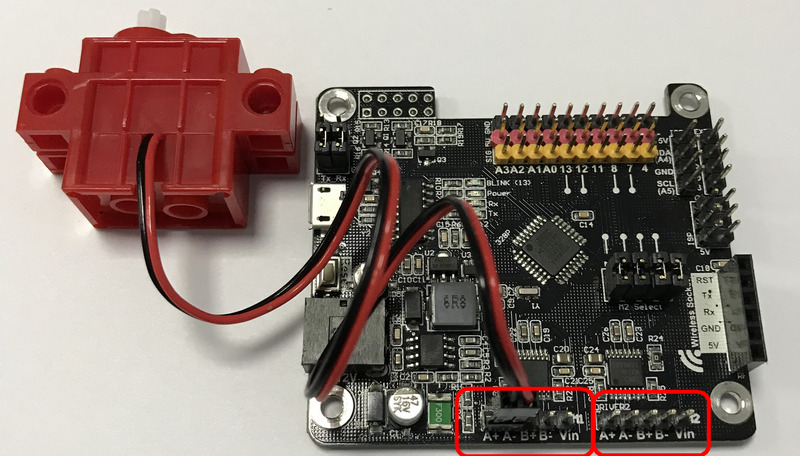
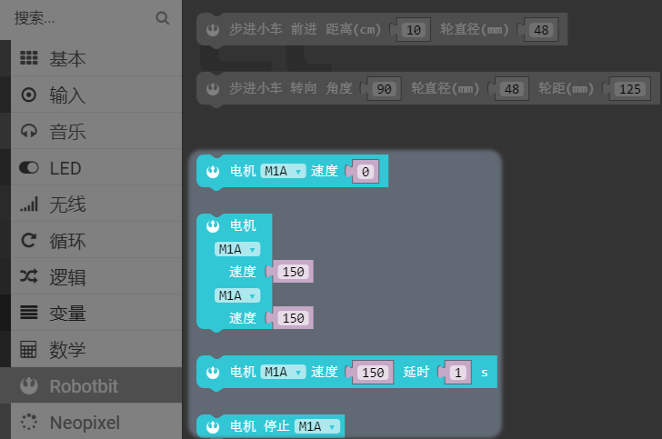
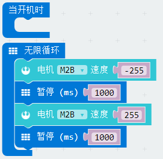
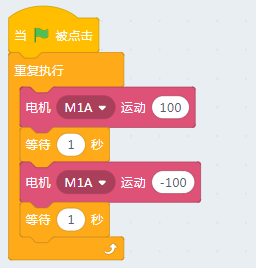
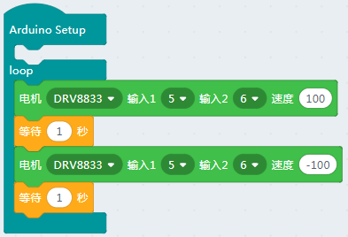

# 乐高风扇  

## 购买链接

__转到淘宝购买__----------→[乐高风扇]https://item.taobao.com/item.htm?spm=a230r.1.14.16.6a7b5261MbsJUj&id=603423647052&ns=1&abbucket=3#detail

## 产品名称

乐高风扇

## 配送清单 

- 乐高风扇 X 1

## 产品简介  

乐高风扇是一款带有乐高结构安装孔的小风扇。解决用户在做智能家居DIY产品时无法安装到乐高结构上的问题。

## 产品特色   

- 控制简单  

    PWM控制，与一般常规电机控制方式类似，可兼容常规主控板的电机驱动模块

- 体积小巧   

    在尽量的体积下，兼容乐高寸与乐高安装孔位

- 安装方式灵活  

    兼容Technical系列安装方式与普通乐高砖块安装方式，输出抽直接采取十字轴安装方式   

- 安全

    采用柔性扇叶，安全可靠，适合课堂场景

## 产品参数   

- 转速：3000±10%r/min
- 工作电流：130±20mA
- 空載寿命：大于200小时
- 重量：28± 2g

## 尺寸规格  

- 长宽：五个乐高孔单元8x4=32mm   
- 高度：三个乐高高度单元8x3=24mm

## 线序介绍 

- 推荐电机线序接发，红接正，黑接负，风扇为吹风模式（实际并没有正负，接反风扇反转而已）

## 机械安装实例   

  

## 与主控板连接方式演示  

针对Robotbit，有M1、M2的A+A-、B+B-接口可以接  

针对Rosbot，有M1、M2的A+A-、B+B-接口可以接  

## 使用环境   

- Makecode中控制方式 

    电机相关积木

    

    转动的程序

    

- Kittenblock中控制方式      

    乐高风扇（与控制普通TT电机方式一样）  
      
    Robotbit(micro：bit)     
    

    Rosbot  
    

    Arduino   
    
