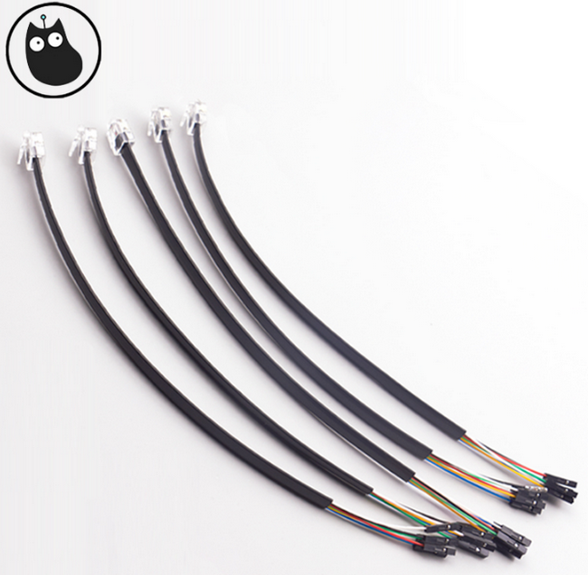

# 产品名称：   
乐高转杜邦线   

## 适用人群：   
拥有乐高和Robotbit或者Rosbot的爱好者   

## 配送清单：   
乐高转杜邦数据 X 1   
   

## 产品简介：   
不少用户手上拥有乐高的大电机，乐高转杜邦数据是用于将乐高电机转接到Robotbit或者Rosbot主控板上使用，让乐高电机和开源硬件一起配搭，做出更加丰富多彩的作品。精选乐高6P6C水晶头，六根杜邦线母头端子，25cm乐高连接线，连接线可用于乐高LEGO EV3   

## 产品特色：   
- 通过杜邦头的转接，可让可编程硬件直接控制乐高电机
- Kittenblock与Makecode中有支持电机正反转与速度的积木块

## 产品参数：   
长x宽x高：250mm x 6.6mm x 2.22mm   
净重：5.4g   
毛重：根据包裹最终大小决定   

## 产品实物接线图   
   

