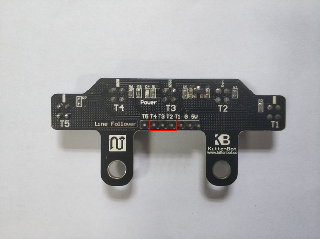
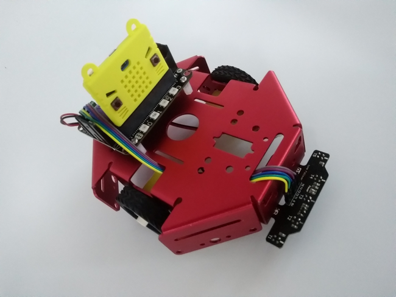
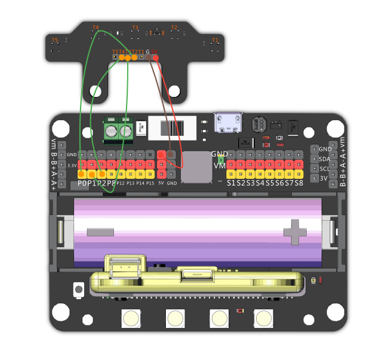
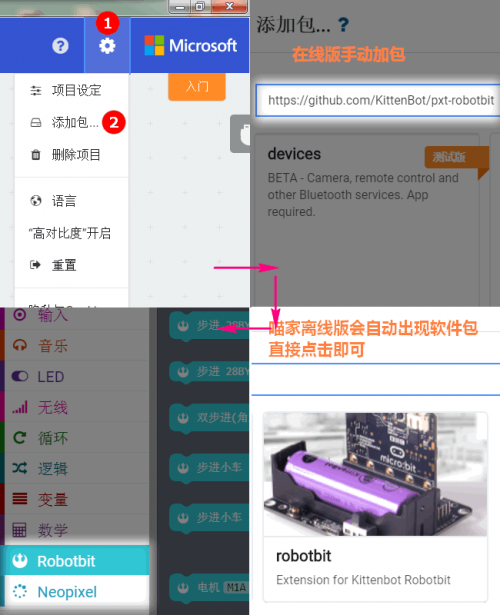
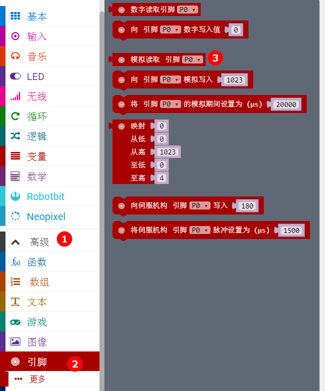
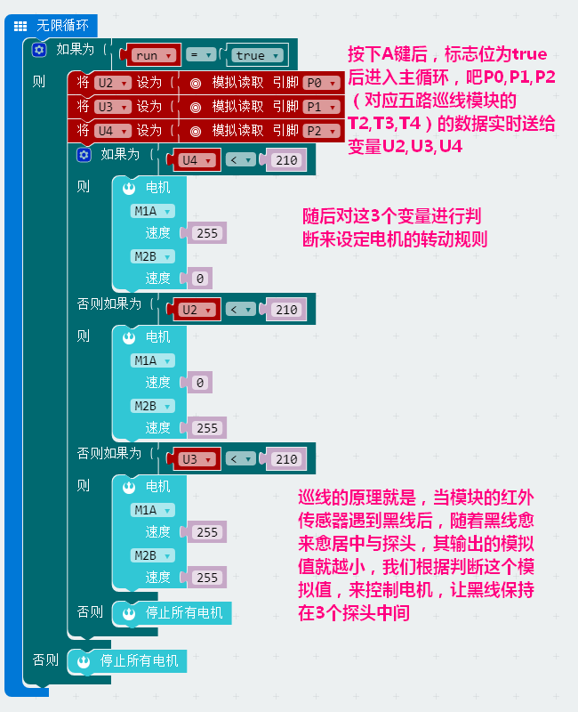
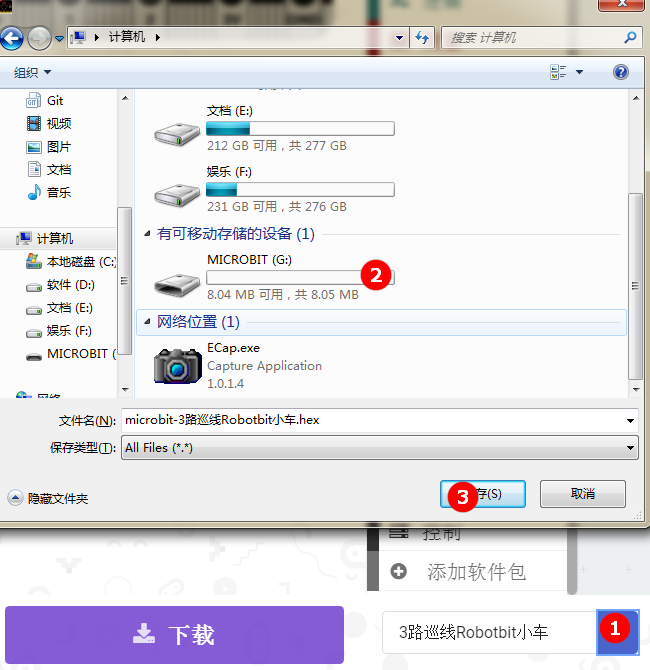

# 玩转五路巡线模块

## 适用人群

小学生/培训机构/家长/爱好者

## 五路巡线模块使用场景

五路巡线其实只用其中三路就足够了，一般用于巡线避障小车

## 产品简介

五路巡线模块是一款包含5组循迹传感器的模块，可以完全满足各种条件下的巡线机器人制作，用于任何5V的主控板，能够完美匹配microbit+robotbit拓展板的使用组合。使用microbit平台的编程免去了繁琐的底层库调用，令编程思维更清晰简单，其中Robotbit拓展板为巡线小车的各种外设提供了丰富的IO口和电机舵机驱动，真正意义上实现一板多用及可拓展性。

## 产品特色

- 基于图形化编程
- 使用简易
- 输出准确
- 巡线定位精确
- 掌握红外探头原理

## 产品参数

长x宽x高：72mm x 33mm x 17.5mm

净重：6.5g

毛重：根据包裹最终大小决定

##技术参数

电压：3.3V、5V

电流：1A

## 五路巡线模块接线

Robotbit--五路巡线模块

- P2--T4
- P1--T3
- P0--T2
- GND--G
- 5V/3.3V--5V（这个地方如果线不够长，可以直接接在3.3V和同一列的GND）

下面程序中用到的电机接线为 _M1A：红-/黑+  M2B：红+/黑-_
## 使用环境 

- Kittenblock(基于Scratch3.0)/Makecode可连接硬件：Microbit
- Arduino：Rosbot主控板

## 使用方法

在makecode中编程，要使用的积木块首先我们需要导入拓展包

关于读取巡线模块的数值是使用如下积木块

接着我们根据读取的数值进行逻辑编程

__我们使用保存到microbit盘的方式下载程序__

## 效果展示

## 注意事项

- 若使用给定程序，接线请严格按照如上
- 寻仙模块3.3V-5V均可
- 使用前请使用在线调试看看所要巡线的返回数值，对程序做数值上的修改即可

如果以上都不能解决问题，请联系小喵科技，热诚为你服务