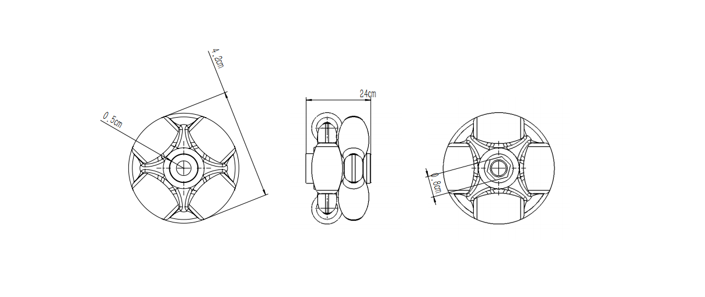
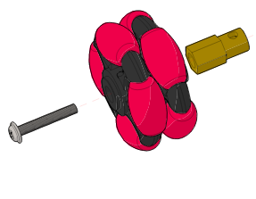

# 全向轮   
   
## 产品名称

全向轮子

## 产品说明   

全向轮可看为内轮与外轮，内外轮上各带有4个橡胶滚子，且交错分布，这样不管轮子如何转动，都可以保证有橡胶滚子与地面接触，使运动更灵活更广泛。  
   
## 产品参数   

- 长：3.7cm   
- 宽：2.3cm   
- 高：3.7cm   
- 净重：27.6g   
 
## 产品特点   

- 运动方向更广   
- 运动更灵活   
- 可实现左右平移   
   
## 产品图片  

   
   
   
## 装配事例  

   

   
   
   
## 注意事项   

- 万向轮必须按照说明书完成装配，少装、漏装零件会引起小车运行时全向轮的摇晃或脱落，导致小车有可能损坏   
- 不要刻意破坏全向轮上的橡胶滚子   
- 不要靠近温度高的地方   

