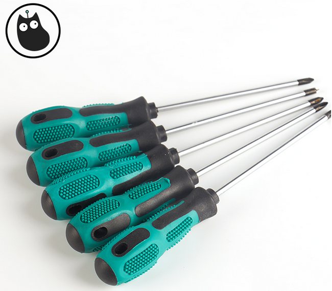

# 产品名称：   
十字螺丝刀   

## 适用人群：   
小学生/培训机构/家长/爱好者  
 
## 配送清单：   
十字螺丝刀 X 1   
   

## 产品简介：   
此螺丝刀为十字带磁性螺丝刀。可用于组装Kittenbot的多种套件，生产和家庭维修。   

## 产品特色：   
- 刀杆硬度大   
- 双色手柄，防滑处理，手感舒适，使力方便   
- 带磁性，使用时可以吸附螺丝    

## 产品参数：   
规格：3*100mm   
刀杆长：100mm   
全长：185mm   
净重：39.3g   
毛重：根据包裹最终大小决定   

## 注意事项   
螺丝刀尖锐，请放到儿童触摸不到的地方妥善保管   
请勿使用螺丝刀进行打闹，十分危险   