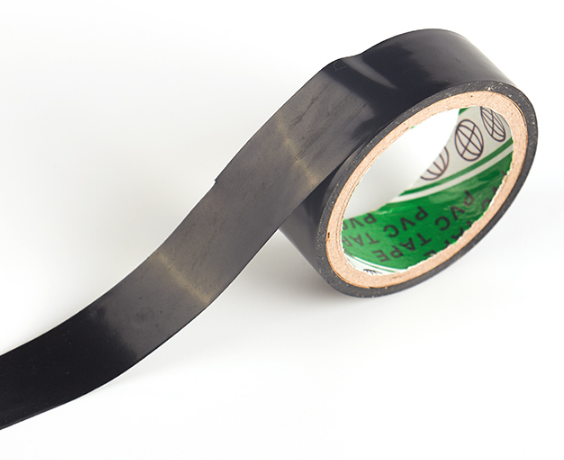

# 巡线黑胶带

## 购买链接

__转到淘宝购买__----------→[巡线黑胶带](https://item.taobao.com/item.htm?spm=a1z10.3-c-s.w4002-17001215033.90.3fbd762e4Pugxx&id=562720018417)
    
## 产品名称

巡线黑胶带

## 产品说明  

能被巡线传感器感应到，能使MiniLFR小圆车及kittenbot的巡线避障小车沿着铺设好的黑胶带运动。    
   
## 产品特点   

-  黏着牢固   
- 能被巡线感应器很好地感应到   
   
## 产品图片  

   
   
## 注意事项  

- 不要靠近火源   
