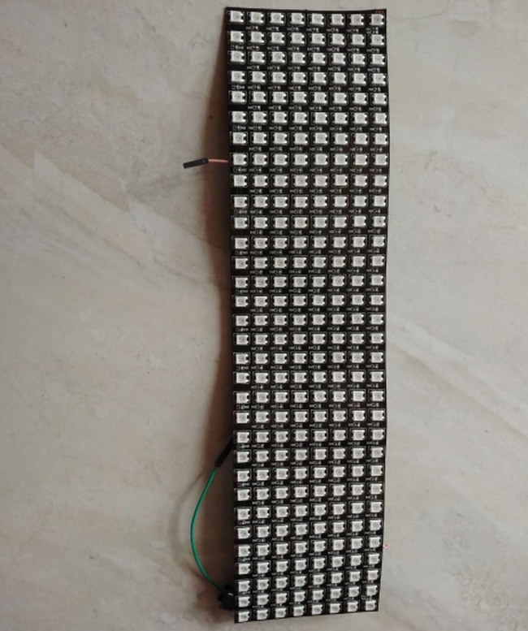
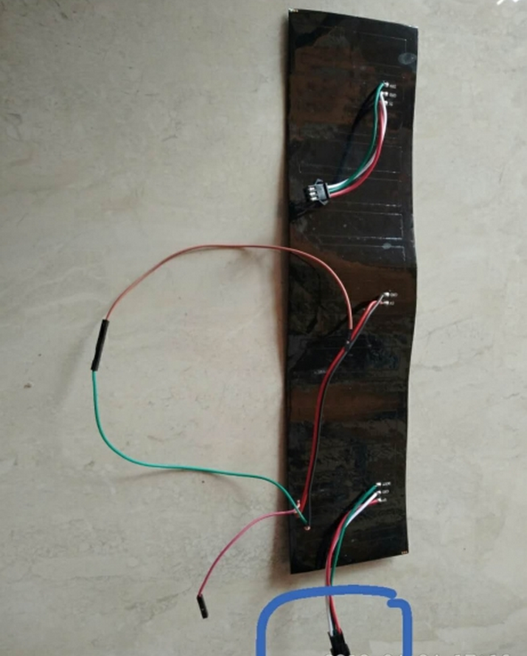
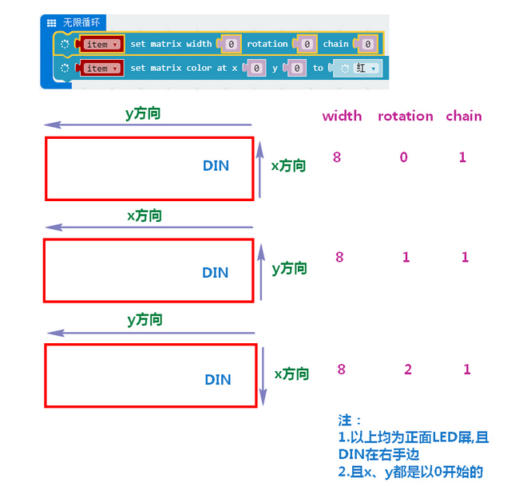
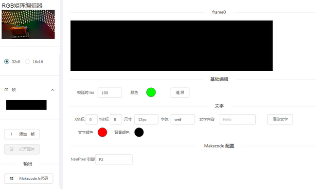
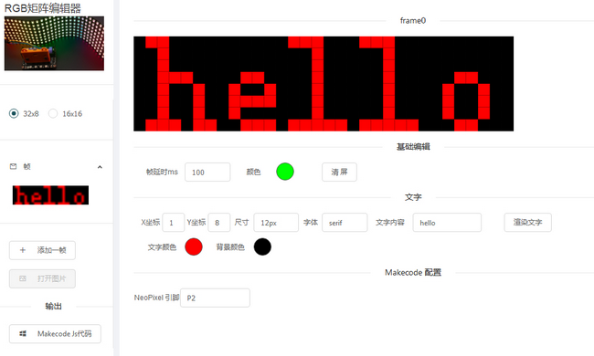
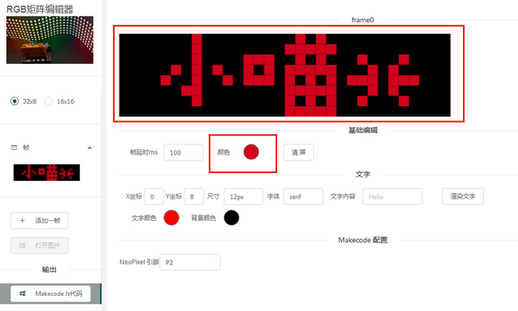
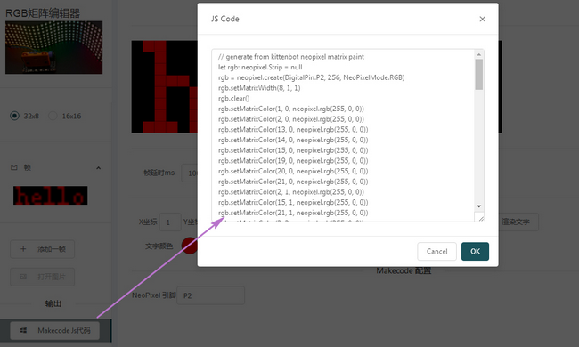
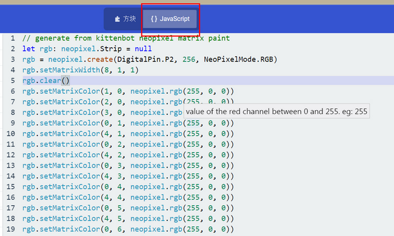
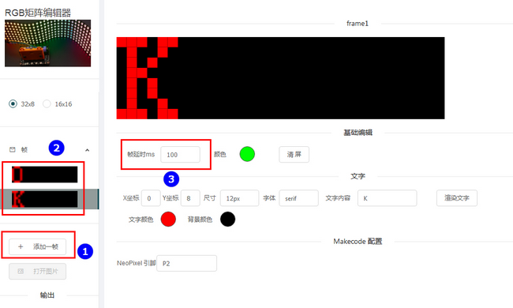

# 玩转柔性屏  

柔性屏是一款酷炫的灯阵集合体，凭借着其柔软的屏身得到柔性屏的称号，方便使用在各种展示，气氛，DIY场合，这里介绍8x32和16x16的柔性屏，其正常工作电压在5V。  

## 柔性屏示意图  

8x32为例

  

 

## 接线  
	    

   

  

## 编程

使用小喵科技离线版makecode的如下添加robotbit软件包   

  

看到出现积木块包  

   

1.开始种初始化柔性屏  

    
   
单色点亮  

   
    
彩虹色点亮  

    
  
推荐调节亮度到30，否则太亮对眼睛不好    

   
  
非全局点亮需要使用刷新显示即show
 
    
  
流水效果积木块，可选偏移或循环，区别在于循环会一直重复，而偏移则闪出尽头就消失，注意都需要要使用show  

    
  
调整你需要的颜色，通过RGB值  

  
  
清屏，记得要带show哦  

    
  
3种不同设置下的灯阵序列，箭头x.y坐标均由0开始 
 
      
  
使用像素单独点亮的话可以参考下面的像素序号表  

  

## 柔性屏编辑器使用
**如果想编辑复杂文字和图形，要手动拖积木或填数组真的太麻烦了！所以小喵为大家带来了一手的便利，柔性屏编辑器，暂时支持16x16和8x32**  
  
**生成器主界面** 

** 二.操作流程** 
1.简便的使用方法  

1.1 自动生成   

  

①.首先选择你的柔性屏种类  
②.此处建议取默认，x的0坐标在屏幕最左端可按需求适当右移  
③.打上你需要的内容（自动生成的汉字显示起来会溢出，建议使用在黑色部分手动描点）  
④.在黑色区域预览出你的内容  
⑤.选择你的柔性屏与板子的接线引脚  
⑥.生成makecode使用的js代码  
 
1.3 手动描点  

   

1.4 如1.1操作显示出hello字符,按照步骤生成代码后复制提示框中的代码

 

1.5 将代码复制到makecode（离线版）选择图中JavaScript代码区并复制后下载到板子里
  
  

2.移屏/切换显示  
  
①.首先添加帧  
②.在该区域内会显示添加的空白帧，根据上述操作根据需要输入内容，帧的顺序为自上而下  
③.此处固定100ms无法更改
如需要移屏可以下面的X坐标处给每一帧递增1（x范围0-31）  
生成JS代码并复制到makecode中看看效果吧

只想显示点字，带点移动的效果之类的，相比在makecode里一个个加积木块或者对着点阵编码表看得眼花缭乱，这样的小工具是不是显得十分称心呢~    

最后附上手动描点在柔性屏上显示的效果，用在节日庆祝、生日派对、DIY作品中都是别有风趣的~  
 
 
  
 

如果操作不成功，请检查：   
    
- 检查接线是否正确   
- Robotbit板子电源开关一定要打开   
- 灯条若需要长时间使用需要注意如下图所示   

 
  
如果以上都不能解决问题，请联系小喵科技，热诚为你服务  