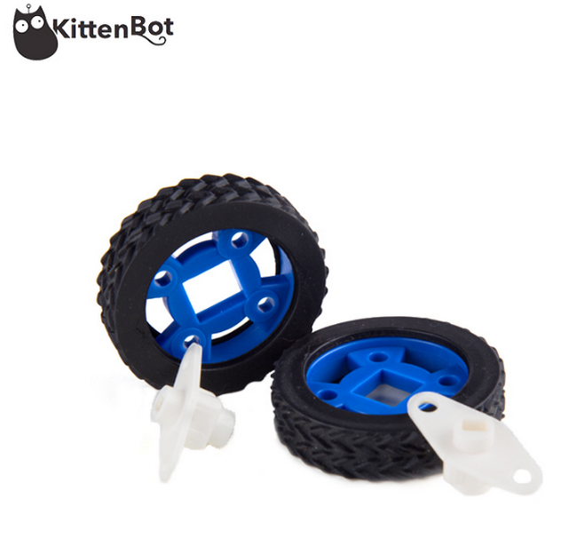
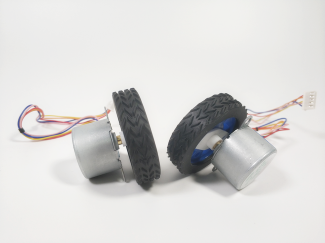

# 橡胶轮   

## 产品名称：   

橡胶轮   

## 适用人群：   

小学生/培训机构/家长/爱好者   

## 配送清单：   

橡胶轮 X 2   

   

## 产品简介：  

KittenBot 橡胶轮，这种定制的轮子设计适合兼容两种电机 TT电机与28BYJ步进电机，便于安装，为您的机器人提供牢固的牵引力，轮毂材质是环保ABS，轮胎由橡胶制成，耐磨，摩擦力大   

## 产品特色：   

- 兼容两种电机 TT电机与28BYJ步进电机   
- 耐磨，摩擦力大   

## 使用方法   

   

   

## 产品参数：   

- 尺寸：47mm（外径）x 33.8mm（内径）x 12mm（厚度）   
- 净重：14.5g   
- 毛重：根据包裹最终大小决定   

