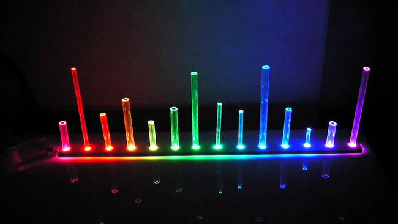
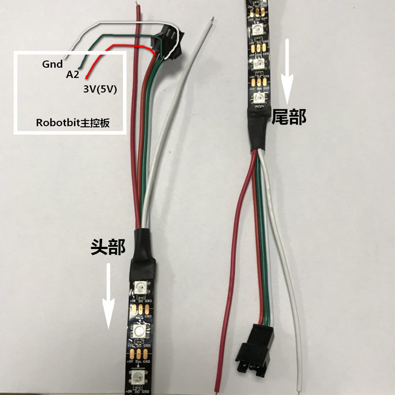
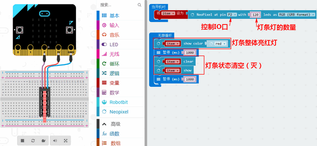
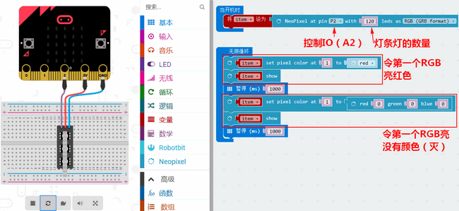
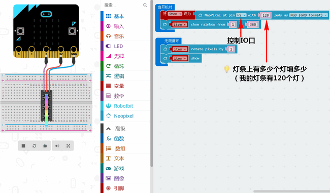
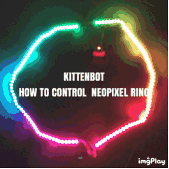

# ws2812灯条

## 购买链接

__转到淘宝购买__----------→[ws2812灯条](https://item.taobao.com/item.htm?spm=a1z10.3-c-s.w4002-17001215033.45.5933762eKLI1ja&id=566497375844)

## 产品名称 

ws2812灯条

## 适用人群

适用于diy爱好者制作炫彩夺目的应用设计，同时也适合在环境的装饰，气氛的点缀等节日或祝福场景

## 配送清单

ws2812灯条 x1

## 灯条示意图

在互动艺术设计中和氛围点缀中用的较为广泛，用好灯条可漂亮的一塌糊

 

## 产品简介

这是一款由ws2812全彩RGB灯组合阵列而成的全彩灯条，柔软和全彩的特性为它在氛围装饰的能力上大大加分。不仅如此，作为技术支持的小喵家也有对应配套的拓展板及图形化编程平台，不仅降低了使用的门槛，还提供了一站到底的实用解决方案。总而言之，选择ws2812全彩灯条用于节日气氛，生日祝福，宴会装饰，家庭布置及创客都是再合适不过的。

## 产品特色

- 图形化编程使用随心
- 气氛渲染程度强
- 掌握灯控原理
- 用于气氛点缀效果极佳
- 支持多模块级联控制
- 长期使用支持外部供电
- 轻便小巧可方便携带
- 可裁剪，随心而欲

## 产品参数 

- 长x宽x高：100mm(500mm) x 10mm x 2mm
- 净重：45g（根据长度决定）
- 毛重：根据包裹最终大小决定
- 支持PH2.0接口

## 技术参数

- 电压：5V
- 电流：1A、长期使用建议10A电源适配器
- 发光角度：120度
- 灰度等级：256级
- 可通过Robotbit拓展板实现流水灯灯炫酷特效

## 使用环境

Makecode,可连接硬件：Microbit

**接线方法**  

主控板 ——灯条  

- 3V（5V）——红色
- IO口——绿色
- Gnd——白色  
  
  

**实物接线**  

  
## 使用方法

第一步依然是添加robotbit包，参考上面  
灯条全亮全灭程序  

  

灯条某个灯单独亮灭程序  

  

彩虹灯条流动程序  

  

## 灯条效果展示
**它在互动设计、智能家居、点阵屏都用得比较多**  

  

## 注意事项   
    
- 接线一定要匹配
- Robotbit板子电源开关一定要打开 
- 务必杜绝接高于5V的电源   
- 灯条若需要长时间使用需要注意如下图所示   

  
  
如果以上都不能解决问题，请联系小喵科技，热诚为你服务  

_本产品只适用于14岁以上的儿童进行独立使用，8~14岁儿童请在家长或者老师的陪同下进行使用。
如使用前请按照小喵官方资料指导下进行使用，不要随便接插电路，切勿外接大电流舵机，大电流电机，以免烧毁电路板。
注意不要在金属表面，或者导电的物体上使用，以免短路
请避免在潮湿和有水的地方使用，以免短路
电路板或者机械上含有细小物件请不要吞食，请放在儿童接触不到的地方妥善保管_