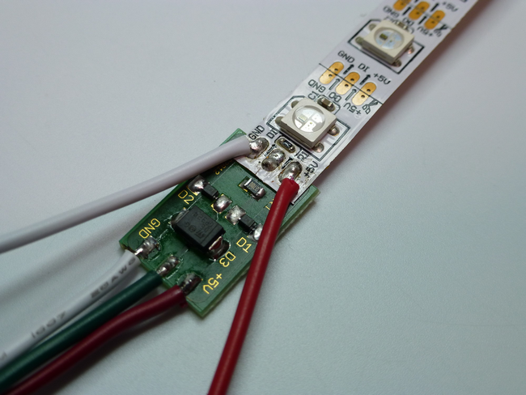

# 灯条接线

## 适用人群

培训机构/家长/爱好者

## 产品简介

这是一款由ws2812全彩RGB灯组合阵列而成的全彩灯条，柔软和全彩的特性为它在氛围装饰的能力上大大加分。不仅如此，作为技术支持的小喵家也有对应配套的拓展板及图形化编程平台，不仅降低了使用的门槛，还提供了一站到底的实用解决方案。总而言之，选择ws2812全彩灯条用于节日气氛，生日祝福，宴会装饰及创客都是再合适不过的。

## 产品特色

- 基于图形化编程
- 使用方便
- 柔软可拼接
- 气氛装饰能力强
- 安全可靠
- 掌握灯控原理

## 产品参数 

长x宽x高：

净重：

毛重：根据包裹最终大小决定

## 技术参数

电压：5V

电流：1A、长期使用建议10A电源适配器

## 使用环境

Makecode可连接硬件：Microbit

**接线方法**  
买到的灯条，一般都是5根线。但实际是3根线，正负那里它各多焊出一根来。大家剥开热缩管就可以看到  

  

主控板 ——灯条  

- 3V（5V）——红色
- IO口——绿色
- Gnd——白色  
  
  
  
## 使用方法
第一步依然是添加robotbit包，参考上面  
灯条全亮全灭程序  

  

灯条某个灯单独亮灭程序  

  

彩虹灯条流动程序  

  

## 灯条效果展示
**它在互动设计、智能家居、点阵屏都用得比较多**  

  

如果操作不成功，请检查：   
    
- 检查接线是否正确   
- Robotbit板子电源开关一定要打开   
- 灯条若需要长时间使用需要注意如下图所示   

  
  
如果以上都不能解决问题，请联系小喵科技，热诚为你服务  