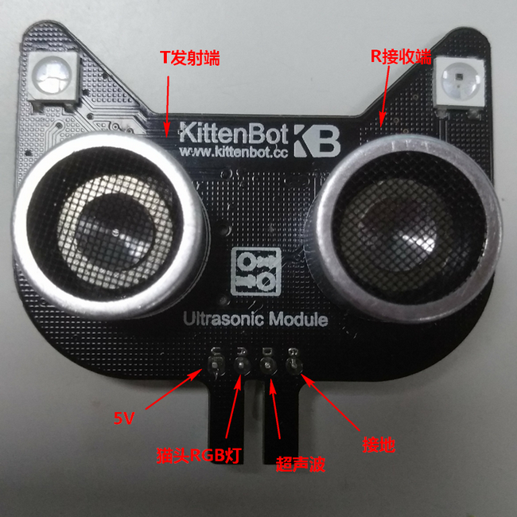
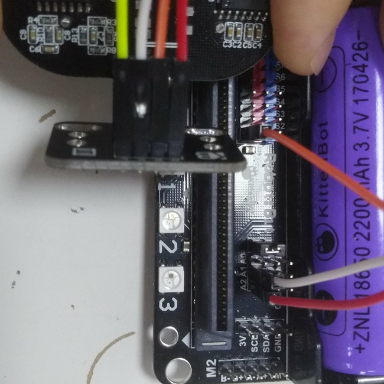
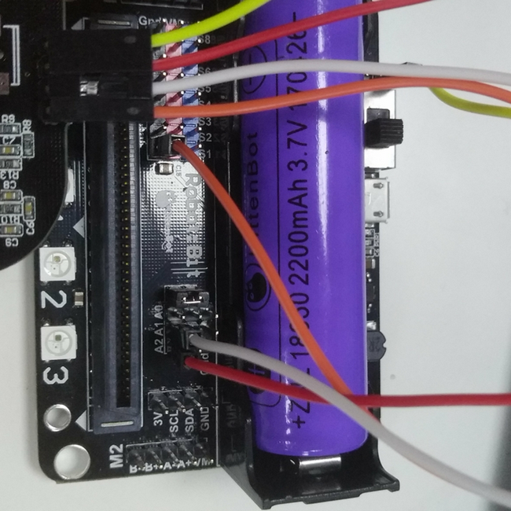
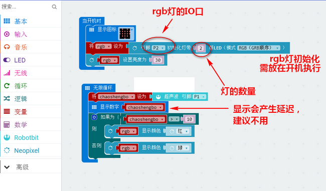
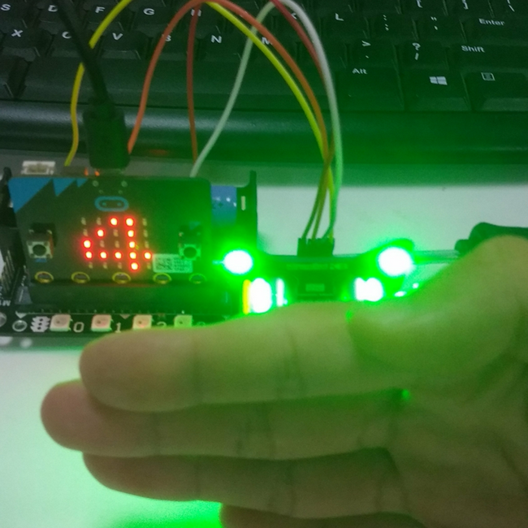

# 猫头超声波 

## 购买链接

__转到淘宝购买__----------→[猫头超声波](https://item.taobao.com/item.htm?spm=a1z10.3-c-s.w4002-17001215033.47.1380762eHXRi4k&id=553680619304)

## 产品名称

猫头超声波模块

## 适用人群

培训机构用于超声波入门及编程思维训练的案例，同时适用于diy爱好者给避障小车和测距项目使用

## 配送清单

猫头超声波模块 x1

## 猫头超声波模块示意图

猫头超声波主要用于避障小车的应用，同时也可用于距离如液面检测等实用型场景

 

 

## 产品简介

猫头超声波是一款不同于市面上普通超声波的产品，外观上的特别之处在于其头顶两侧集成的两颗256灰度RGB灯，这为diy创造了不一样的特色。在结合RGB灯的超声波使用过程中，我们可以更好的将检测信息通过灯的颜色反应出来，无论是美观角度还是实用性角度都是一款更好的超声波产品。

## 产品特色

- 基于图形化编程使用方便
- 集成2颗全彩RGB灯
- 外形独特
- 监测距离长
- 单数字口控制

## 产品参数

- 长x宽x高：48mm x 43mm x 19mm
- 净重：10.7g
- 毛重：根据包裹最终大小决定

## 技术参数

- 工作电压：3V~5V
- 工作温度：-25 ~ +80°C
- 测量角度：30°范围内
- 测量范围：5~300cm（误差<1cm）
- 控制方式：单数字口控制
- RGB灯灰度：256级
- 总接口数：4
- 探头背面印有T、R分别表示发射和接收

## 猫头超声波模块接线

**有转接板的接线方法：** 

robotbit——转接板  

- 5V——V
- P1——1(超声波)
- GND——G
- P2——2(rgb灯)  

  

**直连接线方法：**   

robotbit——超声波模块  

- 5V——V
- P1——D(超声波)
- GND——G
- P2——A(rgb灯)  

  

## 使用环境 

- Kittenblock(基于Scratch3.0)/Makecode可连接硬件：Microbit&Robotbit
- Arduino：Rosbot主控板

## 使用方法

- 编程方式：Kittenblock(基于Scratch3.0)/Arduino/Makecode
- 兼容硬件（配合硬件，或者配套什么使用）：microbit+robotbit拓展板
- 小喵教程集合地址：learn.kittenbot.cn
- 小喵论坛地址：kittenbot.cn/bbs
- 网易云课堂：搜索小喵科技
- 更多的实时讨论，请加入爱上小喵科技官方Q群：568084773

使用小喵科技离线版makecode的如下添加robotbit软件包  

    

使用官方在线版makecode的如下添加robotbit软件包  

  

使用makecode离线版进行编程，编程示例如下  

    

下载
    

## 效果展示 

当超声波检测到障碍小于10厘米时亮绿灯，大于则亮红灯  

  

  

## 注意事项 

- 检查接线是否正确   
- Robotbit板子电源开关一定要打开   
- 需要接5V电源  
- 检测距离在5cm到2.5m之间

如果以上都不能解决问题，请联系小喵科技，热诚为你服务
