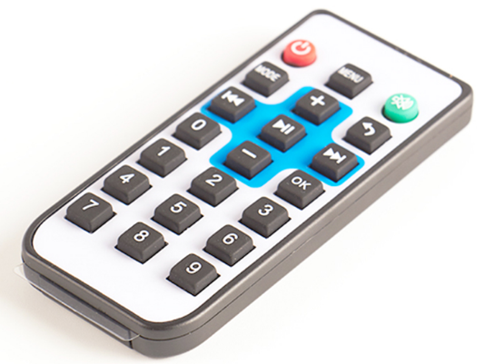

# 红外接收遥控器   
   
## 购买链接   

__转到淘宝购买__----------→[红外接收遥控器 ](https://item.taobao.com/item.htm?spm=a1z10.3-c-s.w4002-17001215033.57.180e762e5O6tuw&id=558849281195) 
   
## 产品名称    

红外接收遥控器    
   
## 适用人群  

需要进行红外遥控的用户   
    
## 产品示意图    
    
    

## 配送清单    

红外接收遥控器x1    
    
## 产品简介   

可适用于红外遥控的场景（如红外遥控MiniLFR巡线小圆车）   
    
## 产品特色   

- 反应迅速   
- 耗电量小   
- 手感舒适   
- 可结合图形化编程   
   
## 产品参数   

- 长x宽x高：9.1cmx4.1cmx1.1cm    
- 净重：24.1g    
- 毛重：根据包裹最终大小决定    
    
## 技术参数  

- 频率：38K    
- 发射距离标准：8米    
- CR2025电池供电    
- 按键作用力：200-350g    
- 按键正常寿命大于20万次    
    
## 使用方法 

- 编程方式：Kittenblock(基于Scratch3.0)/Arduino(Rosbot控制板)    
- 兼容硬件：MiniLFR巡线避障小圆车系列    
- 小喵教程集合地址：learn.kittenbot.cn    
- 小喵论坛地址：kittenbot.cn/bbs    
- 网易云课堂：搜索小喵科技    
- 更多的实时讨论，请加入爱上小喵科技官方Q群：568084773    
    
在kittenblock软件中使用    

    
     
具体使用方案可参考如下     
    
## 注意事项  

- 使用前请确保电池已经装在遥控器里   
- 如果使用不正常请检查程序是否正确   
    
如果以上都不能解决问题，请联系小喵科技，热诚为你服务    
    
请避免在潮湿和有水的地方使用，以免短路    
    
