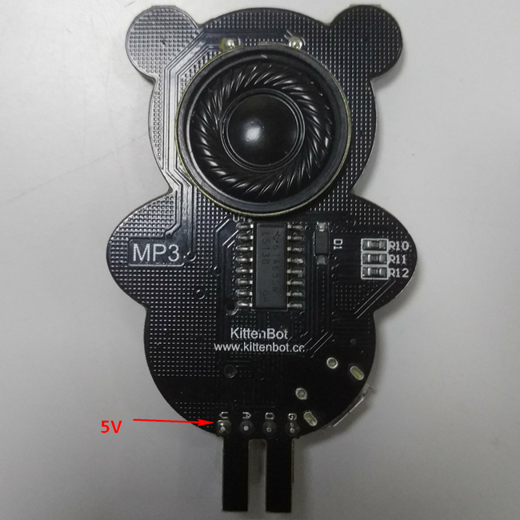
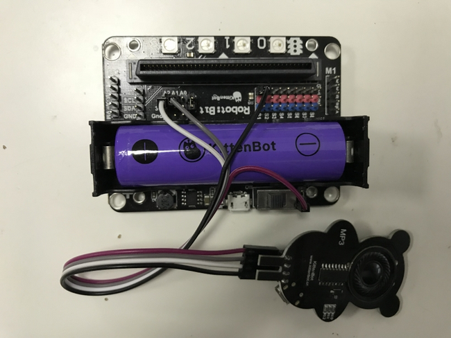
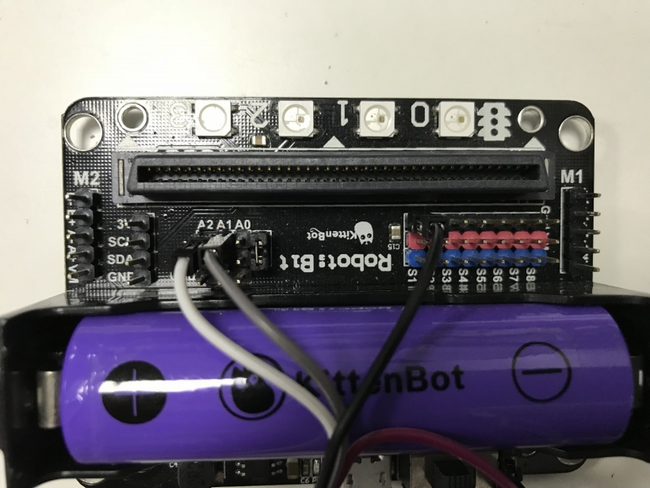
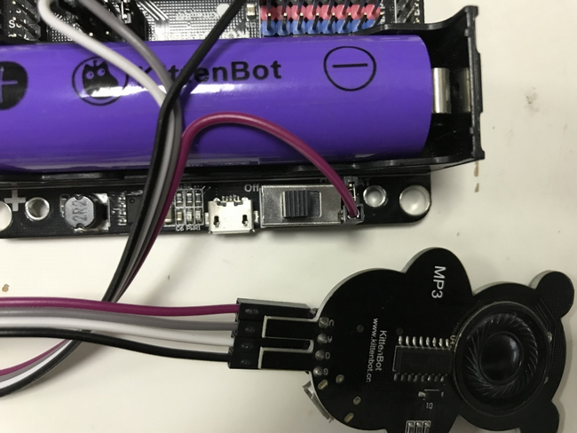

# 玩转萌熊MP3  
萌熊MP3模块是一款工作在5V的容量为16M的音乐存储播放器，仅使用USB拷贝方式，独特可爱的外形是它的特点，平常用以DIY硬件连接使用方便

## 萌熊MP3硬件示意图

  

## 萌熊MP3接线

robotbit——MP3  

- 5V——V
- A1——A
- GND——G
- A2——D
  
  

  

  

## 使用方法 

歌曲载入方式如下  

  

  

  

  

   

这样就把音乐拷贝进mp3了，下面我们就可以使用编程来控制播放了   
 
## 编程 

使用小喵科技离线版makecode的如下添加robotbit软件包  

    

使用官方在线版makecode的如下添加robotbit软件包  

  

使用makecode离线版进行编程，编程示例如下  

	  

**下载**

    
  

如果操作不成功，请检查及需注意：  

- 检查接线是否正确   
- 电源是否接5V   
- 拷贝歌曲不能太大，MP3容量只有16M，且较大拷贝时间很长
- 若无法拷贝的情况请参照下图  

  

  

  
  

如果以上都不能解决问题，请联系小喵科技，热诚为你服务