# 萌熊MP3  

## 购买链接

__转到淘宝购买__----------→[萌熊MP3](https://item.taobao.com/item.htm?spm=a1z10.3-c-s.w4002-17001215033.48.470e762eXVoMC3&id=562567541574)

## 产品名称

萌熊MP3

## 适用人群

适用于diy爱好者，为项目加上歌曲配乐

## 配送清单

萌熊MP3 x1

## 萌熊MP3示意图

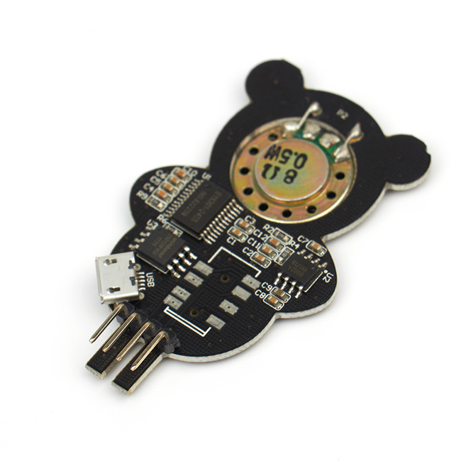  

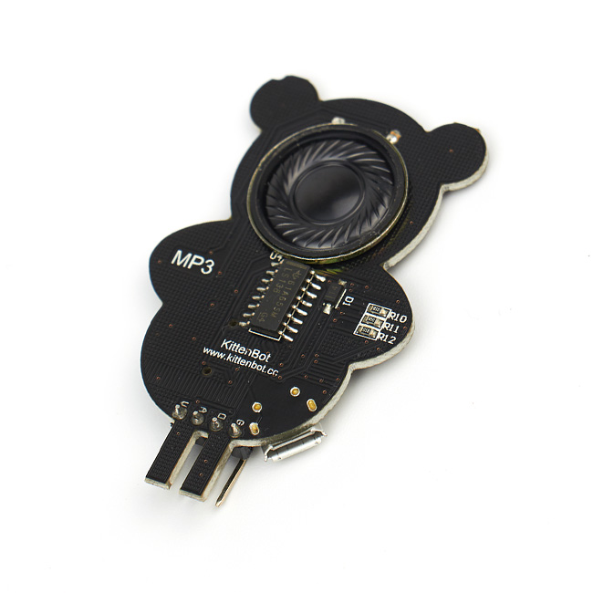 

## 产品简介

萌熊MP3拥有小熊的外形，是一款免驱简单易用的音乐播放模块，内部通过不同的电平信号组合做到换曲、调音等操作，官方给出Mircobit的使用程序，只需要考录MP3文件到模块内即可使用。常被用于diy产品的配乐十分便利。

## 产品特色

- 基于图形化编程使用方便
- 外形独特
- 免驱使用方便
- 集成小喇叭

## 产品参数

- 长x宽x高：57mm x 35mm x 8mm
- 净重：6.8g
- 毛重：根据包裹最终大小决定

## 技术参数

- 工作电压：5V
- 免驱
- 集成小喇叭

## 萌熊MP3接线

__直连接线__

robotbit——MP3  

- 5V——V
- P1——A
- GND——G
- P2——D
 
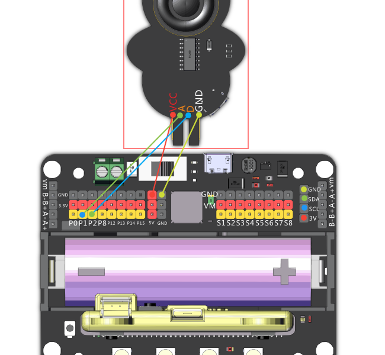  

robotbit——转接板 

- 5V——V
- P1——2
- GND——G
- P2——1

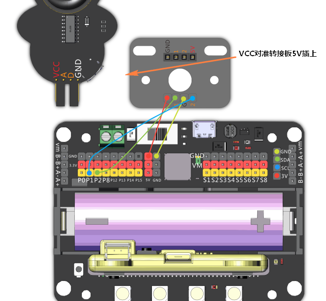 

## 使用环境 

- Kittenblock(基于Scratch3.0)/Makecode可连接硬件：Microbit&Robotbit

## 使用方法

- 编程方式：Makecode
- 兼容硬件（配合硬件，或者配套什么使用）：microbit+robotbit拓展板
- 小喵教程集合地址：learn.kittenbot.cn
- 小喵论坛地址：kittenbot.cn/bbs
- 网易云课堂：搜索小喵科技
- 更多的实时讨论，请加入爱上小喵科技官方Q群：568084773

歌曲载入方式如下  

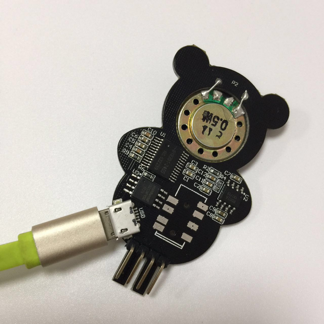  

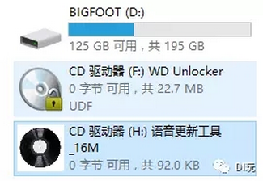  

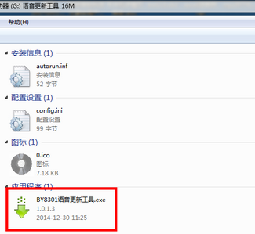  

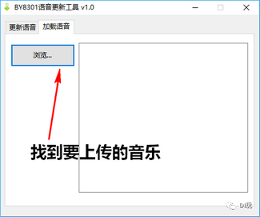  

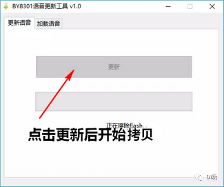   

这样就把音乐拷贝进mp3了，下面我们就可以使用编程来控制播放了   
 

使用小喵科技离线版makecode的如下添加robotbit软件包  

    

使用官方在线版makecode的如下添加robotbit软件包  

  

使用makecode离线版进行编程，编程示例如下  

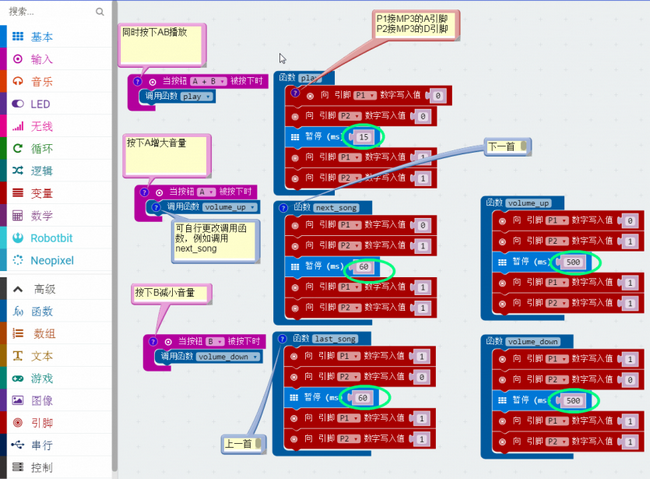	  

**下载**

    
  

## 注意事项 

- 检查接线是否正确   
- 电源是否接5V   
- 拷贝歌曲不能太大，MP3容量只有16M，且较大拷贝时间很长
- 若无法拷贝的情况请参照下图  

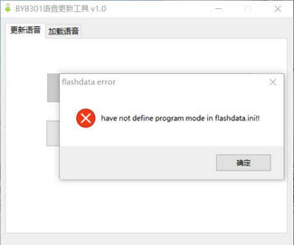  

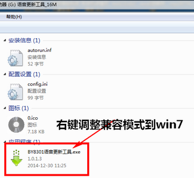  

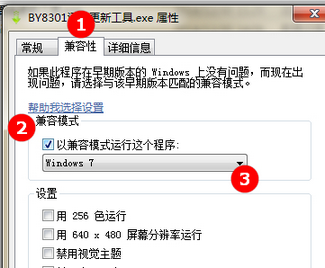  
  

如果以上都不能解决问题，请联系小喵科技，热诚为你服务