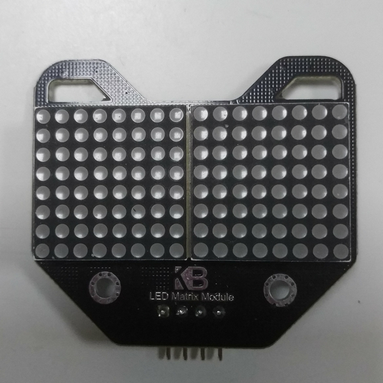
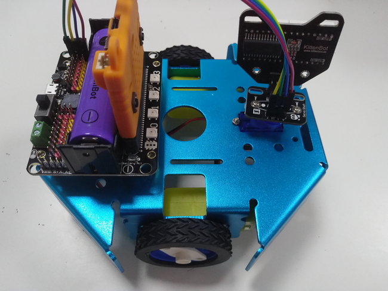
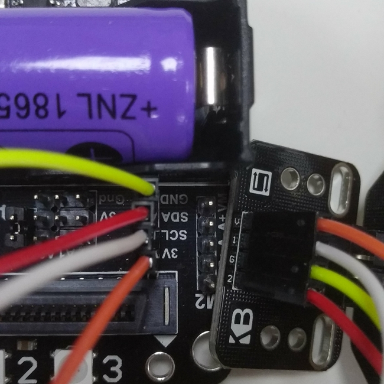
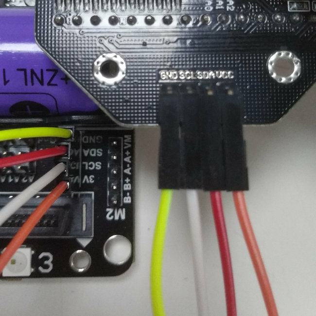
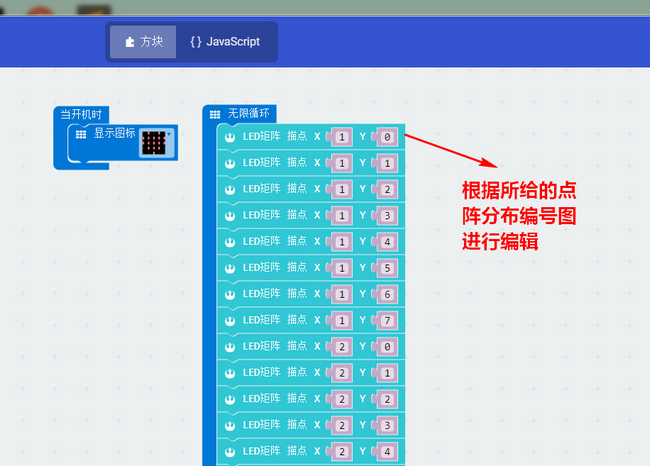
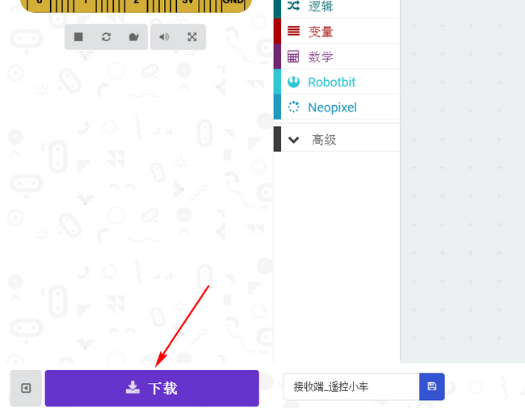
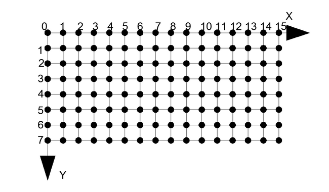

# 贱鼠矩阵屏 #  

## 购买链接

__转到淘宝购买__----------→[贱鼠矩阵屏](https://item.taobao.com/item.htm?spm=a1z10.3-c-s.w4002-17001215033.24.20cb762eT4SP2O&id=562637142070)

## 产品名称

贱鼠矩阵屏

## 适用人群

培训机构做为led点灯的入门案例，同时适想要为自己的设计添上文字和表情的diy爱好者

## 配送清单

贱鼠矩阵屏模块 x1

## 贱鼠矩阵屏模块示意图

贱鼠矩阵屏模块主要用于小车及其他diy的提示字符及丰富表情为设计添加动感

  

  

## 产品简介

贱鼠矩阵屏是一款集成2块8x8点阵屏的模块，可以支持显示字母，字符，表情及汉字。用于机器人的面部表情展现、小车的车头提示、及各种diy设计案例中需要字符告示的地方。其小巧且酷似小老鼠的外形是改产品的一大特色。

## 产品特色

- 基于图形化编程使用方便
- 外形独特
- 显示清晰
- I2C总线控制

## 产品参数

- 长x宽x高：45mm x 45mm x 13mm
- 净重：11.8g
- 毛重：根据包裹最终大小决定

## 技术参数

- 工作电压：3V~5V
- I2C总线控制
- 单块8x8点阵屏：2块

## 贱鼠矩阵屏模块接线

**为了避免接错线烧坏，一定要先接线再开电源!** 

**有转接板的接线方法:**  

robotbit——转接板  

- 3V或5V——V
- SDA——2
- GND——G
- SCL——1  

  

**直连接线方法:**  

robotbit——贱鼠矩阵屏 

- 3V或5V—VCC
- SDA——SDA
- GND——GND
- SCL——SCL

  

## 使用环境 

- Kittenblock(基于Scratch3.0)/Makecode可连接硬件：Microbit&Robotbit
- Arduino：Rosbot主控板

## 使用方法

- 编程方式：Kittenblock(基于Scratch3.0)/Arduino/Makecode
- 兼容硬件（配合硬件，或者配套什么使用）：microbit+robotbit拓展板
- 小喵教程集合地址：learn.kittenbot.cn
- 小喵论坛地址：kittenbot.cn/bbs
- 网易云课堂：搜索小喵科技
- 更多的实时讨论，请加入爱上小喵科技官方Q群：568084773

使用小喵科技离线版makecode的如下添加robotbit软件包  

  

使用官方在线版makecode的如下添加robotbit软件包  

  

使用makecode离线版进行编程，编程示例如下  

    

将程序加载到板子里  

    

上图的编程坐标是根据下图的坐标编排来进行的  

  

**下载**

  
 

## 效果展示

接好线，并恢复固件后下载编好的程序，可以看到矩阵屏上出现了KB两个字符  

## 注意事项

- 检查接线是否正确   

如果以上都不能解决问题，请联系小喵科技，热诚为你服务
