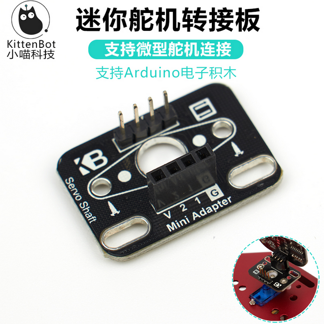

# 转接板

## 购买链接

__转到淘宝购买__----------→[转接板](https://item.taobao.com/item.htm?spm=a1z10.3-c-s.w4002-17001215033.71.59fc762e6Luvq6&id=551258468205)

## 产品名称

猫头超声波转接板

## 适用人群

猫头朝圣般，矩阵屏等其他4Pin电子模块使用者

## 配送清单

转接板 x1

## 转接板示意图

  

## 产品简介

这款转接板主要用于喵家特色电子模块，如猫头超声波，八字灯环，贱鼠矩阵屏等。功能在于方便固定和接线方式转换。

## 产品特色

- 具有额外的VCC / GND端口和电子模块的输入引脚的功能

## 产品参数

- 长x宽x高：31mm x 21.5mm x 11.5mm
- 净重：2.2g
- 毛重：根据包裹最终大小决定

## 技术参数

- 工作电压：5V
- 免驱
- 集成小喇叭

