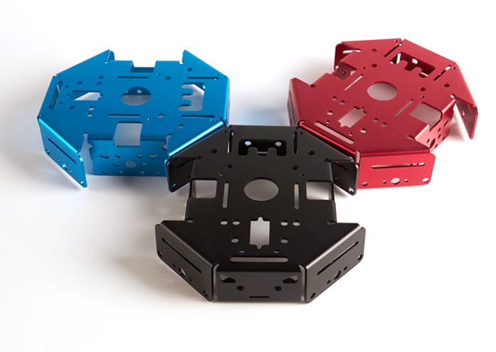
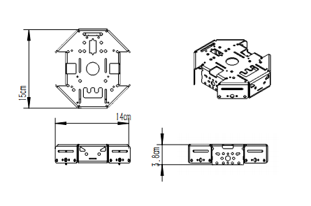

# 铝合底盘

## 购买链接

__转到淘宝购买__----------→[铝合底盘](https://item.taobao.com/item.htm?spm=a1z10.3-c-s.w4002-17001215033.50.1380762eHXRi4k&id=551190318152)

## 产品名称

铝合金小车底盘  
 
 

## 产品说明   

在铝合底盘的四周均有向下弯折的部分，可以装上相对应的电子元件或电机。底盘表面上留有的孔也可以装上电路板、电子元器件等，同时也适配乐高积木。   
   
## 产品特色   

- 左右两边的铝板可以用来固定步进电机或者直流电机；   
- 前后向下弯折的铝板可以固定装有钢珠的万向轮，也可以用来加装各种电子模块；   
- 4个向下弯折的斜铝板也可以用来固定电机；   
- 底盘上表面的中心处的圆孔可以加装白板笔化身绘图小车；   
- 大圆孔旁边的两根竖槽可以安装树莓派；   
- 在上表面还留有舵机槽固定舵机，留有4个带螺纹的孔用以固定主控板，留有的其他通孔还可以适配乐高积木   
   
## 产品参数  

- 长：15cm   
- 宽：14cm   
- 高：3.8cm   
- 净重：131g   
 
## 机械图纸   

   
   
## 注意事项   

- 小心底盘的尖角，以免受伤   
- 避免摔、砸或用力掰底盘，否则发生变形，就会导致底盘失去应有的作用   
- 底盘占水请尽快擦干，以免对底盘造成腐蚀   
