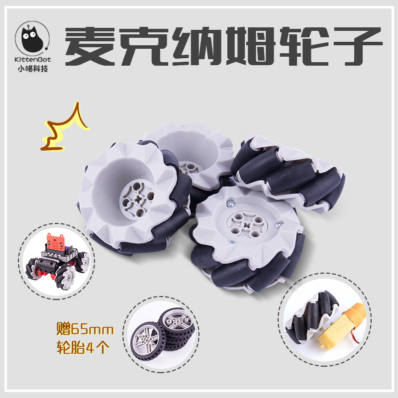
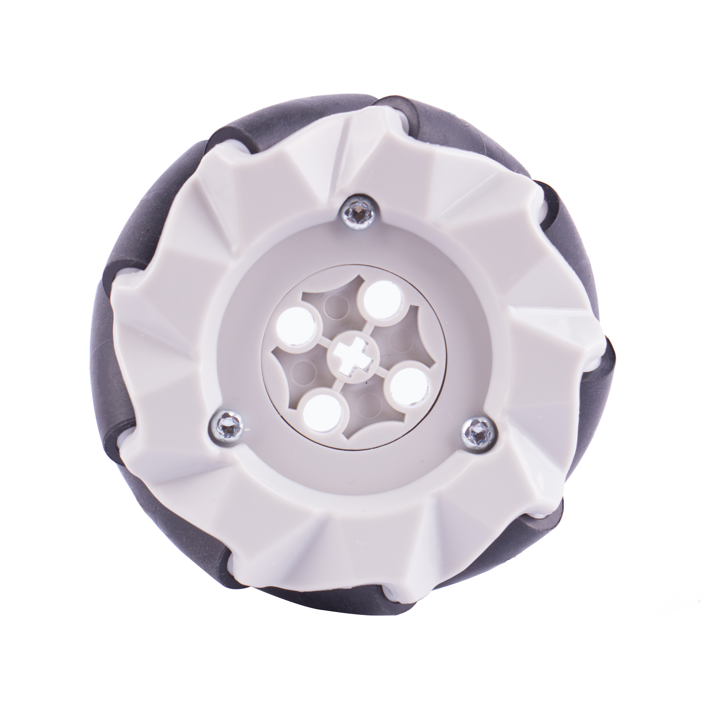

# 麦克纳姆轮子

## 产品名称：   

麦克纳姆轮

## 配送清单：   

麦克纳姆轮 x 4

 

## 产品简介：   

麦克纳姆轮是一款特别的轮子，可以进行全方位任意移动。它由轮毂和围绕轮毂的滚子组合而成，且滚子轴线与轮毂轴成45°夹角。这使得它的速度方向成45°，再通过正交分解，将速度分解为两个成90°的分速度，4个轮子的分速度都处于同等的坐标轴x和y上，通过轮子转向正反从而达到某一方向速度的抵消进而实现多方位移动甚至平移。

## 产品特色：   

- 运动方式为全方位，可平移

## 产品参数：   

- 用法：1组需要4个，必须分左右，左轮2个+右轮2个
- 直径：65mm（2.5寸）
- 宽：30mm
- 轮辊：9分轮
- 重量：48.5g/个
- 建议载重：小于5kg/4个麦轮
- 可接插乐高十字轴电机、TT电机

 

* 麦轮使用注意点：  

- 塑料麦轮最大承重是4个麦轮 5kg
- 4个轮子的的排布为ABAB
- 制作麦克纳姆轮小车，应确保4个轮子成矩形排布

