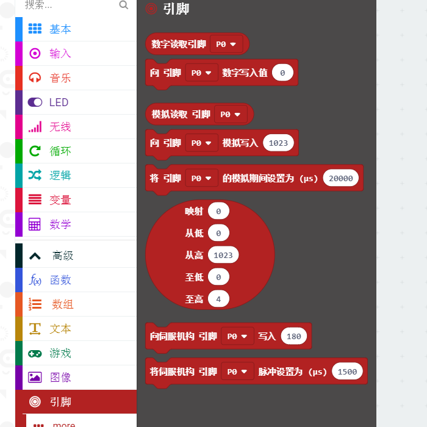
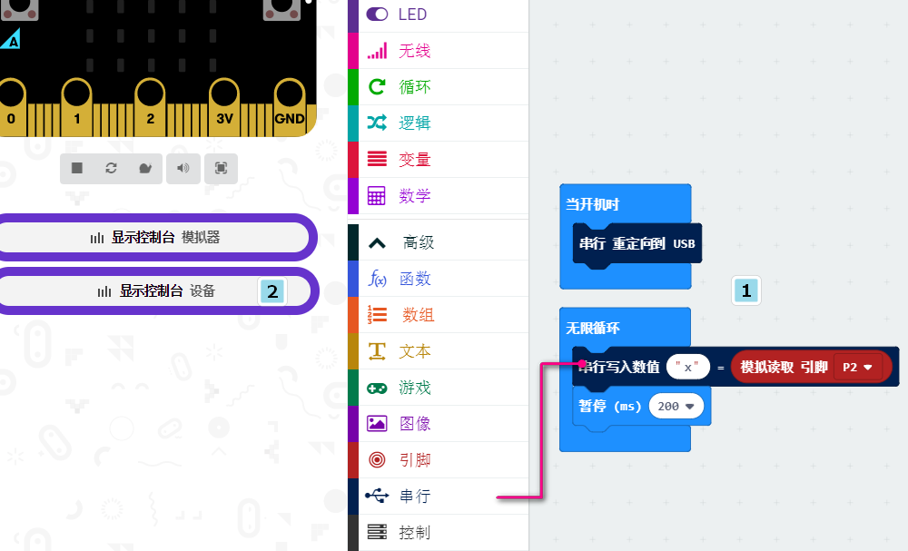
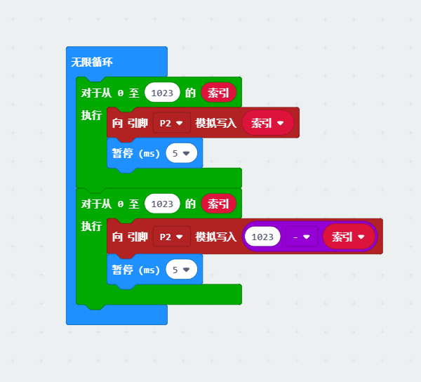
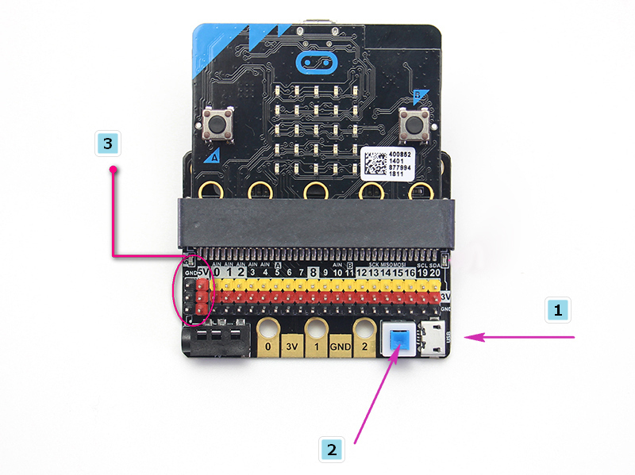
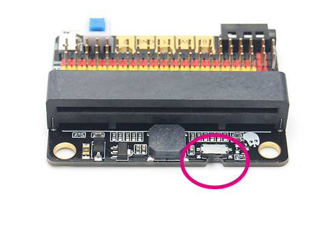

# IObit

## 购买链接

__转到淘宝购买__----------→[IObit](https://item.taobao.com/item.htm?spm=a1z10.3-c-s.w4002-17001215033.23.2c12762ejVnKwc&id=584088775020)

## 产品名称   
IObit，IO是指（input、output），IObit从名字可以看出，它主要是做引脚转出的作用，适合一些狂热的DIY爱好者，希望能自主使用所有IO口。   
## 适合人群   
已经对Microbit有所了解，也清楚Microbit的引脚定义，希望低成本做一些作品的用户。   

## 配送清单   
IObit2.0 X1   

## 产品简介   
这是一款Microbit低廉的扩展板，专门用于Microbit的IO口引出，已经将Microbit上所有io资源引出，同时板载上还自带蜂鸣器，通过跳线帽与P0引脚相连接，可以通过跳线帽对P0引脚进行释放。体积小，非常适合Microbit的小项目。   

## 产品特色   
- 体积小，非常适合DIY   
- IO口全部引出    
- 自带蜂鸣器，可以直接使用Makecode中的音乐模块播放音乐，同时板载3.5mm音频接头，可以外接耳机等音频设备让创意的可塑性更高  
- 带有两个乐高兼容的插销孔，方便拼装结合的创意     
- 以黄红黑区分的3PIN接口，特征明显不易插错，方便接插市面上的传感器
- 仿照microbit引出5PIN金手指，方便了喜欢使用鳄鱼夹制作的创客们
- 比起iobit1.0来说最大的区别在于可以输入输出5V，支持了5V的传感器使用以及增大了驱动能力(可以驱动多个9g小舵机)
- 含有1A自恢复保险丝   
- 喵家用心设计的丝印   

## 产品参数   
长x宽x高：57mmx44mmx12mm        
   

## 技术参数   

- 供电方式：IobitV.2.0支持USB5V供电，此供电方式需要按下蓝色电源开关。
- 工作电压：3V-5V（3V供电情况下不支持5V传感器模块）
- 输出电流：3V和5V电源接口最大输出1A
- 串口引出：串口可对IO口进行映射   
   
- I2C口引出：19、20引脚只能作为I2C功能引脚使用，不能作为普通IO口读写，因为microbit底层写死了   
- spi口引出；14、15（IO口可读写）   

## 使用方式
编程方式：Makecode/Kittenblock(基于Scratch3.0)   
配合硬件：Microbit   

## 具体使用   
使用上与Microbit编程是一致的，因为本身IObit上没有带任何的驱动芯片（除了蜂鸣器）   
一般配合IObit来使用的积木块就是操作IO口，实际市面上很多传感器，都是返回一个高低电平，或者一个模拟值。亦或者针对执行器，microbit则需要输出高低电平来操控。对此方面不熟悉的朋友，可以搜索网易云课堂: 小喵科技并对应找到arduino的教程，里面大概解释了常用市面上传感器是怎么使用个，原理都是一样的。

### 配合常用积木块——>引脚  

使用积木块前，必须先了解清楚你所用的电子模块的控制方式或者读取方式   
   

### 数字读   
大部分新手都会掉坑掉在这里，因为他们经常在初始化的时候忽略了设置上拉或者下拉。所以电平状态读取一次后就失灵了。   
所以这里必须要注意下，microbit本身默认不帮忙设置上下拉，需要自己进行设置。
   

### 模拟读   
对了应对模拟读，因为模拟读会返回0-1023的数值，用点阵屏显示总是会不方便。所以这里利用了小喵家出品的Makecode离线版特有的串口调试功能,首先下载图中所示程序打开串口，步骤2的地方会出现设备的控制台，就可以看到实时返回的数据了。
   

### 数字写   

数字读这里无需设置上下拉    

   

### 模拟写  

模拟写这里举一个呼吸灯的例子  

   

常用IO口操作就是这4种，大家掌握好后，应对市面上常用传感器没有问题。另外一个要注意下，市面上传感器有5v和3.3V兼容的。但是有一部分只能工作在5V中。例如淘宝卖得很普通的那种蓝色超声波，只能工作在5V中，如果接上IObit，读回来的数字永远为0，因为模块没有正常工作！   

## IObit硬件介绍：

### 5V供电
按照图示1插入USB供电（5V 1A），按下2的蓝色按钮，3处的红色指示灯会亮起，此时可以使用左边的5V接口。

### P0蜂鸣器开关

拨动开关用以打开关闭蜂鸣器功能(状态见板子背面的丝印）

### 3Pin IO口引出
已经将Microbit中所有引脚引出，没有任何保留（PS：Microbit上没有P17与P18，并不是IObit没有引出）

黄色对应不同的IO引脚

红色对应3.3V/5V （有丝印标注）

黑色对应GND

### 5PIN金手指
仿照microbit的金手指分别引出3v、gnd、P1、P2、P3。转为倾向使用鳄鱼夹的使用者提供

### 40P Microbit卧式插座
体积紧凑型插座

### 板子安装孔与固定孔
最外侧两个孔直径大概4.8MM，兼容乐高摩擦销，间距48mm

### 3.5mm音频接口
可以接插3.5mm头的音频设备，将P0引脚的声音播放出来。

## IObit编程使用：
如果你Microbit还没入入门,先入门Microbit，这个是操作前提。小喵科技已经为你准备好贴心的[Microbit手把手入门视频教程](https://bbs.kittenbot.cn/forum.php?mod=viewthread&tid=201&highlight=Microbit%2B%CA%D3%C6%B5)

### P0蜂鸣器
在Makecode中直接使用音乐积木块即可

### P0引脚使用
如使用P0记得将蜂鸣器拨动开关拨向关闭的一侧(由于蜂鸣器合P0复用)

## IObit使用注意事项

 - 使用microbit供电时，IObit的IO口驱动能力很弱，IO口电流不足200ma，请勿接大电流器件（例如大舵机MG995、直流电机），**否则会烧坏Microbit**，使用前必须完全了解清楚你所使用的器件电流情况   
 - 当使用5V外接电源时，可以驱动多个小舵机，但请注意电流误超1A！   
 - 如果使用引脚的高低电平读的功能，必须设置引脚上下拉   
   
 - 如果把P0作为普通IO口使用必须将蜂鸣器拨动开关置于关闭一侧，否则蜂鸣器会响或者IO读取数值不正常。
 - 使用与Microbit点阵的共用引脚（如3、4、5、6、7、8、9、10、11），记得在软件上把点阵屏禁用掉，否则会有点阵屏乱亮的现象
 - 不要使用IO19、20，19和20是不能当做IO口来使用的，虽然makecode软件上显示可以使用，实际是用不了的！只能用于I2C通讯
 - USB口允许最大输入电流为1A。

 - **禁止放在金属制品上使用，以免短路**