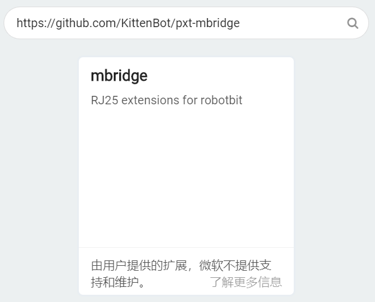
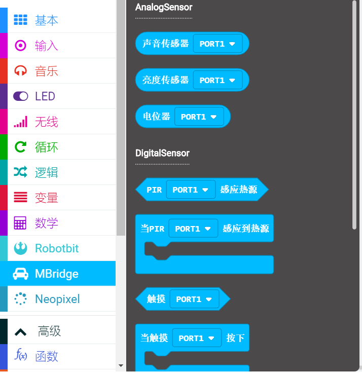
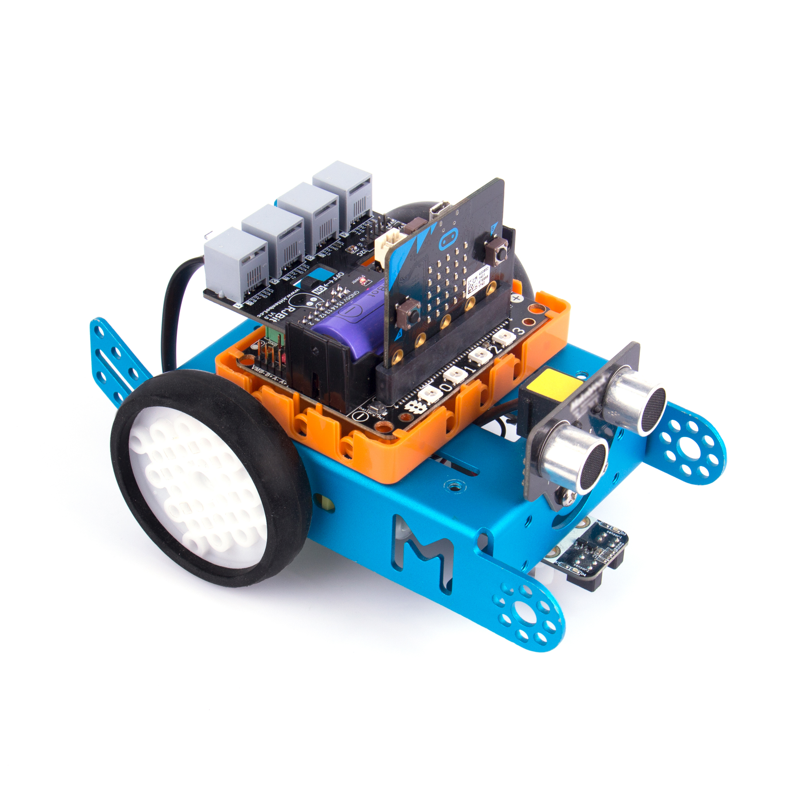
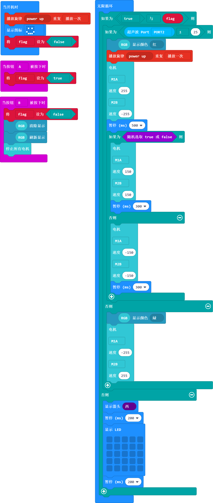
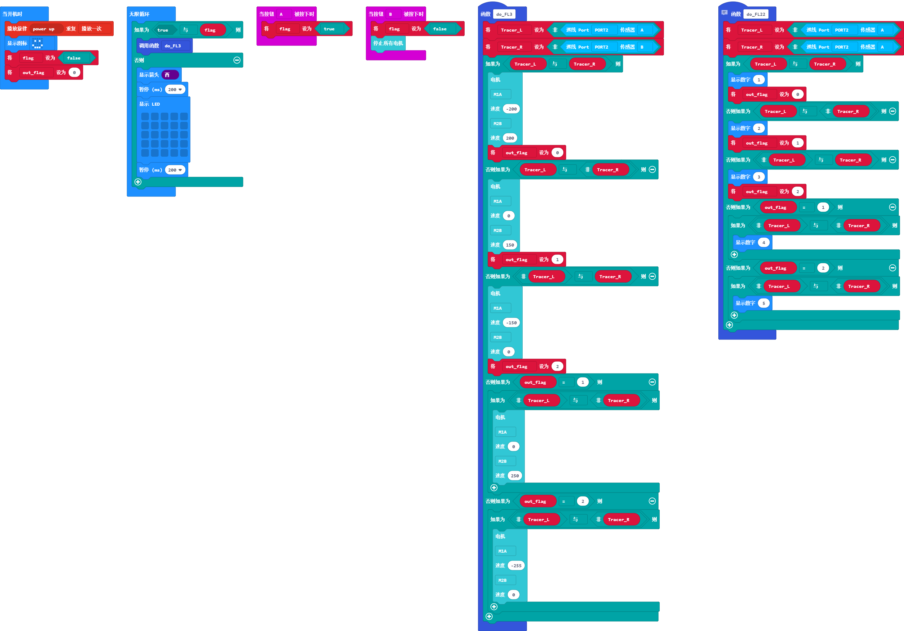

# mBridge

## 简介

mBridge是小喵科技推出一款简单易用兼容RJ25传感器模块的**扩展板**。

它简单易用，mBridge需要插在robotbit上使用，microbit作为主控板，mBridge专为RJ25传感器模块而设计。

让用户在makecode平台下也能使用RJ25传感器模块。

mBridge不能单独使用，必须配搭microbit和robotbit进行使用！

## 建议配搭套餐

1、mBridge

2、Microbit

3、Robotbit

4、Robotbit底座

5、塑料铆钉X5（用于固定Robotbit的底座在金属车架上）

## 特色

在打通microbit与RJ25模块传感器的编程

- 无需浪费您手上的RJ25模块

- 无需转接杜邦线，直接使用RJ25水晶头线

- 已有Robotbit的用户无需为了用RJ25模块，再另买一块差不多性质的Microbit扩展板，只需在Robotbit上扩展即可。

- 支持Makecode，有mBridge插件，驱动mBridge的同时，不影响Robotbit上的编程资源（RGB灯、电机、舵机等等）

## 在Makecode中的编程

在Makecode中编程，现已经支持RJ25的大部分传感器，用户只需要像往常一样简单的拖拽积木块对microbit编程就可以DIY出效果。

mBridge对应的Makecode扩展地址：

https://github.com/KittenBot/pxt-mBridge

成功加载：

## 技术详细参数

### 尺寸

64mmx36mmx24mm

### 接口

4组RJ25接口

- PORT1,PORT2,PORT3可作为模拟传感器接口，可接makeblock带黑色色标模块

- PORT1,PORT2,PORT3,PORT4可作为数字传感器接口，可接makeblock带黄色和蓝色色标模块

- PORT1,PORT2,PORT3,PORT4可作为I2C传感器接口，可接makeblock带白色色标模块

- 板载4Pin I2C排针接口，可接5V I2C模块

### 其他参数

接口电压：5V

LED灯：5V电源指示灯

支持软件：Makecode

## 电路板细节指示图

									
5-> 4P排针，5VI2C杜邦线模块接口 

6-> 5V电源指示灯

7-> 8P排母，插在robotbit的8路IO口上

8-> 2P排母，插在robotbit的5V接口上

9->2P排母，插在robotbit的GND接口上

10-> 4P排母，插在robotbit的I2C接口上

## 与金属车架结合

通过4颗配套铆钉，将Robotbit的底座固定在金属车架上

## 编程实例

总程序包下载：(请转到论坛下载)

https://bbs.kittenbot.cn/forum.php?mod=viewthread&tid=599&page=1&extra=#pid2439

图片太小了，具体下载程序包后，打开hex文件，自己学习程序

### Port2超声波靠近亮红灯

### Port2超声波避障小车

### Port2巡线小车

