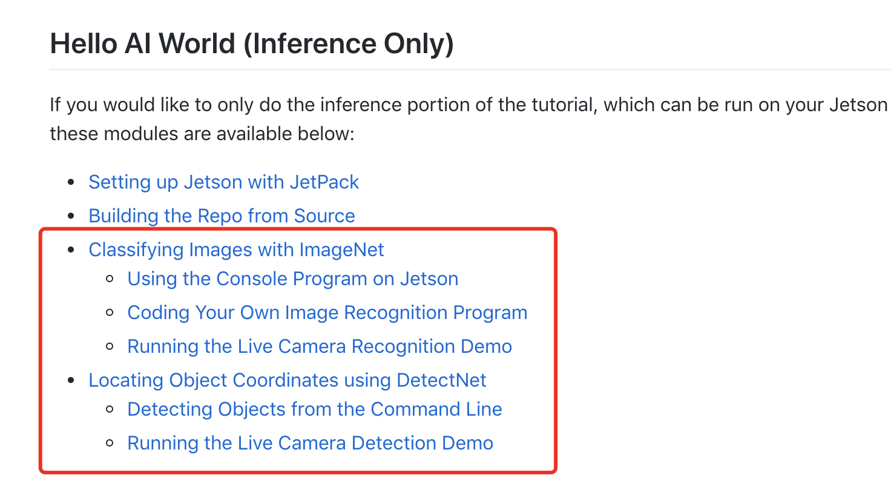

# Jetson AI第一课

官方的jetson系统烧录完后首先就是推荐大家使用hello AI进行上手，但是在国内网络环境下需要做一些额外的工作。这篇教程就是教大家如何在墙内的世界跑起来～

原项目地址：
[https://github.com/dusty-nv/jetson-inference](https://github.com/dusty-nv/jetson-inference)

jetson-inference正如其名只是调用现有训练好的模型进行计算，并不存在数据采集训练的过程，也不需要安装tensorflow或caffe等库。jetson nano的镜像已经内置安装好了cuda，cudnn和opencv等

## 克隆项目到jetson
由于github比较卡，我们将项目挪到国内gitee上了～
```
cd ～
git clone https://gitee.com/Kittenbot/jetson-inference.git
```

接下来我们需要编译项目，默认使用的都是树莓派兼容的csi摄像头，如果大家使用的是usb摄像头可以到不同的项目.cpp文件下将DEFAULT_CAMERA定义后面的-1改成/dev/video

由于大部分模型都托管在google drive的映射上，所以在大防火墙内运行**CMakePreBuild.sh**安装脚本下载模型的时候基本都会超时报错。这里我们已经将下载好的模型放到百度盘上了，下载为data.zip文件。

```
链接: https://pan.baidu.com/s/12DPjN79Jn26EW-gR7cLfMA 提取码: 5fx8 
```

大家下载后可以拷贝到u盘上，查到jetson上可以用ubuntu自带的图形化解压工具解压到jetson-inference下覆盖原有的data目录就行了。

接下来我们运行下面的脚本

```
cd jetson-inference
git submodule update --init
```

如果大家下载并覆盖了data文件夹，运行cmake的时候不会重新去网上找模型数据库。

```
mkdir build
cd build
cmake ../
make
sudo make install
```

如果编译没错的话，会在build/aarch64/bin生产各个程序的可执行文件。接下来基本就可以照着 [https://github.com/dusty-nv/jetson-inference/blob/master/README.md](https://github.com/dusty-nv/jetson-inference/blob/master/README.md)一步步尝试jetson nano的ai能力了～


例如：

```
cd jetson-inference/build/aarch64/bin
./imagenet-console orange_0.jpg output_0.jpg
```


