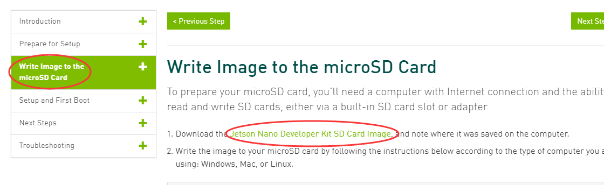
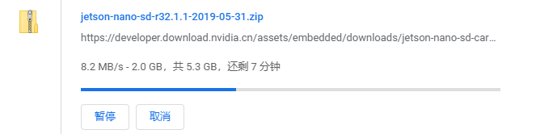
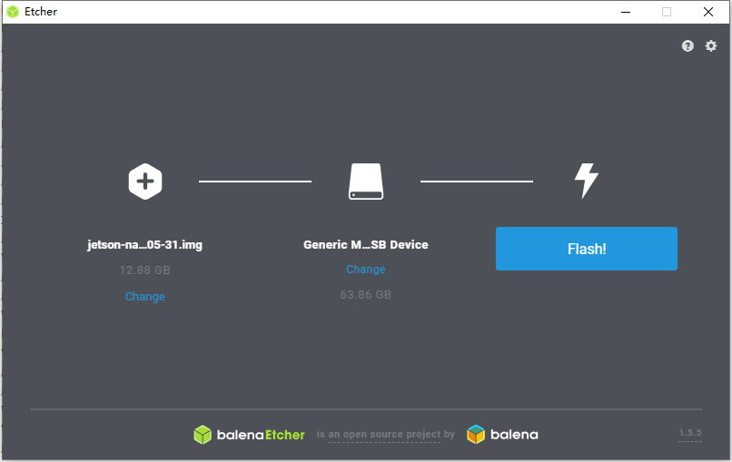
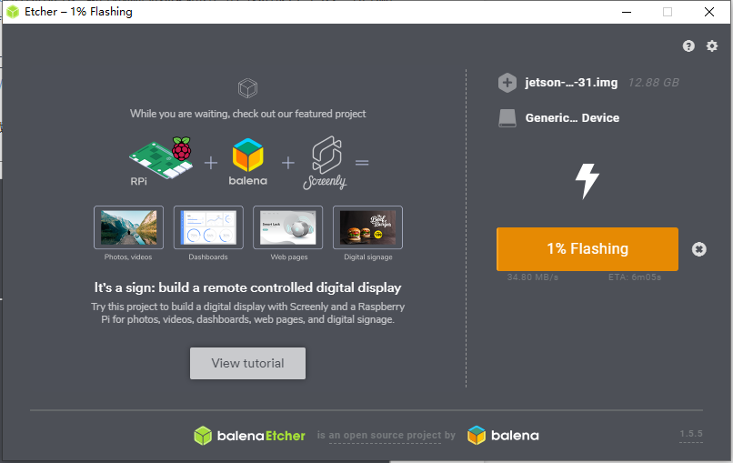
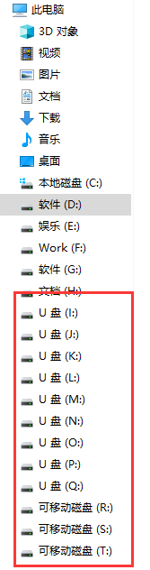
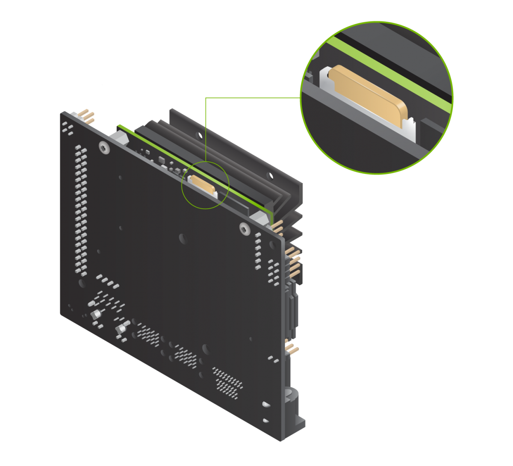
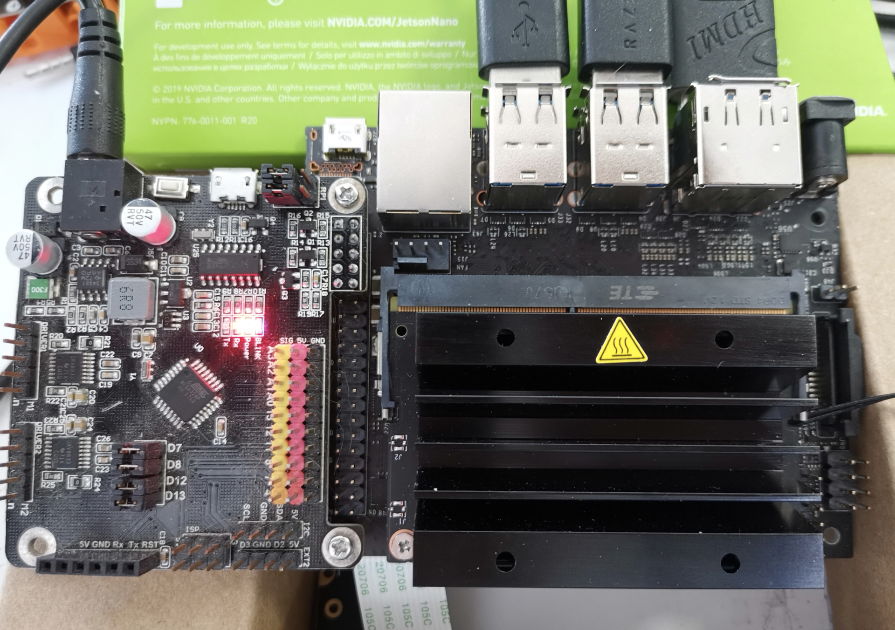
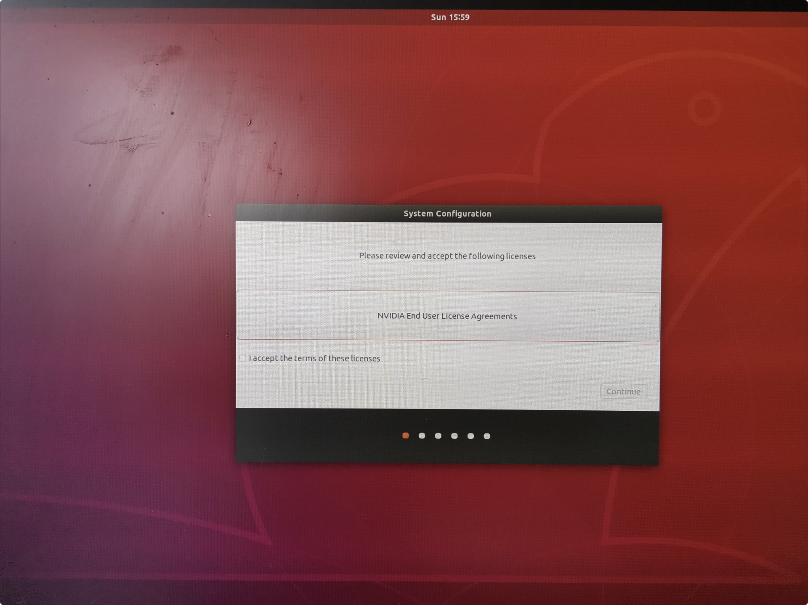

# Jetson nano快速上手

## 下载镜像文件
首先我们需要下jetson的镜像文件，实际上就是一个针对jetson nano优化过的ubuntu系统。
官方推荐是16G的高速tf卡，这里建议大家最少使用32G。因为后面加上各种模型数据和库，再打开swap区可以轻松超过20G。

大家可以前往下面网站，并通过在左侧选中第三栏，红圈的位置为镜像下载地址。
[https://developer.nvidia.com/embedded/learn/get-started-jetson-nano-devkit#write](https://developer.nvidia.com/embedded/learn/get-started-jetson-nano-devkit#write)

可以看到nv的下载速度还是不错的。

## 格式化TF卡
如果你的tf卡之前做过系统安装盘，或者有mac备份等等，新卡可以跳过这一步。通过官方推荐的SD Memory Card Formatter格式化tf卡。或者你想把tf恢复如初，也可以用这个工具。（tf卡刷了jetson镜像后插到电脑上会出现十来个u盘盘符）

我们下载官方推荐的etcher工具进行镜像烧录。
[https://www.balena.io/etcher/](https://www.balena.io/etcher/)

第一项直接选中我们刚刚下载的zip文件，etcher不需要解压刚刚下载的zip文件，会自动读取里面的镜像文件。

之后就开始漫长的烧录过程了，如果你的sd卡读卡器还是USB 2.0或1.1估计要半个小时以上。USB3.0的读卡器大约需要10分钟，注意电脑机箱上蓝色的（9p）才是usb3.0的接口。

当烧录完成后如果电脑上弹出来一堆盘符这是正常现象，将读卡器弹出就好了~

## 首次启动jetson
将tf卡插到jetson主板背面：

之后插上hdmi线，键盘鼠标和网线。电源可以选择micro-usb口，这里需要使用5V 3A的适配器或充电宝。如果使用外部适配器，请一定要选择5V输出的，并且输出电流在3A以上。
**Jetson nano的DC接口只支持5V输入，请千万别将5V以上的适配器插到jetson上面。**
使用外部适配器还需要闭合dc口后边的跳线帽。

如果手上有小喵家rosbot主板可以像下面这样将主板连接到jetson，安装的时候需要额外的2.5mm铜螺柱，rosbot的dc口支持6～12v的电源输入。再三强调，千万不要手滑把高于5v的电源直接查到jetson上。

首次启动后需要完成ubuntu剩下的安装过程，除了时区外基本选默认就行了。

对ubuntu或linux不熟的同学请牢记打开终端的快捷键是 ctrl+alt+t ，linux下的图形化节目我们用的不多，大部分东西都是在命令行下操作～

## 关于wifi模块和摄像头模块的选择
网上大部分卖jetson板子的卖家都会配Intel 8265的wifi模块，因为这个在jetson内置自带
驱动支持。但是ubuntu理论上支持大部分usb的wifi模块，如果缺少驱动先使用有线网络更新一下就行了，通用的ubuntu安装教程应该都能用。
摄像头模块也是如此，大家可以直接使用现场的树莓派的摄像头。或者也可以选用各种usb摄像头，但是需要注意的是选择usb摄像头需要修改部分程序的camera设备为/dev/video

