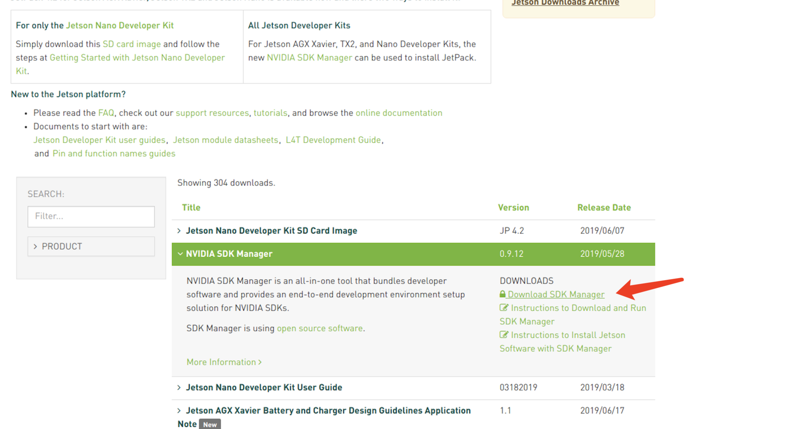
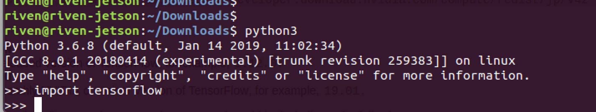

# 从零制作Jetbot镜像


喜欢折腾的小伙伴可以尝试跟着这篇帖子从零制作一个jetson镜像。玩jetson要远比小喵家产品或树莓派烧钱，大家要准备足够的预算~


以下所有文档来自于Nv官方，如有变动以官方的为准：
[https://github.com/NVIDIA-AI-IOT/jetbot/wiki/Create-SD-Card-Image-From-Scratch](https://github.com/NVIDIA-AI-IOT/jetbot/wiki/Create-SD-Card-Image-From-Scratch)
## NUMPY安装
在命令行下依次运行以下命令，除了最后numpy需要重新编译一堆东西耗时比较长外，其他应该没毛病～
```
sudo apt-get update
sudo apt install python3-pip python3-pil
sudo pip3 install --upgrade numpy 
```

## SDK和tensorflow的安装

首先我们来安装Nv的SDK Manager
当前面的numpy安装完后，我们需要安装对应的sdk。jetson nano的ubuntu安装完后桌面有一个developer zone的快捷链接，在chromium打开后找到download那个按钮进入下载链接。

[https://developer.nvidia.com/embedded/downloads](https://developer.nvidia.com/embedded/downloads)

找到Nvidia SDK Manager并且点击下载，默认下载到 ~/Downloads 目录。



下载完成后使用命令行安装：

```
cd ~/Downloads
sudo apt install ./sdkmanager....
```

第二行的....请自行用tab补完。

### 接下来安装各种python3依赖的库
```
sudo apt-get install libhdf5-serial-dev hdf5-tools
```
安装pip3
```
sudo apt-get install python3-pip
```
安装下面的库
```
pip3 install -U pip

sudo apt-get install zlib1g-dev zip libjpeg8-dev libhdf5-dev 

sudo pip3 install -U numpy grpcio absl-py py-cpuinfo psutil portpicker grpcio six mock requests gast h5py astor termcolor
```

上面最后一条命令如果大家碰到跟我一样的运行pip就报错：cannot import name 'main'，那么多半是跟系统自带的pip冲突了，这时候需要删除系统pip再重新安装pip3。运行以下命令：

```
sudo python3 -m pip uninstall pip && sudo apt install python3-pip --reinstall
```

之后就漫长的升级过程 ，部分库更新需要重新编译会导致ubuntu卡顿，大家这时候可以去干点别的等大概半个小时再回来～

### tensorflow安装
安装tensorflow的准备工作就结束了，下面正式安装tensorflow。注意命令中比官方教程多了--no-cache-dir，这是因为ubuntu镜像中pip配置已经过时了。
```
pip3 install --no-cache-dir --pre --extra-index-url https://developer.download.nvidia.com/compute/redist/jp/v42 tensorflow-gpu
```

接下来又是漫长的下载和安装过程，大家可以去干些别的，等半个小时再回来～

安装完成后大家可以测试下tensorflow是否安装成功，注意是python3:

```
python3
>>>import tensorflow
```



如果 import没报错，那么就安装ok了 ～

### 安装pytorch
由于大部分同学访问不了google drive，这里将官方预编译好的pytorch wheel包放到百度盘：

链接: [https://pan.baidu.com/s/1wMHLauajtYvc_MBDiQwt_g](https://pan.baidu.com/s/1wMHLauajtYvc_MBDiQwt_g) 提取码: tg1i 

通过u盘或其他手段考到jetson nano某个目录下，进到这个目录运行以下命令：

```
sudo pip3 install torch-1.0.0a0+18eef1d-cp36-cp36m-linux_aarch64.whl
sudo pip3 install torchvision
```

安装traitlets

```
sudo python3 -m pip install git+https://github.com/ipython/traitlets@master
```

最后我们还需要安装玩机器学习不可或缺的 jupyter 记事本，最后一行是启动jupyter服务器，一切正常的话会在浏览器弹出jupyter记事本

```
sudo apt install nodejs npm
sudo pip3 install jupyter jupyterlab
sudo jupyter labextension install @jupyter-widgets/jupyterlab-manager
sudo jupyter labextension install @jupyterlab/statusbar
jupyter lab --generate-config
jupyter notebook
```

## 安装jetbot项目
弄了这么久我们只是在为jetbot项目准备开发环境，接下来才是主线任务～

```
cd
sudo apt install python3-smbus
git clone https://github.com/NVIDIA-AI-IOT/jetbot
cd jetbot
sudo apt-get install cmake
sudo python3 setup.py install
```

接下来我们将jetbot做成一系列系统服务：

```
cd jetbot/utils
python3 create_stats_service.py
sudo mv jetbot_stats.service /etc/systemd/system/jetbot_stats.service
sudo systemctl enable jetbot_stats
sudo systemctl start jetbot_stats
python3 create_jupyter_service.py
sudo mv jetbot_jupyter.service /etc/systemd/system/jetbot_jupyter.service
sudo systemctl enable jetbot_jupyter
sudo systemctl start jetbot_jupyter
```

在tf卡建立交换区 swapfile

```
sudo fallocate -l 4G /var/swapfile
sudo chmod 600 /var/swapfile
sudo mkswap /var/swapfile
sudo swapon /var/swapfile
sudo bash -c 'echo "/var/swapfile swap swap defaults 0 0" >> /etc/fstab'
```

最后将jetbot的notebook拷贝到用户根目录下就完成了

```
cp -r ~/jetbot/notebooks ~/Notebooks
```


