# 新手引导

## 机器人选择(选arduino类或者Microbit类)
### MiniLFR Kittenbot   
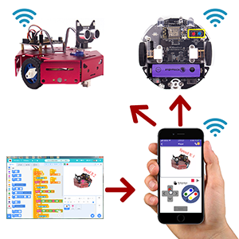   
   
#### 选择机器人   
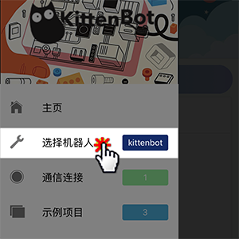   

#### 这里以Kittenbot钣金小车为例，选择Kittenbot   
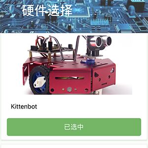   

#### 先初始化wifi模块，确保wifi拨动开关处于右侧   
   

#### 主控板插上电或者打开小圆车开关   
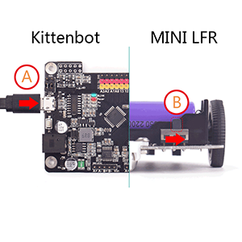   

#### 把wifi模块插入到主控板或者小圆车上   
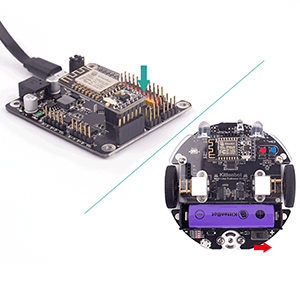   

#### 把wifi拨动开关拨动到左边，进入wifi设置模式   
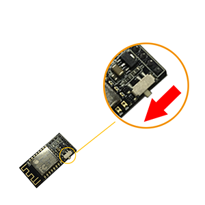   

#### 重新回到APP，选择通讯连接   
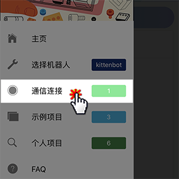   

#### 先确保手机已经在2.4G路由器（非5G）wifi网络中，输入wifi密码，点击加入   
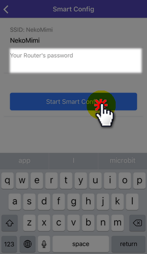   

#### 如果成功加入，会出现一个新的wifi地址（这个你机器人的wifi）   
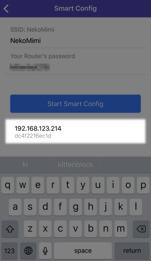   

#### 成功后自动跳转到wifi模块选择列表中，点选你的wifi
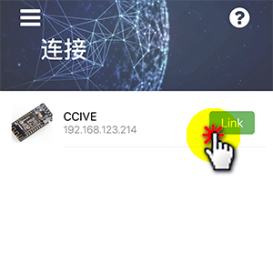   

#### 恭喜你！已经成功连接上机器人wifi，此时需要把wifi模式拨回到右边，进入wifi正常模式
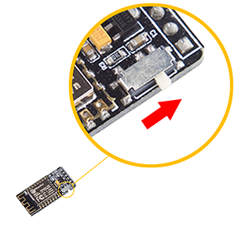   

#### 选择示例项目   
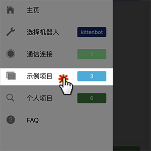   

#### 选择Kittenbot钣金车遥控   
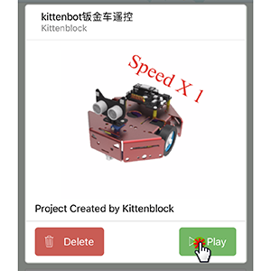   

#### 点击界面的绿旗子，Scratch程序即运行起来   
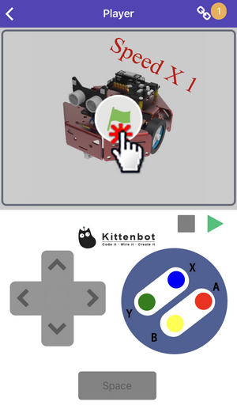   

#### 点击控制按钮，即可控制小车运动（如果wifi已经连接上，但是小车没有反应，请重新给电路板或者小车恢复固件）
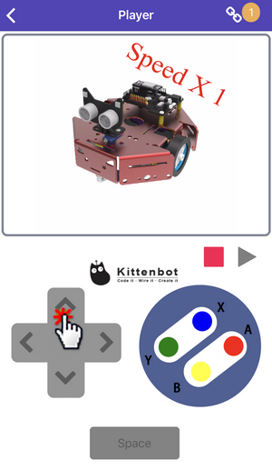   

----------

### Microbit