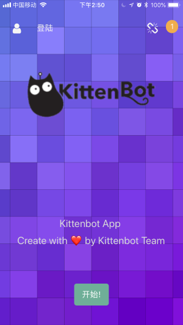
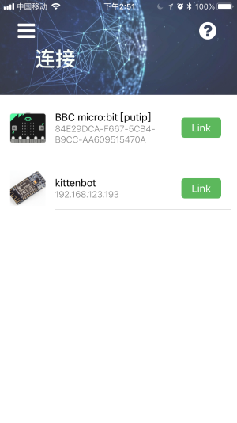
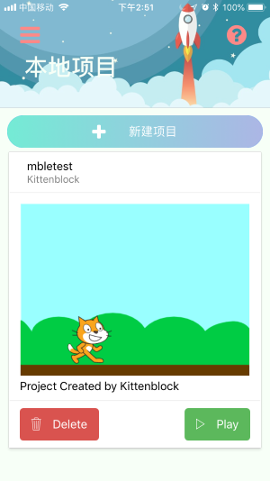
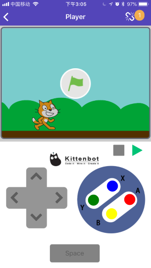

# App V2.3 快速入门手册

因为Kittenbot家App处于快速迭代状态，本教程只针对V2.3x版本的app。

## 主界面

主界面包括左上角登陆小喵家账号体系，目前只支持使用中文bbs进行登录，后续会开放独立注册系统。登陆后可以使用小喵家的iot体系，并支持上传项目和在云端保存sb3文件。

首次启动会自动从小喵家的大服务器同步基本示例和教程，如果网络不好请耐心等待。您也可以在设置按钮中重置数据库来同步最新的示例和教程

底部开始按钮可以打开app侧边导航栏，您也可以在左侧使用手势滑动打开侧边栏。

## 侧边导航栏

导航栏是各个功能模块的入口，后续我们会开发更多的功能模块，所有模块的入口都可以在这里找到。

底部小齿轮可以打开设置面板。

## 新手指引

如果您是第一次使用Kittenblock家软件，建议将这个流程过一遍。这个快速指引包括指引您如何选择机器人和通信连接方式，我们发现大部分用户碰到的问题都在正确配置通信连接，后续基本没有太大的难度了。

## 机器人连接面板

所有和硬件交互的scratch3文件都需要提前连接到机器人才能正常执行，如果是wifi模块需要让wifi模块加入您家中的路由器，并且保证手机和机器人处于同一局域网才能正常工作。

如果使用microbit或者其他蓝牙4.0设备，需要关闭蓝牙模块配对流程，具体参考对应的教程案例。

## 案例和教程

默认app内置的markdown文档和教程，如果有sb3文件的，可以直接打开并执行。所有的案例和教程都在app第一次启动的时候从服务器更新并下载，您也可以前往设置面板手动更新案例和教程的数据库文件。

点击项目图片可以阅读项目文档，点击绿色的播放按钮可以进入scratch3项目执行面板。

如果想在PC上以更舒服的方式阅读，可以前往我们的网站 [http://kittenbot.cn/vvv/#/studio](http://kittenbot.cn/vvv/#/studio)阅读。所有的案例和教程源文件我们都放在github仓库中，您可以可以前往 [http://github.com/kittenbot](http://github.com/kittenbot) 帮助我们改进。

## 示例项目 & 本地项目

保存了本地的scracth3项目文件，您可以通过扫描kittenblock的分享二维码或者网站分享二维码下载手机上。

目前内测网站地址为[http://kittenbot.cn/vvv/#/sb3](http://kittenbot.cn/vvv/#/sb3)

## 项目执行面板

小喵家的app可以直接执行scratch2或者scratch3项目，您只需要将项目用kittenblock分享或者在网站上传分享即可。每个项目都有独立的id和地址，只需要扫描对应的二维码就可以下载到手机app中了。

APP集成了MIT家Scratch3的引擎，我们会在更新app的同时同步更新最新的scratch3引擎。

